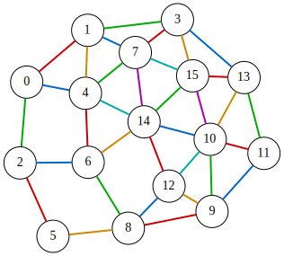

<div class="lang-en" markdown="1">
# Graph Edge Coloring Problem
Given an undirected graph $G=(V,E)$, the **graph edge coloring problem** aims to assign a color to each edge so that no two edges of the same color share a common endpoint.

More specifically, for a set $C$ of colors, the goal is to find an assignment
$\sigma:E\rightarrow C$ such that for any two distinct edges $𝑒$ and $e'$ incident to the same node, we have $\sigma(e)\neq \sigma(e')$.
Equivalently, for every node $u\in V$ and any two distinct neighbors $v\neq v'$
with $(u,v)\in E$ and $(u,v')\in E$ the following must hold:

$$
\sigma((u,v))\neq \sigma((u,v')).
$$


The graph edge coloring problem can be formulated easily as a QUBO expression.
Let $V=\lbrace 0,1,\ldots,n−1\rbrace$ and $C=\lbrace 0,1,\ldots,m−1\rbrace$.
We assign unique IDs $0,1,\ldots,e−1$ to the $e=∣E∣$ edges, and let $(u_i,v_i)$ denote the $i$-th edge.

We introduce an $e\times m$ matrix $X=(x_{i,j})$ of binary variables, where
$x_{i,j}=1$ if and only if edge $(u_i,v_i)$ is assigned color $j$.

### One-hot constraint
Since exactly one color must be assigned to each edge, each row of
$X$ must be one-hot:

$$
\begin{aligned}
  \text{onehot}&= \sum_{i=0}^{e-1}\bigr(\sum_{j=0}^{m-1}x_{i,j}==1\bigl)\\
   &=\sum_{i=0}^{e-1}\bigr(1-\sum_{j=0}^{m-1}x_{i,j}\bigl)^2
\end{aligned}
$$

### Incident edges must differ
For each node, any pair of distinct incident edges must not be assigned the same color. This can be penalized as follows:

$$
\begin{aligned}
  \text{different}&= \sum_{u\in V}\sum_{\substack{i<k\\ i,k\in I(u)}}x_u\cdot x_v\\
   &=\sum_{u\in V}\sum_{\substack{i<k\\ i,k\in I(u)}}\sum_{j=0}^{m-1}x_{u,j}x_{v,j}
\end{aligned}
$$

where $I(u)\subseteq \lbrace 0,1,\ldots,e−1\rbrace$ denotes the set of edge IDs incident to node $u$.

## QUBO objective
By combining these expressions, we obtain the QUBO objective function:

$$
\begin{aligned}
  f &= \text{onehot}+\text{different}
\end{aligned}
$$

This objective attains the minimum value 0 if and only if a valid
edge coloring of the graph exists.

## QUBO++ formulation
It is known that the edge chromatic number of a simple graph is either $\Delta$ or $\Delta+1$, where $\Delta$ is the maximum degree of the graph. The following QUBO++ program attempts to find an edge coloring of a graph with $n$ nodes and $s$ edges using $m=\Delta$ colors:
```cpp
#define MAXDEG 2
#include <qbpp/qbpp.hpp>
#include <qbpp/easy_solver.hpp>
#include <qbpp/graph.hpp>

int main() {
  const size_t n = 16;
  std::vector<std::pair<size_t, size_t>> edges = {
      {0, 1},   {0, 2},   {0, 4},   {1, 3},   {1, 4},   {1, 7},   {2, 5},
      {2, 6},   {3, 7},   {3, 13},  {3, 15},  {4, 6},   {4, 7},   {4, 14},
      {5, 8},   {6, 8},   {6, 14},  {7, 14},  {7, 15},  {8, 9},   {8, 12},
      {9, 10},  {9, 11},  {9, 12},  {10, 11}, {10, 12}, {10, 13}, {10, 14},
      {10, 15}, {11, 13}, {12, 14}, {13, 15}, {14, 15}};
  std::vector<std::vector<size_t>> adj(n);
  for (size_t i = 0; i < edges.size(); ++i) {
    const auto& [u, v] = edges[i];
    adj[u].push_back(i);
    adj[v].push_back(i);
  }

  size_t max_degree = 0;
  for (const auto& neighbors : adj) {
    if (neighbors.size() > max_degree) {
      max_degree = neighbors.size();
    }
  }
  const size_t m = max_degree;

  const size_t s = edges.size();
  auto x = qbpp::var("x", s, m);

  auto onehot = qbpp::sum(qbpp::vector_sum(x) == 1);
  auto different = qbpp::Expr(0);
  for (size_t i = 0; i < n; ++i) {
    for (auto u : adj[i]) {
      for (auto v : adj[i]) {
        if (u < v) {
          different += qbpp::sum(x[u] * x[v]);
        }
      }
    }
  }

  auto f = onehot + different;

  f.simplify_as_binary();
  auto solver = qbpp::easy_solver::EasySolver(f);
  qbpp::Params params;
  params.set("target_energy", "0");
  auto sol = solver.search(params);

  std::cout << "colors = " << m << std::endl;
  std::cout << "onehot = " << sol(onehot) << std::endl;
  std::cout << "different = " << sol(different) << std::endl;

  auto edge_color = qbpp::onehot_to_int(sol(x));

  qbpp::graph::GraphDrawer graph;
  for (size_t i = 0; i < n; ++i) {
    graph.add_node(qbpp::graph::Node(i));
  }
  for (size_t i = 0; i < edges.size(); ++i) {
    const auto& e = edges[i];
    graph.add_edge(qbpp::graph::Edge(e.first, e.second)
                       .color(edge_color[i] + 1)
                       .penwidth(2.0f));
  }

  graph.write("edge_color.svg");
}
```
In this program, we first build the incidence list `adj`, where `adj[i]` stores the indices of edges incident to node `i`.
We then compute the maximum degree $\Delta$ and set `m=`$\Delta$.
Next, we define an `s`$\times$`m` matrix `x` of binary variables, where `x[i][j]=1` means that edge `i` is assigned color `j`.
We construct the expressions `onehot`, `different`, and `f` as follows:
- `onehot` enforces that each edge is assigned exactly one color.
- `different` penalizes pairs of edges that share an endpoint and are assigned the same color.
- `f = onehot + different` is the QUBO objective, which attains the minimum value 0 if and only if a valid `m`-edge-coloring is found.

We solve the resulting QUBO using the Easy Solver with target energy 0, and store the solution in `sol`. We then print the values of `onehot` and `different` evaluated at `sol`.

We also compute `edge_color`, which stores the color assigned to each edge, by applying `qbpp::onehot_to_int()` to `sol(x)`.
Finally, we draw the edge-colored graph using `qbpp::graph::GraphDrawer`, where edge `i` is colored with color number `edge_color[i] + 1`.

The function `qbpp::onehot_to_int()` returns a vector of integers in the range `[0,m−1]`, where each entry indicates the position of the 1 in the corresponding one-hot row. If a row is not a valid one-hot vector, the function returns $−1$ for that row. In this case, the edge color becomes $−1+1=0$, so the edge is drawn in color 0 (black).

This program produces the following output:
```
colors = 6
onehot = 0
different = 0
```
Therefore, a valid edge coloring using `m = 6` colors is found:
<p align="center">
  
</p>
</div>

<div class="lang-ja" markdown="1">
# グラフ辺彩色問題
無向グラフ $G=(V,E)$ が与えられたとき、**グラフ辺彩色問題**は、同じ色の2つの辺が共通の端点を持たないように各辺に色を割り当てることを目的とします。

より具体的には、色の集合 $C$ に対して、同じノードに接続する任意の2つの異なる辺 $e$ と $e'$ について $\sigma(e)\neq \sigma(e')$ となるような割り当て $\sigma:E\rightarrow C$ を求めます。
同等に、すべてのノード $u\in V$ と $(u,v)\in E$ かつ $(u,v')\in E$ である任意の2つの異なる隣接ノード $v\neq v'$ について、以下が成り立つ必要があります：

$$
\sigma((u,v))\neq \sigma((u,v')).
$$


グラフ辺彩色問題は QUBO 式として容易に定式化できます。
$V=\lbrace 0,1,\ldots,n−1\rbrace$、$C=\lbrace 0,1,\ldots,m−1\rbrace$ とします。
$e=∣E∣$ 本の辺に一意の ID $0,1,\ldots,e−1$ を割り当て、$(u_i,v_i)$ で第 $i$ 辺を表します。

$e\times m$ のバイナリ変数行列 $X=(x_{i,j})$ を導入し、$x_{i,j}=1$ は辺 $(u_i,v_i)$ に色 $j$ が割り当てられることを表します。

### ワンホット制約
各辺にちょうど1つの色を割り当てる必要があるため、$X$ の各行はワンホットでなければなりません：

$$
\begin{aligned}
  \text{onehot}&= \sum_{i=0}^{e-1}\bigr(\sum_{j=0}^{m-1}x_{i,j}==1\bigl)\\
   &=\sum_{i=0}^{e-1}\bigr(1-\sum_{j=0}^{m-1}x_{i,j}\bigl)^2
\end{aligned}
$$

### 接続辺は異なる色
各ノードについて、接続する任意の2つの異なる辺は同じ色を割り当ててはなりません。これは以下のようにペナルティ化できます：

$$
\begin{aligned}
  \text{different}&= \sum_{u\in V}\sum_{\substack{i<k\\ i,k\in I(u)}}x_u\cdot x_v\\
   &=\sum_{u\in V}\sum_{\substack{i<k\\ i,k\in I(u)}}\sum_{j=0}^{m-1}x_{u,j}x_{v,j}
\end{aligned}
$$

ここで $I(u)\subseteq \lbrace 0,1,\ldots,e−1\rbrace$ はノード $u$ に接続する辺の ID の集合を表します。

## QUBO 目的関数
これらの式を組み合わせることで、QUBO 目的関数が得られます：

$$
\begin{aligned}
  f &= \text{onehot}+\text{different}
\end{aligned}
$$

この目的関数は、有効な辺彩色が存在する場合にのみ最小値 0 を達成します。

## QUBO++ による定式化
単純グラフの辺彩色数は $\Delta$ または $\Delta+1$ であることが知られています。ここで $\Delta$ はグラフの最大次数です。以下の QUBO++ プログラムは、$n$ ノード、$s$ 辺のグラフに対して $m=\Delta$ 色での辺彩色を求めます：
```cpp
#define MAXDEG 2
#include <qbpp/qbpp.hpp>
#include <qbpp/easy_solver.hpp>
#include <qbpp/graph.hpp>

int main() {
  const size_t n = 16;
  std::vector<std::pair<size_t, size_t>> edges = {
      {0, 1},   {0, 2},   {0, 4},   {1, 3},   {1, 4},   {1, 7},   {2, 5},
      {2, 6},   {3, 7},   {3, 13},  {3, 15},  {4, 6},   {4, 7},   {4, 14},
      {5, 8},   {6, 8},   {6, 14},  {7, 14},  {7, 15},  {8, 9},   {8, 12},
      {9, 10},  {9, 11},  {9, 12},  {10, 11}, {10, 12}, {10, 13}, {10, 14},
      {10, 15}, {11, 13}, {12, 14}, {13, 15}, {14, 15}};
  std::vector<std::vector<size_t>> adj(n);
  for (size_t i = 0; i < edges.size(); ++i) {
    const auto& [u, v] = edges[i];
    adj[u].push_back(i);
    adj[v].push_back(i);
  }

  size_t max_degree = 0;
  for (const auto& neighbors : adj) {
    if (neighbors.size() > max_degree) {
      max_degree = neighbors.size();
    }
  }
  const size_t m = max_degree;

  const size_t s = edges.size();
  auto x = qbpp::var("x", s, m);

  auto onehot = qbpp::sum(qbpp::vector_sum(x) == 1);
  auto different = qbpp::Expr(0);
  for (size_t i = 0; i < n; ++i) {
    for (auto u : adj[i]) {
      for (auto v : adj[i]) {
        if (u < v) {
          different += qbpp::sum(x[u] * x[v]);
        }
      }
    }
  }

  auto f = onehot + different;

  f.simplify_as_binary();
  auto solver = qbpp::easy_solver::EasySolver(f);
  qbpp::Params params;
  params.set("target_energy", "0");
  auto sol = solver.search(params);

  std::cout << "colors = " << m << std::endl;
  std::cout << "onehot = " << sol(onehot) << std::endl;
  std::cout << "different = " << sol(different) << std::endl;

  auto edge_color = qbpp::onehot_to_int(sol(x));

  qbpp::graph::GraphDrawer graph;
  for (size_t i = 0; i < n; ++i) {
    graph.add_node(qbpp::graph::Node(i));
  }
  for (size_t i = 0; i < edges.size(); ++i) {
    const auto& e = edges[i];
    graph.add_edge(qbpp::graph::Edge(e.first, e.second)
                       .color(edge_color[i] + 1)
                       .penwidth(2.0f));
  }

  graph.write("edge_color.svg");
}
```
このプログラムでは、まず接続リスト `adj` を構築します。`adj[i]` にはノード `i` に接続する辺のインデックスが格納されます。
次に、最大次数 $\Delta$ を計算し、`m=`$\Delta$ と設定します。
そして、`s`$\times$`m` のバイナリ変数行列 `x` を定義します。`x[i][j]=1` は辺 `i` に色 `j` が割り当てられることを意味します。
式 `onehot`、`different`、`f` を以下のように構築します：
- `onehot` は各辺にちょうど1つの色が割り当てられることを強制します。
- `different` は端点を共有し同じ色が割り当てられた辺のペアにペナルティを課します。
- `f = onehot + different` は QUBO 目的関数であり、有効な `m`-辺彩色が見つかった場合にのみ最小値 0 を達成します。

得られた QUBO を目標エネルギー 0 で Easy Solver を用いて解き、解を `sol` に格納します。次に、`sol` における `onehot` と `different` の値を出力します。

また、`sol(x)` に `qbpp::onehot_to_int()` を適用して、各辺に割り当てられた色を格納する `edge_color` を計算します。
最後に、`qbpp::graph::GraphDrawer` を使って辺彩色されたグラフを描画します。辺 `i` は色番号 `edge_color[i] + 1` で彩色されます。

関数 `qbpp::onehot_to_int()` は `[0,m−1]` の範囲の整数ベクトルを返し、各エントリは対応するワンホット行における 1 の位置を示します。行が有効なワンホットベクトルでない場合、その行に対して $−1$ を返します。この場合、辺の色は $−1+1=0$ となり、辺は色 0（黒）で描画されます。

このプログラムの出力は以下の通りです：
```
colors = 6
onehot = 0
different = 0
```
したがって、`m = 6` 色を使った有効な辺彩色が見つかりました：
<p align="center">
  
</p>
</div>
