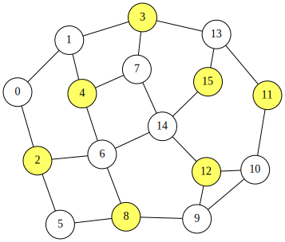

<div class="lang-en" markdown="1">
# QUBO++ Simple Graph Drawing Library and Solving the Maximum Independent Set (MIS) Problem

## QUBO++ Simple Graph Drawing Library
QUBO++ bundles a simple graph drawing library to visualize results obtained from graph-theoretic problems.
It is a wrapper around Graphviz, which you can install on Ubuntu as follows:

```bash
sudo apt install graphviz
```

To use this library, include `qbpp/graph.hpp`:
```cpp
#include <qbpp/graph.hpp>
```

The library generates DOT input and invokes `neato` to render graphs.

> **WARNING**: This header-only library is intended for visualizing results produced by QUBO++ sample programs.
> Its API and behavior may change without notice, and it should not be used in mission-critical applications.

## Maximum Independent Set (MIS) Problem

An independent set of an undirected graph $G=(V,E)$ is a subset of vertices $S\subseteq V$ such that no two vertices in $S$ are connected by an edge in $E$.
The Maximum Independent Set (MIS) problem asks for an independent set with maximum cardinality.

The MIS problem can be formulated as a QUBO as follows.
Assume that $G$ has $n$ vertices indexed from $0$ to $n-1$.
We introduce $n$ binary variables $x_i$ $(0\le i\le n-1)$, where $x_i=1$ if and only if vertex $i$ is included in $S$.
Since we want to maximize $|S|=\sum_{i=0}^{n-1}x_i$, we minimize the following objective:

$$
\begin{aligned}
\text{objective} = -\sum_{i=0}^{n-1} x_i .
\end{aligned}
$$

To enforce independence, for every edge $(i,j)\in E$ we must not select both endpoints simultaneously.
This can be penalized by

$$
\begin{aligned}
\text{constraint} = \sum_{(i,j)\in E} x_i x_j .
\end{aligned}
$$

Combining the objective and the penalty yields the QUBO function

$$
\begin{aligned}
f = \text{objective} + 2\times\text{constraint}.
\end{aligned}
$$

The penalty coefficient $2$ is sufficient to prioritize feasibility over increasing the set size.

## QUBO++ Program for the MIS Problem
Based on the QUBO formulation of the MIS problem described above, the following QUBO++ program solves an instance with 16 nodes. The edges are stored in `edges`, and the obtained solution is visualized using the QUBO++ graph drawing library:
```cpp
#define MAXDEG 2
#include <qbpp/qbpp.hpp>
#include <qbpp/exhaustive_solver.hpp>
#include <qbpp/graph.hpp>

int main() {
  const size_t N = 16;
  std::vector<std::pair<size_t, size_t>> edges = {
      {0, 1},   {0, 2},   {1, 3},   {1, 4},   {2, 5},  {2, 6},
      {3, 7},   {3, 13},  {4, 6},   {4, 7},   {5, 8},  {6, 8},
      {6, 14},  {7, 14},  {8, 9},   {9, 10},  {9, 12}, {10, 11},
      {10, 12}, {11, 13}, {12, 14}, {13, 15}, {14, 15}};

  auto x = qbpp::var("x", N);

  auto objective = -qbpp::sum(x);
  auto constraint = qbpp::toExpr(0);
  for (const auto& e : edges) {
    constraint += x[e.first] * x[e.second];
  }
  auto f = objective + constraint * 2;
  f.simplify_as_binary();

  auto solver = qbpp::exhaustive_solver::ExhaustiveSolver(f);
  auto sol = solver.search();

  std::cout << "objective = " << objective(sol) << std::endl;
  std::cout << "constraint = " << constraint(sol) << std::endl;

  qbpp::graph::GraphDrawer graph;
  for (size_t i = 0; i < N; ++i) {
    graph.add_node(qbpp::graph::Node(i).color(sol(x[i])));
  }
  for (const auto& e : edges) {
    graph.add_edge(qbpp::graph::Edge(e.first, e.second));
  }
  graph.write("mis.svg");
}
```
For a vector `x` of `N = 16` binary variables, the expressions `objective`, `constraint`, and `f` are constructed according to the above QUBO formulation.
The Exhaustive Solver is then used to find an optimal solution for `f`, which is stored in `sol`. The values of `objective` and `constraint` evaluated at `sol` are printed.

A `qbpp::graph::GraphDrawer` object, `graph`, is created next. In the loop over `i`, a `qbpp::graph::Node` object is created with label `i`, and its color is set to 0 or 1 depending on the value of `x[i]` in `sol` via the `color()` member function. Each node is added to graph using `add_node()`.

Similarly, in the loop over edges, an `qbpp::graph::Edge(e.first, e.second)` object is created for each edge and added to graph using `add_edge()`. Finally, `graph.write("mis.svg")` renders the graph and writes the resulting image to `mis.svg`.

This program produces the following output:
```
objective = -7
constraint = 0
```
This implies that the obtained solution selects 7 nodes and satisfies all constraints. The rendered image is saved as `mis.svg`:

<p align="center">
  
</p>

## API of the QUBO++ Simple Graph Drawing Library
The QUBO++ Simple Graph Drawing Library provides the following classes:
- **`qbpp::graph::Node`**:
Stores node information such as the label, color, pen width, and position.
- **`qbpp::graph::Edge`**:
Stores edge information such as the two endpoint nodes, whether the edge is directed or undirected, its color, and pen width.
- **`qbpp::graph::GraphDrawing`**:
Stores vectors of `qbpp::graph::Node` and `qbpp::graph::Edge` that together constitute a graph.

### `qbpp::graph::Node`
- **`Node(std::string s)`**:
Constructs a node whose label is s.
- **`Node(size_t i)`**
Constructs a node whose label is `std::to_string(i)`.
- **`color(std::string s)`**
Sets the node color to s, which must be in the form `#RRGGBB`.
- **`color(int i)`**:
Sets the node color to the `i`-th entry in the color palette. The default color 0 is white.
- **`penwidth(float f)`**:
Sets the pen width to `f` for drawing the node outline.
- **`position(float x, float y)`**:
Sets the node position to `(x, y)`.

### `qbpp::graph::Edge`
The following constructors and member functions are supported:
- **`Edge(std::string from, std::string to)`**:
Constructs an edge connecting the nodes labeled from and to.
- **`Edge(size_t from, size_t to)`**;
Constructs an edge connecting the node labeled `std::to_string(from)` to the node labeled `std::to_string(to)`.
- **`directed()`**:
Configures the edge as directed.
- **`color(std::string s)`**:
Sets the edge color to `s`, which must be in the form `#RRGGBB`.
- **`color(int i)`**:
Sets the edge color to the i-th entry in the color palette. The default color 0 is black.
- **`penwidth(float f)`**:
Sets the pen width to `f` for drawing the edge.

### `qbpp::graph::GraphDrawing`
The following member functions are supported:
- **`add_node(const Node& node)`**:
Appends node to the graph.
- **`add_edge(const Edge& edge)`**:
Appends edge to the graph.
- **`write(std::string file_name)`**:
Renders the graph and writes it to `file_name`.
Supported formats include `svg`, `png`, `jpg`, and `pdf` (via Graphviz).
The output format is determined by the file extension.
</div>

<div class="lang-ja" markdown="1">
# QUBO++ 簡易グラフ描画ライブラリと最大独立集合 (MIS) 問題の求解

## QUBO++ 簡易グラフ描画ライブラリ
QUBO++ には、グラフ理論的問題から得られた結果を可視化するための簡易グラフ描画ライブラリが付属しています。
これは Graphviz のラッパーであり、Ubuntu では以下のようにインストールできます：

```bash
sudo apt install graphviz
```

このライブラリを使用するには、`qbpp/graph.hpp` をインクルードします：
```cpp
#include <qbpp/graph.hpp>
```

このライブラリは DOT 入力を生成し、`neato` を呼び出してグラフを描画します。

> **警告**: このヘッダオンリーライブラリは、QUBO++ サンプルプログラムで得られた結果の可視化を目的としています。
> API や動作は予告なく変更される可能性があり、ミッションクリティカルなアプリケーションでの使用は推奨しません。

## 最大独立集合 (MIS) 問題

無向グラフ $G=(V,E)$ の独立集合とは、$S$ 内のどの2頂点も $E$ の辺で結ばれていないような頂点部分集合 $S\subseteq V$ のことです。
最大独立集合 (MIS) 問題は、最大の要素数を持つ独立集合を求める問題です。

MIS 問題は以下のように QUBO として定式化できます。
$G$ が $0$ から $n-1$ までの番号が付けられた $n$ 個の頂点を持つとします。
$n$ 個のバイナリ変数 $x_i$ $(0\le i\le n-1)$ を導入し、$x_i=1$ は頂点 $i$ が $S$ に含まれることを表します。
$|S|=\sum_{i=0}^{n-1}x_i$ を最大化したいので、以下の目的関数を最小化します：

$$
\begin{aligned}
\text{objective} = -\sum_{i=0}^{n-1} x_i .
\end{aligned}
$$

独立性を保証するために、すべての辺 $(i,j)\in E$ について両端点を同時に選択してはなりません。
これは以下のペナルティで表現できます：

$$
\begin{aligned}
\text{constraint} = \sum_{(i,j)\in E} x_i x_j .
\end{aligned}
$$

目的関数とペナルティを組み合わせると、以下の QUBO 関数が得られます：

$$
\begin{aligned}
f = \text{objective} + 2\times\text{constraint}.
\end{aligned}
$$

ペナルティ係数 $2$ は、集合サイズの増加よりも実行可能性を優先するのに十分な値です。

## MIS 問題の QUBO++ プログラム
上記の MIS 問題の QUBO 定式化に基づき、以下の QUBO++ プログラムは 16 ノードのインスタンスを解きます。辺は `edges` に格納され、得られた解は QUBO++ グラフ描画ライブラリを用いて可視化されます：
```cpp
#define MAXDEG 2
#include <qbpp/qbpp.hpp>
#include <qbpp/exhaustive_solver.hpp>
#include <qbpp/graph.hpp>

int main() {
  const size_t N = 16;
  std::vector<std::pair<size_t, size_t>> edges = {
      {0, 1},   {0, 2},   {1, 3},   {1, 4},   {2, 5},  {2, 6},
      {3, 7},   {3, 13},  {4, 6},   {4, 7},   {5, 8},  {6, 8},
      {6, 14},  {7, 14},  {8, 9},   {9, 10},  {9, 12}, {10, 11},
      {10, 12}, {11, 13}, {12, 14}, {13, 15}, {14, 15}};

  auto x = qbpp::var("x", N);

  auto objective = -qbpp::sum(x);
  auto constraint = qbpp::toExpr(0);
  for (const auto& e : edges) {
    constraint += x[e.first] * x[e.second];
  }
  auto f = objective + constraint * 2;
  f.simplify_as_binary();

  auto solver = qbpp::exhaustive_solver::ExhaustiveSolver(f);
  auto sol = solver.search();

  std::cout << "objective = " << objective(sol) << std::endl;
  std::cout << "constraint = " << constraint(sol) << std::endl;

  qbpp::graph::GraphDrawer graph;
  for (size_t i = 0; i < N; ++i) {
    graph.add_node(qbpp::graph::Node(i).color(sol(x[i])));
  }
  for (const auto& e : edges) {
    graph.add_edge(qbpp::graph::Edge(e.first, e.second));
  }
  graph.write("mis.svg");
}
```
`N = 16` 個のバイナリ変数のベクトル `x` に対して、上記の QUBO 定式化に従って式 `objective`、`constraint`、`f` を構築します。
Exhaustive Solver を用いて `f` の最適解を求め、`sol` に格納します。`sol` における `objective` と `constraint` の値が出力されます。

次に、`qbpp::graph::GraphDrawer` オブジェクト `graph` を作成します。`i` のループでは、ラベル `i` を持つ `qbpp::graph::Node` オブジェクトが作成され、`color()` メンバ関数により `sol` における `x[i]` の値に応じて色が 0 または 1 に設定されます。各ノードは `add_node()` を使って graph に追加されます。

同様に、辺のループでは、各辺に対して `qbpp::graph::Edge(e.first, e.second)` オブジェクトが作成され、`add_edge()` を使って graph に追加されます。最後に、`graph.write("mis.svg")` がグラフを描画し、結果の画像を `mis.svg` に書き出します。

このプログラムの出力は以下の通りです：
```
objective = -7
constraint = 0
```
これは、得られた解が 7 個のノードを選択し、すべての制約を満たしていることを意味します。描画された画像は `mis.svg` として保存されます：

<p align="center">
  
</p>

## QUBO++ 簡易グラフ描画ライブラリの API
QUBO++ 簡易グラフ描画ライブラリは以下のクラスを提供します：
- **`qbpp::graph::Node`**:
ラベル、色、線幅、位置などのノード情報を格納します。
- **`qbpp::graph::Edge`**:
2つの端点ノード、有向・無向の区別、色、線幅などの辺情報を格納します。
- **`qbpp::graph::GraphDrawing`**:
グラフを構成する `qbpp::graph::Node` と `qbpp::graph::Edge` のベクトルを格納します。

### `qbpp::graph::Node`
- **`Node(std::string s)`**:
ラベルが s であるノードを構築します。
- **`Node(size_t i)`**
ラベルが `std::to_string(i)` であるノードを構築します。
- **`color(std::string s)`**
ノードの色を s に設定します。`#RRGGBB` の形式である必要があります。
- **`color(int i)`**:
ノードの色をカラーパレットの `i` 番目のエントリに設定します。デフォルトの色 0 は白です。
- **`penwidth(float f)`**:
ノードの輪郭を描画する線幅を `f` に設定します。
- **`position(float x, float y)`**:
ノードの位置を `(x, y)` に設定します。

### `qbpp::graph::Edge`
以下のコンストラクタとメンバ関数がサポートされています：
- **`Edge(std::string from, std::string to)`**:
ラベルが from と to であるノードを結ぶ辺を構築します。
- **`Edge(size_t from, size_t to)`**;
ラベルが `std::to_string(from)` であるノードとラベルが `std::to_string(to)` であるノードを結ぶ辺を構築します。
- **`directed()`**:
辺を有向辺として設定します。
- **`color(std::string s)`**:
辺の色を `s` に設定します。`#RRGGBB` の形式である必要があります。
- **`color(int i)`**:
辺の色をカラーパレットの i 番目のエントリに設定します。デフォルトの色 0 は黒です。
- **`penwidth(float f)`**:
辺を描画する線幅を `f` に設定します。

### `qbpp::graph::GraphDrawing`
以下のメンバ関数がサポートされています：
- **`add_node(const Node& node)`**:
ノードをグラフに追加します。
- **`add_edge(const Edge& edge)`**:
辺をグラフに追加します。
- **`write(std::string file_name)`**:
グラフを描画し、`file_name` に書き出します。
対応フォーマットは `svg`、`png`、`jpg`、`pdf`（Graphviz 経由）です。
出力フォーマットはファイルの拡張子によって決定されます。
</div>
