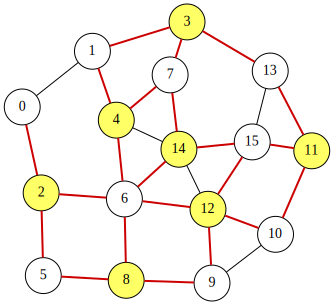

<div class="lang-en" markdown="1">
# Max-Cut Problem

Given an undirected graph $G=(V,E)$, the **Max-Cut** problem aims to partition the node set $V$ into two disjoint subsets $S$ and $\overline{S}$ so that the number of edges in $E$ that have one endpoint in $S$ and the other in $\overline{S}$ is **maximized**.

Assume that the nodes are labeled $0,1,\ldots,n-1$.
We introduce $n$ binary variables $x_0, x_1, \ldots, x_{n-1}$, where
$x_i=1$ if and only if node $i$ belongs to $S$ ($0\le i\le n-1$).
Then, the number of edges crossing the cut $(S,\overline{S})$ is given by

$$
\begin{aligned}
\text{objective} &= \sum_{(i,j)\in E}\Bigl(x_i\bar{x}_j + \bar{x}_ix_j\Bigr).
\end{aligned}
$$

Since the QUBO problems aims to **minimize** an objective function, we obtain a QUBO expression $f$ by **negating** the objective:

$$
\begin{aligned}
f &= -\,\text{objective}.
\end{aligned}
$$

An optimal assignment minimizing $f$ corresponds to a maximum cut of $G$.
Moreover, the value of $\text{objective}$ equals the number of edges crossing between $S$ and $\overline{S}$.

## QUBO++ program for the MAX-CUT problem
Based on the formulation above, the following QUBO++ program constructs the QUBO expression $f$ for a 16-node graph and solves it using the Exhaustive Solver:

```cpp
#define MAXDEG 2
#include <qbpp/qbpp.hpp>
#include <qbpp/exhaustive_solver.hpp>
#include <qbpp/graph.hpp>

int main() {
  const size_t N = 16;
  std::vector<std::pair<size_t, size_t>> edges = {
      {0, 1},   {0, 2},   {1, 3},   {1, 4},   {2, 5},   {2, 6},   {3, 7},
      {3, 13},  {4, 6},   {4, 7},   {4, 14},  {5, 8},   {6, 8},   {6, 12},
      {6, 14},  {7, 14},  {8, 9},   {9, 10},  {9, 12},  {10, 11}, {10, 12},
      {11, 13}, {11, 15}, {12, 14}, {12, 15}, {13, 15}, {14, 15}};

  auto x = qbpp::var("x", N);

  auto objective = qbpp::toExpr(0);
  for (const auto& edge : edges) {
    objective += x[edge.first] * ~x[edge.second] +
                 ~x[edge.first] * x[edge.second];
  }

  auto f = -objective;
  f.simplify_as_binary();

  auto solver = qbpp::exhaustive_solver::ExhaustiveSolver(f);
  auto sol = solver.search();

  std::cout << "objective = " << objective(sol) << std::endl;
  qbpp::graph::GraphDrawer graph;
  for (size_t i = 0; i < N; ++i) {
    graph.add_node(qbpp::graph::Node(i).color(sol(x[i])));
  }
  for (const auto& e : edges) {
    auto edge = qbpp::graph::Edge(e.first, e.second);
    if (sol(x[e.first]) != sol(x[e.second])) {
      edge.color(1).penwidth(2.0);
    }
    graph.add_edge(edge);
  }
  graph.write("maxcut.svg");
}
```
This program creates the expressions `objective` and `f`, where `f` is the negation of `objective`.
The Exhaustive Solver minimizes `f`, and an optimal assignment is stored in `sol`.

To visualize the solution, a `GraphDrawer` object `graph` is created and populated with nodes and edges.
In this visualization, nodes $i$ in S (i.e., those with $x_i=1$) are colored, and edges crossing the cut are highlighted.

This program prints the following output:
```
objective = 22
```
The resulting graph is rendered and stored in the file `maxcut.svg`:

<p align="center">
  
</p>
</div>

<div class="lang-ja" markdown="1">
# 最大カット問題

無向グラフ $G=(V,E)$ が与えられたとき、**最大カット**問題は、ノード集合 $V$ を2つの互いに素な部分集合 $S$ と $\overline{S}$ に分割し、一方の端点が $S$ に、他方の端点が $\overline{S}$ にある $E$ の辺の数を**最大化**することを目的とします。

ノードに $0,1,\ldots,n-1$ のラベルが付いているとします。
$n$ 個のバイナリ変数 $x_0, x_1, \ldots, x_{n-1}$ を導入し、$x_i=1$ はノード $i$ が $S$ に属することを表します ($0\le i\le n-1$)。
すると、カット $(S,\overline{S})$ を横断する辺の数は以下で与えられます：

$$
\begin{aligned}
\text{objective} &= \sum_{(i,j)\in E}\Bigl(x_i\bar{x}_j + \bar{x}_ix_j\Bigr).
\end{aligned}
$$

QUBO 問題は目的関数を**最小化**するため、目的関数を**符号反転**して QUBO 式 $f$ を得ます：

$$
\begin{aligned}
f &= -\,\text{objective}.
\end{aligned}
$$

$f$ を最小化する最適な割り当ては $G$ の最大カットに対応します。
また、$\text{objective}$ の値は $S$ と $\overline{S}$ の間を横断する辺の数に等しくなります。

## 最大カット問題の QUBO++ プログラム
上記の定式化に基づき、以下の QUBO++ プログラムは 16 ノードのグラフに対する QUBO 式 $f$ を構築し、Exhaustive Solver を用いて解きます：

```cpp
#define MAXDEG 2
#include <qbpp/qbpp.hpp>
#include <qbpp/exhaustive_solver.hpp>
#include <qbpp/graph.hpp>

int main() {
  const size_t N = 16;
  std::vector<std::pair<size_t, size_t>> edges = {
      {0, 1},   {0, 2},   {1, 3},   {1, 4},   {2, 5},   {2, 6},   {3, 7},
      {3, 13},  {4, 6},   {4, 7},   {4, 14},  {5, 8},   {6, 8},   {6, 12},
      {6, 14},  {7, 14},  {8, 9},   {9, 10},  {9, 12},  {10, 11}, {10, 12},
      {11, 13}, {11, 15}, {12, 14}, {12, 15}, {13, 15}, {14, 15}};

  auto x = qbpp::var("x", N);

  auto objective = qbpp::toExpr(0);
  for (const auto& edge : edges) {
    objective += x[edge.first] * ~x[edge.second] +
                 ~x[edge.first] * x[edge.second];
  }

  auto f = -objective;
  f.simplify_as_binary();

  auto solver = qbpp::exhaustive_solver::ExhaustiveSolver(f);
  auto sol = solver.search();

  std::cout << "objective = " << objective(sol) << std::endl;
  qbpp::graph::GraphDrawer graph;
  for (size_t i = 0; i < N; ++i) {
    graph.add_node(qbpp::graph::Node(i).color(sol(x[i])));
  }
  for (const auto& e : edges) {
    auto edge = qbpp::graph::Edge(e.first, e.second);
    if (sol(x[e.first]) != sol(x[e.second])) {
      edge.color(1).penwidth(2.0);
    }
    graph.add_edge(edge);
  }
  graph.write("maxcut.svg");
}
```
このプログラムは式 `objective` と `f` を作成します。`f` は `objective` の符号反転です。
Exhaustive Solver が `f` を最小化し、最適な割り当てが `sol` に格納されます。

解を可視化するために、`GraphDrawer` オブジェクト `graph` を作成し、ノードと辺を追加します。
この可視化では、$S$ に属するノード $i$（つまり $x_i=1$ のノード）が着色され、カットを横断する辺が強調表示されます。

このプログラムの出力は以下の通りです：
```
objective = 22
```
結果のグラフは描画され、ファイル `maxcut.svg` に保存されます：

<p align="center">
  
</p>
</div>
