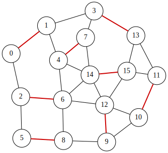

<div class="lang-en" markdown="1">
# Maximum Matching Problem

A **matching** in an undirected graph is a set of edges such that no two edges share a common node.
Given an undirected graph $G=(V,E)$, the **Maximum Matching** problem aims to find a matching $S \subseteq E$ that contains the maximum number of edges.

Assume that the graph has $n$ vertices and $m$ edges, and that the edges are labeled $0,1,\ldots,m-1$.
We introduce $m$ binary variables $x_0, x_1, \ldots, x_{m-1}$, where
$x_i=1$ if and only if edge $i$ is selected (i.e., belongs to $S$) ($0\le i\le m-1$).
The objective is to maximize the number of selected edges:

$$
\begin{aligned}
\text{objective} &= \sum_{i=0}^{m-1} x_i .
\end{aligned}
$$

To enforce the matching condition, we penalize any pair of selected edges that share a node.
Let $\mathcal{P}$ be the set of unordered pairs $(e_1,e_2)$ of distinct edges that share a common endpoint.
Then the following penalty takes value $0$ if and only if the selected edges form a matching:

$$
\begin{aligned}
\text{constraint} &= \sum_{\{e_1,e_2\}\in \mathcal{P}} x_{e_1}x_{e_2}.
\end{aligned}
$$

We construct a QUBO expression $f$ by combining the objective and the penalty as follows:

$$
\begin{aligned}
f &= -\text{objective} + 2 \times \text{constraint}.
\end{aligned}
$$

Here, the penalty term is multiplied by 2 to ensure that violating the matching constraint is more costly than increasing the objective.
An assignment minimizing $f$ therefore corresponds to a maximum matching of $G$.

## QUBO++ program for the maximum matching
Based on the formulation above, the following QUBO++ program constructs the QUBO expression $f$ for a 16-node graph and solves it using the **Exhaustive Solver**

```cpp
#define MAXDEG 2
#include <qbpp/qbpp.hpp>
#include <qbpp/exhaustive_solver.hpp>
#include <qbpp/graph.hpp>

int main() {
  const size_t N = 16;
  std::vector<std::pair<size_t, size_t>> edges = {
      {0, 1},   {0, 2},   {1, 3},   {1, 4},   {2, 5},   {2, 6},   {3, 7},
      {3, 13},  {4, 6},   {4, 7},   {4, 14},  {5, 8},   {6, 8},   {6, 12},
      {6, 14},  {7, 14},  {8, 9},   {9, 10},  {9, 12},  {10, 11}, {10, 12},
      {11, 13}, {11, 15}, {12, 14}, {12, 15}, {13, 15}, {14, 15}};
  const size_t M = edges.size();

  auto x = qbpp::var("x", M);

  auto objective = qbpp::sum(x);

  auto constraint = qbpp::toExpr(0);
  for (size_t i = 0; i < M; ++i) {
    for (size_t j = i + 1; j < M; ++j) {
      if (edges[i].first == edges[j].first ||
          edges[i].first == edges[j].second ||
          edges[i].second == edges[j].first ||
          edges[i].second == edges[j].second) {
        constraint += x[i] * x[j];
      }
    }
  }

  auto f = -objective + 2 * constraint;
  f.simplify_as_binary();

  auto solver = qbpp::exhaustive_solver::ExhaustiveSolver(f);
  auto sol = solver.search();

  std::cout << "objective = " << objective(sol) << std::endl;
  qbpp::graph::GraphDrawer graph;
  for (size_t i = 0; i < N; ++i) {
    graph.add_node(qbpp::graph::Node(i));
  }
  for (size_t i = 0; i < M; ++i) {
    auto edge = qbpp::graph::Edge(edges[i].first, edges[i].second);
    if (sol(x[i])) {
      edge.color(1).penwidth(2.0);
    }
    graph.add_edge(edge);
  }
  graph.write("maxmatching.svg");
}
```
This program creates the expressions `objective`, `constraint`, and `f`, where `f` is the negated `objective` plus a penalty term.
The Exhaustive Solver minimizes `f`, and an optimal assignment is stored in `sol`.

To visualize the solution, a `GraphDrawer` object `graph` is created and populated with nodes and edges.
In this visualization, selected edges in $S$ (i.e., edges $i$ with $x_i=1$) are highlighted.

The resulting graph is rendered and stored in the file `maxmatching.svg`:

<p align="center">
  
</p>
</div>

<div class="lang-ja" markdown="1">
# 最大マッチング問題

無向グラフにおける**マッチング**とは、どの2つの辺も共通のノードを持たないような辺の集合です。
無向グラフ $G=(V,E)$ が与えられたとき、**最大マッチング**問題は、辺の数が最大となるマッチング $S \subseteq E$ を求めることを目的とします。

グラフが $n$ 個の頂点と $m$ 本の辺を持ち、辺に $0,1,\ldots,m-1$ のラベルが付いているとします。
$m$ 個のバイナリ変数 $x_0, x_1, \ldots, x_{m-1}$ を導入し、$x_i=1$ は辺 $i$ が選択されている（つまり $S$ に属する）ことを表します ($0\le i\le m-1$)。
目的は、選択された辺の数を最大化することです：

$$
\begin{aligned}
\text{objective} &= \sum_{i=0}^{m-1} x_i .
\end{aligned}
$$

マッチング条件を強制するために、共通のノードを持つ選択された辺のペアにペナルティを課します。
$\mathcal{P}$ を、共通の端点を持つ異なる辺の順序なしペア $(e_1,e_2)$ の集合とします。
すると、以下のペナルティは、選択された辺がマッチングを形成する場合にのみ値 $0$ をとります：

$$
\begin{aligned}
\text{constraint} &= \sum_{\{e_1,e_2\}\in \mathcal{P}} x_{e_1}x_{e_2}.
\end{aligned}
$$

目的関数とペナルティを組み合わせて QUBO 式 $f$ を構築します：

$$
\begin{aligned}
f &= -\text{objective} + 2 \times \text{constraint}.
\end{aligned}
$$

ここで、ペナルティ項に 2 を掛けることで、マッチング制約の違反が目的関数の増加よりもコストが高くなるようにしています。
$f$ を最小化する割り当ては、$G$ の最大マッチングに対応します。

## 最大マッチングの QUBO++ プログラム
上記の定式化に基づき、以下の QUBO++ プログラムは 16 ノードのグラフに対する QUBO 式 $f$ を構築し、**Exhaustive Solver** を用いて解きます。

```cpp
#define MAXDEG 2
#include <qbpp/qbpp.hpp>
#include <qbpp/exhaustive_solver.hpp>
#include <qbpp/graph.hpp>

int main() {
  const size_t N = 16;
  std::vector<std::pair<size_t, size_t>> edges = {
      {0, 1},   {0, 2},   {1, 3},   {1, 4},   {2, 5},   {2, 6},   {3, 7},
      {3, 13},  {4, 6},   {4, 7},   {4, 14},  {5, 8},   {6, 8},   {6, 12},
      {6, 14},  {7, 14},  {8, 9},   {9, 10},  {9, 12},  {10, 11}, {10, 12},
      {11, 13}, {11, 15}, {12, 14}, {12, 15}, {13, 15}, {14, 15}};
  const size_t M = edges.size();

  auto x = qbpp::var("x", M);

  auto objective = qbpp::sum(x);

  auto constraint = qbpp::toExpr(0);
  for (size_t i = 0; i < M; ++i) {
    for (size_t j = i + 1; j < M; ++j) {
      if (edges[i].first == edges[j].first ||
          edges[i].first == edges[j].second ||
          edges[i].second == edges[j].first ||
          edges[i].second == edges[j].second) {
        constraint += x[i] * x[j];
      }
    }
  }

  auto f = -objective + 2 * constraint;
  f.simplify_as_binary();

  auto solver = qbpp::exhaustive_solver::ExhaustiveSolver(f);
  auto sol = solver.search();

  std::cout << "objective = " << objective(sol) << std::endl;
  qbpp::graph::GraphDrawer graph;
  for (size_t i = 0; i < N; ++i) {
    graph.add_node(qbpp::graph::Node(i));
  }
  for (size_t i = 0; i < M; ++i) {
    auto edge = qbpp::graph::Edge(edges[i].first, edges[i].second);
    if (sol(x[i])) {
      edge.color(1).penwidth(2.0);
    }
    graph.add_edge(edge);
  }
  graph.write("maxmatching.svg");
}
```
このプログラムは式 `objective`、`constraint`、`f` を作成します。`f` は `objective` の符号反転にペナルティ項を加えたものです。
Exhaustive Solver が `f` を最小化し、最適な割り当てが `sol` に格納されます。

解を可視化するために、`GraphDrawer` オブジェクト `graph` を作成し、ノードと辺を追加します。
この可視化では、$S$ に属する選択された辺（つまり $x_i=1$ の辺 $i$）が強調表示されます。

結果のグラフは描画され、ファイル `maxmatching.svg` に保存されます：

<p align="center">
  
</p>
</div>
