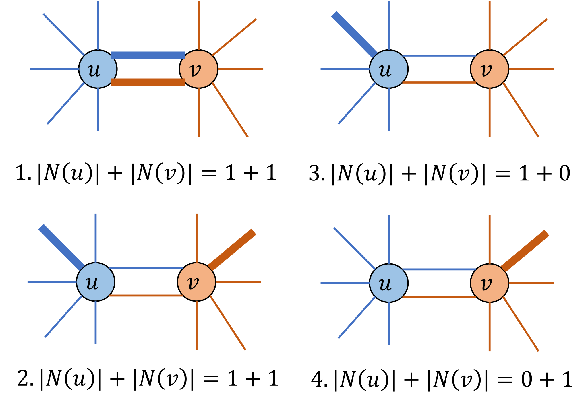
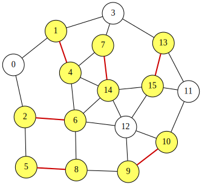

<div class="lang-en" markdown="1">

# Minimum Maximal Matching Problem

A **matching** in an undirected graph is a set of edges such that no two edges share a common endpoint.
A **maximal matching** is a matching to which no additional edge can be added without violating the matching condition.
Given an undirected graph $G=(V,E)$, the minimum maximal matching problem asks for a maximal matching $S \subseteq E$ with the minimum number of edges.

The maximality condition of a matching can be described in a compact way.
For a node $u\in V$, let $N(u)$ denote the set of edges in $S$ incident to $u$.
Then $S$ is a maximal matching if and only if, for every edge $(u,v)\in E$, the following condition holds:

$$
 1 \leq |N(u)|+|N(v)| \leq 2
$$

This condition is satisfied if and only if $S$ constitute a maximal matching. To ensure that $S$ is a maximal matching, the following cases cover all possibilities:

<p align="center">
  
</p>

We can formulate the minimum maximal matching problem as finding a subset $S$ that satisfies the above condition and has minimum cardinality.

For a formal proof, see the following paper:


> **Reference**:
> Nakahara, Y., Tsukiyama, S., Nakano, K., Parque, V., & Ito, Y. (2025). **A penalty-free QUBO formulation for the minimum maximal matching problem**. International Journal of Parallel, Emergent and Distributed Systems, 1–19. https://doi.org/10.1080/17445760.2025.2579546


# QUBO formuation for the minimum maximal matching
Assume that the graph has $n$ vertices and $m$ edges, and that the edges are labeled $0,1,\ldots,m-1$.
We introduce $m$ binary variables $x_0, x_1, \ldots, x_{m-1}$, where $x_i=1$ if and only if edge $i$ is selected (i.e., belongs to $S$).
The objective is to minimize the number of selected edges:

$$
\begin{aligned}
\text{objective} &= \sum_{i=0}^{m-1} x_i .
\end{aligned}
$$

To enforce the maximality condition, we use the following constraint:

$$
\begin{aligned}
\text{constraint} &= \sum_{(u,v)\in E} (1 \leq |N(u)|+|N(v)| \leq 2)
\end{aligned}
$$

We construct a QUBO expression $f$ by combining the objective and the constraint as follows:

$$
\begin{aligned}
f &= \text{objective} + \text{constraint}.
\end{aligned}
$$

## QUBO++ program
The following QUBO++ program finds a minimum maximal matching of a fixed undirected graph with $N=16$ nodes and $M=27$ edges:
```cpp
#define MAXDEG 2
#include <qbpp/qbpp.hpp>
#include <qbpp/exhaustive_solver.hpp>
#include <qbpp/graph.hpp>

int main() {
  const size_t N = 16;
  std::vector<std::pair<size_t, size_t>> edges = {
      {0, 1},   {0, 2},   {1, 3},   {1, 4},   {2, 5},   {2, 6},   {3, 7},
      {3, 13},  {4, 6},   {4, 7},   {4, 14},  {5, 8},   {6, 8},   {6, 12},
      {6, 14},  {7, 14},  {8, 9},   {9, 10},  {9, 12},  {10, 11}, {10, 12},
      {11, 13}, {11, 15}, {12, 14}, {12, 15}, {13, 15}, {14, 15}};
  const size_t M = edges.size();

  std::vector<std::vector<size_t>> adj(N);
  for (size_t i = 0; i < M; ++i) {
    const auto& edge = edges[i];
    adj[edge.first].push_back(i);
    adj[edge.second].push_back(i);
  }

  auto x = qbpp::var("x", M);

  auto objective = qbpp::sum(x);

  auto constraint = qbpp::toExpr(0);
  for (const auto& e : edges) {
    auto u = e.first;
    auto v = e.second;
    auto t = qbpp::toExpr(0);
    for (const auto idx : adj[u]) {
      t += x[idx];
    }
    for (const auto idx : adj[v]) {
      t += x[idx];
    }
    constraint += 1 <= t <= 2;
  }

  auto f = objective + constraint;

  f.simplify_as_binary();
  auto solver = qbpp::exhaustive_solver::ExhaustiveSolver(f);
  auto sol = solver.search();

  std::cout << "objective = " << objective(sol) << std::endl;
  std::cout << "constraint = " << constraint(sol) << std::endl;

  qbpp::graph::GraphDrawer graph;
  std::vector<int> selected_nodes(N);
  for (size_t i = 0; i < M; ++i) {
    if (sol(x[i])) {
      selected_nodes[edges[i].first] = 1;
      selected_nodes[edges[i].second] = 1;
    }
  }
  for (size_t i = 0; i < N; ++i) {
    graph.add_node(qbpp::graph::Node(i).color(selected_nodes[i]));
  }
  for (size_t i = 0; i < M; ++i) {
    auto edge = qbpp::graph::Edge(edges[i].first, edges[i].second);
    if (sol(x[i])) {
      edge.color(1).penwidth(2.0);
    }
    graph.add_edge(edge);
  }
  graph.write("minmaxmatching.svg");
}
```
We first define a vector `x` of `M` binary variables, and then define `objective`, `constraint`, and `f` based on the formulation above.
The Exhaustive Solver is used to find an optimal solution of `f`.
The values of objective and constraint are printed, and the resulting graph is saved to `minmaxmatching.svg`.

This program produces the following output:
```
objective = 6
constraint = 0
```
Thus, $S$ contains 6 edges.
The resulting graph stored in `minmaxmatching.svg` is shown below:
<p align="center">
  
</p>
In this graph, the selected edges in $S$ and all nodes incident to these edges are highlighted.
We can see that no more edge can be added, and the maximality condition is satisfied.

</div>

<div class="lang-ja" markdown="1">

# 最小極大マッチング問題

無向グラフにおける**マッチング**とは、どの2辺も共通の端点を持たない辺の集合です。
**極大マッチング**とは、マッチング条件を崩さずにこれ以上辺を追加できないマッチングのことです。
無向グラフ $G=(V,E)$ が与えられたとき、最小極大マッチング問題は、辺数が最小の極大マッチング $S \subseteq E$ を求める問題です。

マッチングの極大性条件は、次のようにコンパクトに記述できます。
頂点 $u\in V$ に対して、$N(u)$ を $u$ に接続する $S$ 中の辺の集合とします。
このとき、$S$ が極大マッチングであるための必要十分条件は、すべての辺 $(u,v)\in E$ に対して以下が成り立つことです:

$$
 1 \leq |N(u)|+|N(v)| \leq 2
$$

この条件は $S$ が極大マッチングを構成する場合にのみ満たされます。$S$ が極大マッチングであることを保証するために、以下のケースがすべての場合を網羅します:

<p align="center">
  
</p>

最小極大マッチング問題は、上記の条件を満たし、かつ要素数が最小の部分集合 $S$ を見つける問題として定式化できます。

厳密な証明については、以下の論文を参照してください:


> **参考文献**:
> Nakahara, Y., Tsukiyama, S., Nakano, K., Parque, V., & Ito, Y. (2025). **A penalty-free QUBO formulation for the minimum maximal matching problem**. International Journal of Parallel, Emergent and Distributed Systems, 1–19. https://doi.org/10.1080/17445760.2025.2579546


# 最小極大マッチングのQUBO定式化
グラフが $n$ 個の頂点と $m$ 本の辺を持ち、辺に $0,1,\ldots,m-1$ のラベルが付いているとします。
$m$ 個のバイナリ変数 $x_0, x_1, \ldots, x_{m-1}$ を導入し、$x_i=1$ は辺 $i$ が選択されている（すなわち $S$ に属する）場合とします。
目的関数は、選択された辺の数を最小化することです:

$$
\begin{aligned}
\text{objective} &= \sum_{i=0}^{m-1} x_i .
\end{aligned}
$$

極大性条件を課すために、以下の制約を使用します:

$$
\begin{aligned}
\text{constraint} &= \sum_{(u,v)\in E} (1 \leq |N(u)|+|N(v)| \leq 2)
\end{aligned}
$$

目的関数と制約を組み合わせて、QUBO式 $f$ を次のように構成します:

$$
\begin{aligned}
f &= \text{objective} + \text{constraint}.
\end{aligned}
$$

## QUBO++プログラム
以下のQUBO++プログラムは、$N=16$ 頂点、$M=27$ 辺の固定された無向グラフの最小極大マッチングを求めます:
```cpp
#define MAXDEG 2
#include <qbpp/qbpp.hpp>
#include <qbpp/exhaustive_solver.hpp>
#include <qbpp/graph.hpp>

int main() {
  const size_t N = 16;
  std::vector<std::pair<size_t, size_t>> edges = {
      {0, 1},   {0, 2},   {1, 3},   {1, 4},   {2, 5},   {2, 6},   {3, 7},
      {3, 13},  {4, 6},   {4, 7},   {4, 14},  {5, 8},   {6, 8},   {6, 12},
      {6, 14},  {7, 14},  {8, 9},   {9, 10},  {9, 12},  {10, 11}, {10, 12},
      {11, 13}, {11, 15}, {12, 14}, {12, 15}, {13, 15}, {14, 15}};
  const size_t M = edges.size();

  std::vector<std::vector<size_t>> adj(N);
  for (size_t i = 0; i < M; ++i) {
    const auto& edge = edges[i];
    adj[edge.first].push_back(i);
    adj[edge.second].push_back(i);
  }

  auto x = qbpp::var("x", M);

  auto objective = qbpp::sum(x);

  auto constraint = qbpp::toExpr(0);
  for (const auto& e : edges) {
    auto u = e.first;
    auto v = e.second;
    auto t = qbpp::toExpr(0);
    for (const auto idx : adj[u]) {
      t += x[idx];
    }
    for (const auto idx : adj[v]) {
      t += x[idx];
    }
    constraint += 1 <= t <= 2;
  }

  auto f = objective + constraint;

  f.simplify_as_binary();
  auto solver = qbpp::exhaustive_solver::ExhaustiveSolver(f);
  auto sol = solver.search();

  std::cout << "objective = " << objective(sol) << std::endl;
  std::cout << "constraint = " << constraint(sol) << std::endl;

  qbpp::graph::GraphDrawer graph;
  std::vector<int> selected_nodes(N);
  for (size_t i = 0; i < M; ++i) {
    if (sol(x[i])) {
      selected_nodes[edges[i].first] = 1;
      selected_nodes[edges[i].second] = 1;
    }
  }
  for (size_t i = 0; i < N; ++i) {
    graph.add_node(qbpp::graph::Node(i).color(selected_nodes[i]));
  }
  for (size_t i = 0; i < M; ++i) {
    auto edge = qbpp::graph::Edge(edges[i].first, edges[i].second);
    if (sol(x[i])) {
      edge.color(1).penwidth(2.0);
    }
    graph.add_edge(edge);
  }
  graph.write("minmaxmatching.svg");
}
```
まず `M` 個のバイナリ変数のベクトル `x` を定義し、上記の定式化に基づいて `objective`、`constraint`、`f` を定義します。
Exhaustive Solver を使用して `f` の最適解を求めます。
目的関数値と制約値が出力され、結果のグラフが `minmaxmatching.svg` に保存されます。

このプログラムは以下の出力を生成します:
```
objective = 6
constraint = 0
```
したがって、$S$ は6本の辺を含みます。
`minmaxmatching.svg` に格納された結果のグラフを以下に示します:
<p align="center">
  
</p>
このグラフでは、$S$ 中の選択された辺と、それらの辺に接続するすべての頂点がハイライトされています。
これ以上辺を追加できないことが確認でき、極大性条件が満たされています。

</div>
