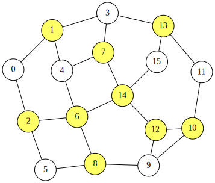

<div class="lang-en" markdown="1">

# Minimum Vertex Cover Problem
A **vertex cover** of an undirected graph $G=(V,E)$ is a subset
$S\subseteq V$ such that, for every edge $(u,v)\in E$, at least one of its endpoints belongs to $S$.
The **minimum vertex cover problem** is to find a vertex cover with minimum cardinality.

We can formulate this problem as a QUBO expression.
For an $n$-node graph $G=(V,E)$ whose nodes are labeled $0,1,\ldots,n−1$,
we introduce $n$ binary variables $x_0,x_1,\ldots, x_{n-1}$, where $x_i=1$ if and only if node
$i$ is selected (i.e., $i\in S$).

Using negated literals $\overline{x}_i$ (where $\overline{x}_i=1$ iff $x_i=0$),
we define the following penalty term, which becomes 0 if and only if every edge is covered:

$$
\begin{aligned}
\text{constraint} &= \sum_{(i,j)\in E} \overline{x}_i\,\overline{x}_j
\end{aligned}
$$

For an edge $(i,j)$, the product $\overline{x}_i\,\overline{x}_j$ equals 1 only when neither endpoint is selected, meaning the edge is uncovered. Therefore, the sum counts the number of uncovered edges.

Equivalently, since the condition $1\leq x_i+x_j\leq 2$ means that one or both endpoints are selected, we can write a QUBO++-style formulation as:

$$
\begin{aligned}
\text{constraint'} &= \sum_{(i,j)\in E} (1\leq x_i+x_j\leq 2)
\end{aligned}
$$

The objective is to minimize the number of selected vertices:

$$
\begin{aligned}
\text{objective} &= \sum_{i=0}^{n-1}x_i
\end{aligned}
$$

Finally, the QUBO expression $f$ is given by:

$$
\begin{aligned}
f &= \text{objective} + 2\times \text{constraint}, \text{or}\\
  &= \text{objective} + \text{constraint'}
\end{aligned}
$$

The penalty coefficient 2 is used to prioritize satisfying the constraint over minimizing the objective.

## QUBO++ program for the minimum vertex cover problem
The following QUBO++ program solves the minimum vertex cover problem for a graph with $N=16$ nodes:


```cpp
#define MAXDEG 2
#include <qbpp/qbpp.hpp>
#include <qbpp/exhaustive_solver.hpp>
#include <qbpp/graph.hpp>

int main() {
  const size_t N = 16;
  std::vector<std::pair<size_t, size_t>> edges = {
      {0, 1},   {0, 2},   {1, 3},   {1, 4},   {2, 5},  {2, 6},
      {3, 7},   {3, 13},  {4, 6},   {4, 7},   {5, 8},  {6, 8},
      {6, 14},  {7, 14},  {8, 9},   {9, 10},  {9, 12}, {10, 11},
      {10, 12}, {11, 13}, {12, 14}, {13, 15}, {14, 15}};

  auto x = qbpp::var("x", N);

  auto objective = qbpp::sum(x);
  auto constraint = qbpp::toExpr(0);
  for (const auto& e : edges) {
    constraint += ~x[e.first] * ~x[e.second];
  }
  auto f = objective + constraint * 2;
  f.simplify_as_binary();

  auto solver = qbpp::exhaustive_solver::ExhaustiveSolver(f);
  auto sol = solver.search();

  std::cout << "objective = " << objective(sol) << std::endl;
  std::cout << "constraint = " << constraint(sol) << std::endl;

  qbpp::graph::GraphDrawer graph;
  for (size_t i = 0; i < N; ++i) {
    graph.add_node(qbpp::graph::Node(i).color(sol(x[i])));
  }
  for (const auto& e : edges) {
    graph.add_edge(qbpp::graph::Edge(e.first, e.second));
  }
  graph.write("vertexcover.svg");
}
```

In this program, `objective`, `constraint`, and `f` are constructed according to the formulation above.
The Exhaustive Solver is applied to `f` to search for an optimal solution.
The obtained solution `sol` is visualized and saved as `vertexcover.svg`.

This program prints the following output:
```cpp
objective = 9
constraint = 0
```
An optimal solution with objective value 9 and constraint value 0 is obtained.
The resulting image, which highlights the selected vertices, is shown below:

<p align="center">
  
</p>

</div>

<div class="lang-ja" markdown="1">

# 最小頂点被覆問題
無向グラフ $G=(V,E)$ の**頂点被覆**とは、すべての辺 $(u,v)\in E$ に対して、少なくとも一方の端点が含まれるような部分集合 $S\subseteq V$ のことです。
**最小頂点被覆問題**は、要素数が最小の頂点被覆を求める問題です。

この問題はQUBO式として定式化できます。
$n$ 頂点のグラフ $G=(V,E)$（頂点に $0,1,\ldots,n-1$ のラベルが付いている）に対して、
$n$ 個のバイナリ変数 $x_0,x_1,\ldots, x_{n-1}$ を導入します。ここで $x_i=1$ は頂点 $i$ が選択されている（すなわち $i\in S$）場合です。

否定リテラル $\overline{x}_i$（$\overline{x}_i=1$ は $x_i=0$ のとき）を用いて、
すべての辺が被覆されている場合にのみ0となる以下のペナルティ項を定義します:

$$
\begin{aligned}
\text{constraint} &= \sum_{(i,j)\in E} \overline{x}_i\,\overline{x}_j
\end{aligned}
$$

辺 $(i,j)$ に対して、積 $\overline{x}_i\,\overline{x}_j$ はどちらの端点も選択されていないとき（辺が被覆されていないとき）にのみ1となります。したがって、この和は被覆されていない辺の数を数えます。

同等に、条件 $1\leq x_i+x_j\leq 2$ は一方または両方の端点が選択されていることを意味するので、QUBO++形式の定式化として次のように書けます:

$$
\begin{aligned}
\text{constraint'} &= \sum_{(i,j)\in E} (1\leq x_i+x_j\leq 2)
\end{aligned}
$$

目的関数は、選択された頂点の数を最小化することです:

$$
\begin{aligned}
\text{objective} &= \sum_{i=0}^{n-1}x_i
\end{aligned}
$$

最終的に、QUBO式 $f$ は次のようになります:

$$
\begin{aligned}
f &= \text{objective} + 2\times \text{constraint}, \text{or}\\
  &= \text{objective} + \text{constraint'}
\end{aligned}
$$

ペナルティ係数2は、目的関数の最小化よりも制約の充足を優先するために使用されます。

## 最小頂点被覆問題のQUBO++プログラム
以下のQUBO++プログラムは、$N=16$ 頂点のグラフに対する最小頂点被覆問題を解きます:


```cpp
#define MAXDEG 2
#include <qbpp/qbpp.hpp>
#include <qbpp/exhaustive_solver.hpp>
#include <qbpp/graph.hpp>

int main() {
  const size_t N = 16;
  std::vector<std::pair<size_t, size_t>> edges = {
      {0, 1},   {0, 2},   {1, 3},   {1, 4},   {2, 5},  {2, 6},
      {3, 7},   {3, 13},  {4, 6},   {4, 7},   {5, 8},  {6, 8},
      {6, 14},  {7, 14},  {8, 9},   {9, 10},  {9, 12}, {10, 11},
      {10, 12}, {11, 13}, {12, 14}, {13, 15}, {14, 15}};

  auto x = qbpp::var("x", N);

  auto objective = qbpp::sum(x);
  auto constraint = qbpp::toExpr(0);
  for (const auto& e : edges) {
    constraint += ~x[e.first] * ~x[e.second];
  }
  auto f = objective + constraint * 2;
  f.simplify_as_binary();

  auto solver = qbpp::exhaustive_solver::ExhaustiveSolver(f);
  auto sol = solver.search();

  std::cout << "objective = " << objective(sol) << std::endl;
  std::cout << "constraint = " << constraint(sol) << std::endl;

  qbpp::graph::GraphDrawer graph;
  for (size_t i = 0; i < N; ++i) {
    graph.add_node(qbpp::graph::Node(i).color(sol(x[i])));
  }
  for (const auto& e : edges) {
    graph.add_edge(qbpp::graph::Edge(e.first, e.second));
  }
  graph.write("vertexcover.svg");
}
```

このプログラムでは、上記の定式化に従って `objective`、`constraint`、`f` を構成しています。
Exhaustive Solver を `f` に適用して最適解を探索します。
得られた解 `sol` は可視化され、`vertexcover.svg` として保存されます。

このプログラムは以下の出力を生成します:
```cpp
objective = 9
constraint = 0
```
目的関数値9、制約値0の最適解が得られました。
選択された頂点がハイライトされた結果の画像を以下に示します:

<p align="center">
  
</p>

</div>
