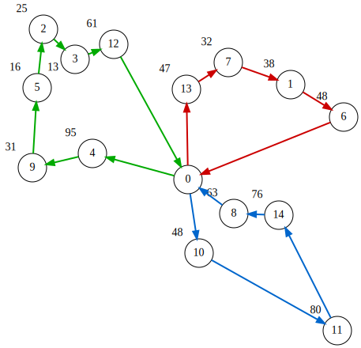

# Capacitated Vehicle Routing Problem (CVRP)
The **Capacitated Vehicle Routing Problem (CVRP)** aims to find a set of routes for $V$ **vehicles** that start and end at a single **depot** and collectively serve all **customers**.
We index the **locations** by $i \in \lbrace 0,1,\ldots,N-1\rbrace$, where location 0 denotes the depot and locations $1,\ldots,N-1$ are customers.
Each customer $i\in \lbrace 1,\ldots,N-1\rbrace$ has a demand $d_i$ to be delivered (and we set $d_0=0$ for the depot).
Each vehicle $v \in \lbrace 0,\ldots,V-1\rbrace$ departs from the depot, visits a subset of customers, and returns to the depot, subject to the capacity constraint that the total delivered demand on its route does not exceed the vehicle capacity $q_v$.
The objective is to minimize the total travel cost over all vehicles.

We assume that locations are points in the two-dimensional plane and that the travel cost between two locations is the Euclidean distance.
Let $c_{i,j}$ denote the distance (cost) between locations $i$ and $j$.

## QUBO++ formulation: array of binary variables
We give each vehicle $L$ **slots**, where slot $t$ of vehicle $v$ holds the $t$-th customer visited by vehicle $v$.
A slot may also be **empty**, which we represent by assigning the depot (location 0) to it: an empty slot simply means that the vehicle serves fewer than $L$ customers.

The number of slots $L$ is an upper bound on the number of customers a single vehicle can serve.
It is computed in advance from the demands and the largest vehicle capacity:
sort the demands in ascending order and greedily accumulate them until the largest capacity is exceeded; the number of accumulated demands is $L$.
For the instance solved below, we have $L=9$, so the formulation uses $V\times L\times N = 3\times 9\times 15 = 405$ binary variables.

We thus use a $V\times L\times N$ array $A=(a_{v,t,i})$ ($0\leq v\leq V-1$, $0\leq t\leq L-1$, $0\leq i\leq N-1$) of binary variables,
where $a_{v,t,i}$ is 1 if and only if slot $t$ of vehicle $v$ holds location $i$ (with $i=0$ meaning that the slot is empty).

The figure below shows an example assignment of $A=(a_{v,t,i})$ for the
$V=3$, $N=15$, $L=9$ instance (the instance solved by the program below),
representing a CVRP solution. For each vehicle (0, 1, 2) it shows an
$L\times N$ grid; a colored cell is $a_{v,t,i}=1$ (slot $t$ of vehicle $v$
holds location $i$). Slots assigned to the depot (location 0) are empty
slots.

<p align="center">
  
</p>

Each vehicle starts at the depot (location 0), visits the customers stored
in its non-empty slots in order, and returns to the depot. Each customer
$1,\ldots,14$ appears in exactly one slot of exactly one vehicle, so this
array represents a feasible CVRP solution. The empty slots line up after
the customers, but the formulation does not require this: an empty slot
between two customers only means the vehicle passes through the depot in
between, which never shortens a route under the triangle inequality. Hence
no extra constraint on the position of empty slots is needed, and the
optimal solution is naturally a lean set of routes.

## Constraints for QUBO++ formulation

### Row constraint (one-hot at each slot)
Each slot must hold exactly one location (a customer or the depot for an empty slot).
We impose the one-hot constraint:

$$
\begin{aligned}
\text{row}\_\text{constraint} & = \sum_{v=0}^{V-1}\sum_{t=0}^{L-1}\bigr(\sum_{i=0}^{N-1} a_{v,t,i} = 1\bigl)\\
 &= \sum_{v=0}^{V-1}\sum_{t=0}^{L-1}\bigr(1-\sum_{i=0}^{N-1} a_{v,t,i}\bigl)^2
\end{aligned}
$$

**row\_constraint** attains its minimum value $0$
if and only if every row is one-hot.

### Column constraint
Each customer must be held by exactly one slot of exactly one vehicle:

$$
\begin{aligned}
\text{column}\_\text{constraint}
& = \sum_{i=1}^{N-1}\bigr(\sum_{v=0}^{V-1}\sum_{t=0}^{L-1} a_{v,t,i} = 1\bigl)\\
 &= \sum_{i=1}^{N-1}\bigr(1-\sum_{v=0}^{V-1}\sum_{t=0}^{L-1} a_{v,t,i}\bigl)^2
\end{aligned}
$$

**column\_constraint** is 0 if and only if every customer $i = 1, \dots ,N−1$ is visited exactly once.
Note that no such constraint is imposed on the depot column $i=0$: any number of slots may be empty.

### Capacity constraint
For each vehicle $v$, the total delivered demand is

$$
\sum_{t=0}^{L-1}\sum_{i=1}^{N-1}d_ia_{v,t,i},
$$

which must be at most $q_v$.
Then the following constraint must be 0:

$$
\begin{aligned}
\text{capacity}\_\text{constraint} &= \sum_{v=0}^{V-1}\Bigr(0\leq \sum_{t=0}^{L-1}\sum_{i=1}^{N-1}d_ia_{v,t,i}\leq q_v\Bigl)
\end{aligned}
$$

**capacity\_constraint** is 0 if and only if all vehicles do not exceed their capacity.


## Objective for QUBO formulation

The total tour cost of a vehicle consists of the leg from the depot to its first slot, the legs between consecutive slots, and the leg from its last slot back to the depot:

$$
\begin{aligned}
\text{objective} &= \sum_{v=0}^{V-1}\Bigr(\sum_{i=1}^{N-1}c_{0,i}a_{v,0,i}
+ \sum_{t=0}^{L-2}\sum_{i=0}^{N-1}\sum_{j=0}^{N-1}c_{i,j}a_{v,t,i}a_{v,t+1,j}
+ \sum_{i=1}^{N-1}c_{i,0}a_{v,L-1,i}\Bigl)
\end{aligned}
$$

Under the Euclidean metric we have $c_{i,i}=0$, so empty slots at the beginning or the end of a route contribute no extra cost, and when all constraints are satisfied
$\text{objective}$ equals the total travel cost of all vehicles.

## QUBO formulation for the CVRP

Combining the objective and constraints, we obtain the QUBO:

$$
\begin{aligned}
f &= \text{objective} + P\cdot \text{cons}(\text{row}\_\text{constraint}+\text{column}\_\text{constraint}+\text{capacity}\_\text{constraint}),
\end{aligned}
$$

where $P$ is the constraint weight. Wrapping the constraint part in
`qbpp::cons()` declares it as constraints; the solver then searches
efficiently for solutions satisfying them (see
[Native Constraints](CONSTRAINTS)).

## QUBO++ program
The following QUBO++ program finds a solution to a randomly generated CVRP instance with $N=15$ locations (a depot and 14 customers) and $V=3$ vehicles, with a time limit of 10 seconds.
The vector `locations` stores triples `(x,y,d)`, where `(x,y)` is the 2D coordinate of a location and `d` is a customer's demand (the depot demand is 0).
The vector `vehicle_capacity` stores the capacities `{200, 250, 300}` of the $V=3$ vehicles.

Distances are the **exact Euclidean distances** computed with `std::sqrt` (no rounding). Since the default `coeff_t` is an integer type, we define `DOUBLE_TYPE` before including the header to use the [real (double) coefficient](VAREXPR#real-double-coefficients) frontend and build `objective` in `double`.


```cpp
#define DOUBLE_TYPE
#include <algorithm>
#include <cmath>
#include <qbpp/qbpp.hpp>
#include <qbpp/easy_solver.hpp>
#include <qbpp/graph.hpp>

int main() {
  std::vector<std::tuple<float, float, int>> locations = {
      {200, 200, 0},  {330, 320, 38}, {17, 390, 25},  {57, 352, 13},
      {79, 233, 95},  {9, 316, 16},   {397, 279, 48}, {251, 348, 32},
      {258, 157, 63}, {3, 215, 31},   {214, 107, 48}, {389, 9, 80},
      {106, 371, 61}, {198, 314, 47}, {315, 155, 76}};
  std::vector<int> vehicle_capacity = {200, 250, 300};

  const size_t N = locations.size();
  const size_t V = vehicle_capacity.size();

  auto dist = [&](size_t i, size_t j) {
    const auto [x1, y1, q1] = locations[i];
    const auto [x2, y2, q2] = locations[j];
    return std::sqrt((x1 - x2) * (x1 - x2) + (y1 - y2) * (y1 - y2));
  };

  std::vector<int> sorted_demands;
  for (size_t i = 1; i < N; ++i)
    sorted_demands.push_back(std::get<2>(locations[i]));
  std::sort(sorted_demands.begin(), sorted_demands.end());
  const int max_capacity =
      *std::max_element(vehicle_capacity.begin(), vehicle_capacity.end());
  size_t L = 0;
  for (int acc = 0; L < sorted_demands.size() &&
                    acc + sorted_demands[L] <= max_capacity;
       ++L) {
    acc += sorted_demands[L];
  }

  auto a = qbpp::var("a", V, L, N);

  auto row_constraint = qbpp::sum(qbpp::vector_sum(a) == 1);

  auto column_sum = qbpp::expr(N - 1);
  for (size_t v = 0; v < V; ++v)
    for (size_t t = 0; t < L; ++t)
      for (size_t i = 1; i < N; ++i) column_sum[i - 1] += a[v][t][i];
  auto column_constraint = qbpp::sum(column_sum == 1);

  auto vehicle_load = qbpp::expr(V);
  auto capacity_constraint = qbpp::toExpr(0);
  for (size_t v = 0; v < V; ++v) {
    for (size_t t = 0; t < L; ++t)
      for (size_t i = 1; i < N; ++i)
        vehicle_load[v] += a[v][t][i] * std::get<2>(locations[i]);
    capacity_constraint += 0 <= vehicle_load[v] <= vehicle_capacity[v];
  }

  auto objective = qbpp::toExpr(0);
  for (size_t v = 0; v < V; ++v) {
    for (size_t i = 1; i < N; ++i) objective += dist(0, i) * a[v][0][i];
    for (size_t t = 0; t + 1 < L; ++t)
      for (size_t i = 0; i < N; ++i)
        for (size_t j = 0; j < N; ++j)
          if (dist(i, j) != 0) objective += dist(i, j) * a[v][t][i] * a[v][t + 1][j];
    for (size_t i = 1; i < N; ++i) objective += dist(i, 0) * a[v][L - 1][i];
  }

  auto f = objective + 3000 * qbpp::cons(row_constraint + column_constraint +
                                         capacity_constraint);
  f.simplify_as_binary();
  auto solver = qbpp::EasySolver(f);
  auto sol = solver.search({{"time_limit", 10}});

  std::cout << "violated constraints = " << f.cons(sol) << std::endl;
  std::cout << "objective = " << objective(sol) << std::endl;

  auto tour = qbpp::onehot_to_int(sol(a));
  for (size_t v = 0; v < V; ++v) {
    std::cout << "Vehicle " << v << " : load = " << vehicle_load[v](sol)
              << " / " << vehicle_capacity[v] << " : 0 ";
    for (size_t t = 0; t < L; ++t) {
      int node = tour[v][t];
      if (node > 0)
        std::cout << "-> " << node << "("
                  << std::get<2>(locations[static_cast<size_t>(node)]) << ") ";
    }
    std::cout << "-> 0" << std::endl;
  }

  qbpp::graph::GraphDrawer graph;
  for (size_t i = 0; i < locations.size(); ++i) {
    const auto [x, y, q] = locations[i];
    graph.add(qbpp::graph::Node(i).position(x, y).xlabel(
        q != 0 ? std::to_string(q) : ""));
  }
  for (size_t v = 0; v < V; ++v) {
    int prev = 0;
    for (size_t t = 0; t < L; ++t) {
      int node = tour[v][t];
      if (node <= 0) continue;
      graph.add(qbpp::graph::Edge(prev, node).directed().color(v + 1).penwidth(2.0f));
      prev = node;
    }
    if (prev != 0)
      graph.add(qbpp::graph::Edge(prev, 0).directed().color(v + 1).penwidth(2.0f));
  }
  graph.draw();
  graph.write("cvrp15.svg");
  return 0;
}
```


The program first computes the number of slots `L` (9 for this instance) from the sorted demands and the maximum vehicle capacity, and defines the array `a` of $V\times L\times N = 3\times 9\times 15 = 405$ binary variables. It then defines the objective term `objective` and the constraint terms `row_constraint`, `column_constraint`, and `capacity_constraint`, declares them as constraints with `qbpp::cons()`, and combines them: `f = objective + 3000 * qbpp::cons(row_constraint + column_constraint + capacity_constraint)`. The Easy Solver then searches for an assignment `sol` that minimizes `f` with a time limit of 10 seconds.

`f.cons(sol)` returns the number of violated constraints (0 when all are satisfied). As an example, the following results are obtained:
```
violated constraints = 0
objective = 1821.13
Vehicle 0 : load = 165 / 200 : 0 -> 6(48) -> 1(38) -> 7(32) -> 13(47) -> 0
Vehicle 1 : load = 241 / 250 : 0 -> 4(95) -> 9(31) -> 5(16) -> 2(25) -> 3(13) -> 12(61) -> 0
Vehicle 2 : load = 267 / 300 : 0 -> 10(48) -> 11(80) -> 14(76) -> 8(63) -> 0
```
The total travel cost of 1821.13 is the best value confirmed by repeated long runs on this instance (we do not prove optimality). Being a heuristic solver, a 10-second run may end slightly above 1821.13 on occasion.

Finally, the program visualizes the obtained solution as a graph and writes it to `cvrp15.svg`:

<p align="center">
  
</p>
