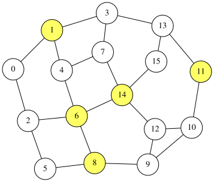

# Minimum Dominating Set Problem
A dominating set of an undirected graph $G=(V,E)$ is a subset $S\subseteq V$ such that every node
$u\in V$ is either in $S$ or adjacent to a vertex in $S$.

Let $N(u)=\lbrace v\in V\mid (u,v)\in E\rbrace$ be the set of neighbors of $u\in V$, and let
$N[u]=\lbrace u\rbrace\cup N(u)$ be the closed neighborhood of $u$.
Then $S$ is a dominating set if and only if

$$
\begin{aligned}
V = \bigcup_{u\in S} N[u].
\end{aligned}
$$

The minimum dominating set problem aims to find the dominating set with the minimum cardinality.
On an $n$-node graph $G=(V,E)$ with nodes labeled $0,1,\ldots,n−1$, we introduce $n$ binary variables $x_0, x_1, \ldots, x_{n-1}$ where $x_i=1$ if and only if node $i$ is included in the dominating set $S$.
Below, we show a formulation that declares the constraints with [`qbpp::cons()`](CONSTRAINTS), and finally introduce a HUBO formulation that uses products of [negated literals](NEGATIVE).

## Formulation of the minimum dominating set problem
A node $i$ is dominated if $N[i]\cap S$ is not empty.
This condition is equivalent to the following inequality:

$$
\begin{aligned}
\sum_{j\in N[i]}x_j &\geq 1 && (0\leq i\leq n-1)
\end{aligned}
$$

In QUBO++, the inequality for each node is enclosed in `qbpp::cons()` to declare it as a constraint.
When a constraint is violated, the square of the violation multiplied by the weight is added to the energy.

The objective is to minimize the number of selected nodes:

$$
\begin{aligned}
\text{objective} = \sum_{i=0}^{n-1} x_i
\end{aligned}
$$

With the weight $n+1$ for the constraints, the expression $f$ is:

$$
\begin{aligned}
f &= \text{objective} + (n+1)\times \sum_{i=0}^{n-1} \text{cons}\Bigl(\sum_{j\in N[i]}x_j \geq 1\Bigr)
\end{aligned}
$$

The weight $n+1$ is a safe choice to prioritize satisfying the dominating-set constraints over minimizing the objective.

## QUBO++ program
The following QUBO++ program finds a solution for a graph with $N=16$ nodes:

```cpp
#include <qbpp/qbpp.hpp>
#include <qbpp/easy_solver.hpp>
#include <qbpp/graph.hpp>

int main() {
  const size_t N = 16;
  std::vector<std::pair<size_t, size_t>> edges = {
      {0, 1},   {0, 2},   {1, 3},   {1, 4},   {2, 5},  {2, 6},
      {3, 7},   {3, 13},  {4, 6},   {4, 7},   {5, 8},  {6, 8},
      {6, 14},  {7, 14},  {8, 9},   {9, 10},  {9, 12}, {10, 11},
      {10, 12}, {11, 13}, {12, 14}, {13, 15}, {14, 15}};

  std::vector<std::vector<size_t>> adj(N);
  for (const auto& e : edges) {
    adj[e.first].push_back(e.second);
    adj[e.second].push_back(e.first);
  }

  auto x = qbpp::var("x", N);

  auto objective = qbpp::sum(x);

  auto constraint = qbpp::toExpr(0);
  for (size_t i = 0; i < N; ++i) {
    auto t = qbpp::toExpr(x[i]);
    for (size_t j : adj[i]) {
      t += x[j];
    }
    constraint += qbpp::cons(t >= 1);
  }

  auto f = objective + (N + 1) * constraint;
  f.simplify_as_binary();

  auto solver = qbpp::EasySolver(f);
  auto sol = solver.search({{"time_limit", 1.0}});

  std::cout << "objective = " << objective(sol) << std::endl;
  std::cout << "violated constraints = " << f.cons(sol) << std::endl;

  qbpp::graph::GraphDrawer graph;
  for (size_t i = 0; i < N; ++i) {
    graph.add_node(qbpp::graph::Node(i).color(sol(x[i])));
  }
  for (const auto& e : edges) {
    graph.add_edge(qbpp::graph::Edge(e.first, e.second));
  }
  graph.write("dominatingset.svg");
}
```

This program first builds the adjacency list `adj` from the edge list `edges`, where each `adj[i]` stores the neighbors of vertex `i`.
It then builds $\sum_{j\in N[i]}x_j$ in `t` and adds `qbpp::cons(t >= 1)` to `constraint`.
The Easy Solver is applied to `f` to obtain a solution `sol`.
The value of `objective` and the number of violated constraints `f.cons(sol)` for `sol` are printed, and the resulting graph is saved as `dominatingset.svg`, where the selected vertices are highlighted.

This program produces the following output:
```
objective = 5
violated constraints = 0
```
The image file stores the following image:

<p align="center">
  
</p>

If `t >= 1` is written without `qbpp::cons()`, it becomes an ordinary penalty expression and introduces auxiliary variables.
A constraint declared with `qbpp::cons()` introduces no auxiliary variables.

## HUBO formulation with products of negated literals
Using negated literals $\overline{x}_i$ (where $\overline{x}_i=1$ iff $x_i=0$), the same constraints can also be written as products.
Node $i$ is NOT dominated only when $x_j=0$ for all $j\in N[i]$, i.e., $\prod_{j\in N[i]}\overline{x}_j=1$.
Thus, the following expression is 0 only when every node is dominated:

$$
\begin{aligned}
\text{constraint} = \sum_{i=0}^{n-1} \prod_{j\in N[i]}\overline{x}_j
\end{aligned}
$$

Because this expression is never negative, it can be added to the objective as a penalty as it is:
```cpp
  auto constraint = qbpp::toExpr(0);
  for (size_t i = 0; i < N; ++i) {
    auto t = qbpp::toExpr(~x[i]);
    for (size_t j : adj[i]) {
      t *= ~x[j];
    }
    constraint += t;
  }
  auto f = objective + (N + 1) * constraint;
```
The degree of the term for node $i$ is $\lvert N[i] \rvert$, so the expression contains terms of degree 3 or higher.
QUBO++ handles higher-degree terms as they are, so this `f` can also be solved with the Easy Solver in the same way.
