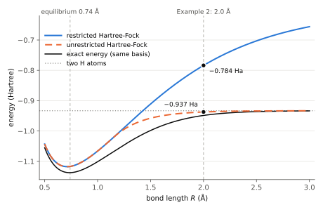

# Quantum Chemistry with FMQA

This page uses the procedure of [Black-Box Optimization with FMQA](FMQA) to find the molecular orbitals that minimize the energy of a molecule.
The shape of the molecular orbitals is described by angles, and the angles are searched with [native integer variables](NATIVE_INTEGER).
Instead of an FM, the model that predicts the energy (the surrogate model) is a polynomial in the integer variables.
QUBO++ minimizes this degree-4 polynomial in integer variables directly, without expanding the variables into binary variables.

The page covers two examples: one variable (HeH⁺) and two variables (a stretched H₂ molecule).

## Setting: an expensive energy calculation

In quantum chemistry, once the orbitals that hold the electrons (the molecular orbitals) are chosen, the energy of the molecule can be calculated.
Finding the molecular orbitals with the lowest energy is the core of the calculation.
For real molecules, a single energy calculation takes a long time.
Measuring the energy of a molecule on a quantum computer (the variational quantum eigensolver, VQE) also repeats the same loop: choose the angles of a circuit, then measure the energy.
We therefore treat the energy as a black-box function and look for its minimum with few evaluations.

The examples on this page are small molecules with two electrons, so the energy can be calculated by a short formula.
The formula is used only in place of the real calculation and to check the answer; the FMQA part does not look inside it.

## FMQA with integer variables

The procedure is the same as in [FMQA](FMQA):

1. Evaluate a few randomly chosen points.
2. Fit the surrogate model to all points evaluated so far (learning).
3. Write the surrogate model as a QUBO++ expression and find the point minimizing the prediction with `EasySolver`.
4. Evaluate the energy at that point, add it to the data, and go back to step 2.

What differs is the variables and the surrogate model:

- **Variables**: each angle of the molecular orbitals takes 65 values, represented by an integer.
  A native integer variable is not expanded into binary digits; the solver searches over its integer values directly.
  Moving to the next angle is a natural move: the integer goes up or down by 1.
- **Surrogate model**: an FM is a quadratic expression in binary variables, so it is a QUBO as is.
  On this page there are only one or two integer variables, so we use a degree-4 polynomial, which can represent more shapes.
  It has 5 coefficients for one variable and 15 for two.
  For native integer variables, `n * n` is the square of an integer, so a degree-4 polynomial is directly a QUBO++ expression.
- **Learning**: the prediction is linear in the coefficients, so regularized least squares (regularization coefficient $10^{-6}$) gives the coefficients by solving one system of linear equations.

## Example 1: the molecular orbital of HeH⁺

### The black-box function

The helium hydride ion HeH⁺ has two electrons.
We use the smallest basis (the STO-3G basis) and write the molecular orbital as a combination of two functions $\chi_1, \chi_2$, obtained by orthonormalizing the 1s orbitals of He and H.
When the two electrons occupy the same molecular orbital (the restricted Hartree-Fock method), the molecular orbital is given by a single angle $\theta$:

$$\phi(\theta) = \cos\theta\, \chi_1 + \sin\theta\, \chi_2$$

For any $\theta$, $\phi$ has length 1.
Since $\theta$ and $\theta + \pi$ give the same orbital up to sign, $-\pi/2 \le \theta \le \pi/2$ covers all molecular orbitals.
With $c = \cos\theta$ and $s = \sin\theta$, the energy is:

$$
\begin{aligned}
E(\theta) = E_\mathrm{nuc}
&+ 2\bigl(c^2 h_{11} + 2cs\, h_{12} + s^2 h_{22}\bigr) \\
&+ c^4 (11|11) + s^4 (22|22) + 2c^2 s^2 \bigl[(11|22) + 2\,(12|12)\bigr]
+ 4c^3 s\, (11|12) + 4cs^3\, (22|12)
\end{aligned}
$$

$h_{pq}$ are one-electron integrals (the kinetic energy of one electron and its attraction to the nuclei), $(pq|rs)$ are two-electron integrals (the repulsion between electrons), and $E_\mathrm{nuc}$ is the repulsion between the nuclei.
Their values at the bond length 1.4632 bohr are written in the program.

In a molecule made of two identical atoms, such as H₂, symmetry determines the molecular orbitals.
HeH⁺ is made of two different atoms, so how far the electrons lean toward He (the value of $\theta$) is not known until we calculate it.

### Integer variable and surrogate model

We represent $\theta$ by an integer $n \in \lbrace 0, \ldots, 64\rbrace$, 65 steps from $-\pi/2$ to $\pi/2$:

$$\theta(n) = -\frac{\pi}{2} + \frac{\pi n}{64}$$

The surrogate model is a degree-4 polynomial in $t = n/64$:

$$\hat{E}(n) = w_0 + w_1 t + w_2 t^2 + w_3 t^3 + w_4 t^4$$

We first evaluate 4 random points, and after that the $n$ found by QUBO++.
If the $n$ found by QUBO++ has already been evaluated, we evaluate a neighbor ($n \pm 1$) of the best point so far that has not been evaluated yet.
If both neighbors of the best point have been evaluated, the best point is confirmed to be lower than both neighbors, and we stop.

### QUBO++ program


```cpp
#define DOUBLE_TYPE
#include <qbpp/qbpp.hpp>
#include <qbpp/easy_solver.hpp>

#include <algorithm>
#include <cmath>
#include <iomanip>
#include <random>
#include <vector>

// integrals of HeH+ (STO-3G basis, bond length 1.4632 bohr, in Hartree)
// index 1 is He 1s and 2 is H 1s (orthonormalized basis)
const double H11 = -2.475236114935;  // one-electron integrals
const double H22 = -1.448259466847;
const double H12 = -0.378724331272;
const double G1111 = 1.147471043048;  // two-electron integrals
const double G2222 = 0.816258183162;
const double G1122 = 0.526201856993;
const double G1212 = 0.011345007430;
const double G1112 = -0.003104665462;
const double G2212 = -0.004941256971;
const double E_NUC = 1.366867140514;  // repulsion energy between the nuclei
const double PI = std::acos(-1.0);

constexpr int L = 65;    // number of angle steps
constexpr int D = 4;     // degree of the surrogate model
constexpr int INIT = 4;  // number of random points evaluated first

// black box: energy with two electrons in the orbital cos(θ) χ1 + sin(θ) χ2
// really a slow quantum chemistry calculation; a formula stands in here
double blackbox(double theta) {
  double c = std::cos(theta), s = std::sin(theta);
  return E_NUC + 2 * (c * c * H11 + 2 * c * s * H12 + s * s * H22) +
         c * c * c * c * G1111 + s * s * s * s * G2222 +
         2 * c * c * s * s * (G1122 + 2 * G1212) + 4 * c * c * c * s * G1112 +
         4 * c * s * s * s * G2212;
}

// angle for the integer k (0 to L-1)
double theta(int k) { return -PI / 2 + PI * k / (L - 1); }

// w minimizing Σ_m (Σ_j A[m][j] w_j - y_m)^2 + 1e-6 Σ_j w_j^2
std::vector<double> fit(const std::vector<std::vector<double>>& A,
                        const std::vector<double>& y) {
  const size_t P = A[0].size();
  // linear system (A^T A + 1e-6 I) w = A^T y (last column of M: right side)
  std::vector<std::vector<double>> M(P, std::vector<double>(P + 1, 0.0));
  for (size_t m = 0; m < A.size(); ++m)
    for (size_t i = 0; i < P; ++i) {
      for (size_t j = 0; j < P; ++j) M[i][j] += A[m][i] * A[m][j];
      M[i][P] += A[m][i] * y[m];
    }
  for (size_t i = 0; i < P; ++i) M[i][i] += 1e-6;
  // solve it by Gaussian elimination
  for (size_t i = 0; i < P; ++i)
    for (size_t j = i + 1; j < P; ++j) {
      double r = M[j][i] / M[i][i];
      for (size_t l = i; l <= P; ++l) M[j][l] -= r * M[i][l];
    }
  std::vector<double> w(P);
  for (size_t i = P; i-- > 0;) {
    w[i] = M[i][P];
    for (size_t j = i + 1; j < P; ++j) w[i] -= M[i][j] * w[j];
    w[i] /= M[i][i];
  }
  return w;
}

int main() {
  std::mt19937 rng(1);
  std::uniform_int_distribution<int> pick(0, L - 1);
  std::vector<int> ks;     // evaluated points
  std::vector<double> es;  // their energies
  auto evaluated = [&](int k) {
    return std::find(ks.begin(), ks.end(), k) != ks.end();
  };
  std::cout << std::fixed << std::setprecision(6);

  // 1. evaluate randomly chosen points
  while (ks.size() < INIT) {
    int k = pick(rng);
    if (evaluated(k)) continue;
    ks.push_back(k);
    es.push_back(blackbox(theta(k)));
    std::cout << "eval " << ks.size() << ": n = " << std::setw(2) << k
              << ", E = " << es.back() << " Ha (random)" << std::endl;
  }

  auto n = 0 <= qbpp::int_var("n") <= L - 1;
  qbpp::Expr t = (1.0 / (L - 1)) * n;  // coordinate from 0 to 1
  while (true) {
    // 2. fit the surrogate model w0 + w1 t + ... + w4 t^4
    std::vector<std::vector<double>> A;
    for (int k : ks) {
      std::vector<double> row;
      for (int d = 0; d <= D; ++d) row.push_back(std::pow(k / (L - 1.0), d));
      A.push_back(row);
    }
    auto w = fit(A, es);

    // 3. write the surrogate model in QUBO++ and find n minimizing it
    qbpp::Expr f = 0, td = 1;
    for (int d = 0; d <= D; ++d) {
      f += w[d] * td;
      td = td * t;
    }
    f.simplify_as_binary();
    auto sol = qbpp::EasySolver(f).search({{"time_limit", 0.2}});
    int k = int(sol(n));

    // if already evaluated, take an unevaluated neighbor of the best point
    if (evaluated(k)) {
      int b = ks[std::min_element(es.begin(), es.end()) - es.begin()];
      if (b > 0 && !evaluated(b - 1)) {
        k = b - 1;
      } else if (b < L - 1 && !evaluated(b + 1)) {
        k = b + 1;
      } else {
        break;  // both neighbors of the best point are evaluated
      }
    }

    // 4. evaluate the energy and add it to the data
    ks.push_back(k);
    es.push_back(blackbox(theta(k)));
    std::cout << "eval " << ks.size() << ": n = " << std::setw(2) << k
              << ", E = " << es.back() << " Ha" << std::endl;
  }

  size_t i = std::min_element(es.begin(), es.end()) - es.begin();
  std::cout << "best: n = " << ks[i] << ", theta = " << std::setprecision(4)
            << theta(ks[i]) << ", E = " << std::setprecision(6) << es[i]
            << " Ha" << std::endl;
  // check: the minimum over all L values
  double emin = INFINITY;
  for (int k = 0; k < L; ++k) emin = std::min(emin, blackbox(theta(k)));
  std::cout << "minimum over all " << L << " values: " << emin << " Ha"
            << std::endl;
}
```


- `#define DOUBLE_TYPE` makes the coefficients of expressions real numbers (`double`) (see [Real (double) coefficients](VAREXPR#real-double-coefficients)).
  The fitted coefficients $w_d$ can be used directly as coefficients of the QUBO++ expression.
- `0 <= qbpp::int_var("n") <= L - 1` declares the integer variable $n$ with $0 \le n \le 64$.
  `t` is the expression $t = n/64$, and repeating `td = td * t` builds $t^d$.
- `fit` performs regularized least squares and solves the system of linear equations by Gaussian elimination.
  The coefficient matrix is symmetric and positive definite, so no row exchanges are needed.
- `sol(n)` returns a real number, so it is converted to `int`.
- The program runs in a few seconds.

### Output

```
eval 1: n = 27, E = -2.022443 Ha (random)
eval 2: n = 64, E = -0.713394 Ha (random)
eval 3: n = 46, E = -2.701490 Ha (random)
eval 4: n = 60, E = -1.104257 Ha (random)
eval 5: n = 39, E = -2.812462 Ha
eval 6: n = 38, E = -2.782225 Ha
eval 7: n = 40, E = -2.832456 Ha
eval 8: n = 41, E = -2.841406 Ha
eval 9: n = 42, E = -2.838619 Ha
best: n = 41, theta = 0.4418, E = -2.841406 Ha
minimum over all 65 values: -2.841406 Ha
```

After the first 4 random points (`random`), 4 more evaluations reach $n = 41$ ($\theta = 0.4418$), the best of the 65 values.
`eval 9` evaluates $n = 42$, the other neighbor of the best point; both neighbors are now evaluated, so the program stops.
The last line is the answer obtained by evaluating all 65 values, and it agrees with the result of FMQA.

The molecular orbital found has $\cos\theta = 0.90$ and $\sin\theta = 0.43$: the electrons lean toward He.
The minimum over a continuous $\theta$ is $-2.841836$ Ha; the difference from the value found (0.43 mHa) comes from dividing $\theta$ into 65 steps.

Over 20 runs with different random seeds, all 20 runs reached the best of the 65 values.
Including the first 4 points, they used 6 to 11 evaluations (mostly 7 or 8), about 1/8 of evaluating all 65 values.

## Example 2: stretched H₂ and spin symmetry breaking

### The black-box function

Consider the two electrons of the hydrogen molecule H₂.
In the STO-3G basis, the 1s orbitals of the two H atoms give two molecular orbitals: the bonding orbital $\sigma_g$ and the antibonding orbital $\sigma_u$.
In the unrestricted Hartree-Fock method, the spin-up ($\alpha$) electron and the spin-down ($\beta$) electron may occupy different molecular orbitals.
We describe each of them by an angle, $\theta_\alpha$ and $\theta_\beta$:

$$
\phi_\alpha = \cos\theta_\alpha\, \sigma_g + \sin\theta_\alpha\, \sigma_u, \qquad
\phi_\beta = \cos\theta_\beta\, \sigma_g + \sin\theta_\beta\, \sigma_u
$$

With $c_x = \cos\theta_x$ and $s_x = \sin\theta_x$, the energy is:

$$
\begin{aligned}
E(\theta_\alpha, \theta_\beta) = E_\mathrm{nuc}
&+ (c_\alpha^2 + c_\beta^2)\, h_{gg} + (s_\alpha^2 + s_\beta^2)\, h_{uu} \\
&+ c_\alpha^2 c_\beta^2\, J_{gg} + s_\alpha^2 s_\beta^2\, J_{uu}
+ (c_\alpha^2 s_\beta^2 + s_\alpha^2 c_\beta^2)\, J_{gu}
+ 4\, c_\alpha s_\alpha c_\beta s_\beta\, K_{gu}
\end{aligned}
$$

$h_{gg}, h_{uu}$ are one-electron integrals, $J_{gg}, J_{uu}, J_{gu}$ are Coulomb integrals (the repulsion between electrons), and $K_{gu}$ is an exchange integral.
This page uses their values at the bond length 2.0 Å, with the bond stretched from its equilibrium length (0.74 Å).
The values are written in the program.

### The symmetric solution and the symmetry-broken solution

At $\theta_\alpha = \theta_\beta = 0$, both electrons occupy $\sigma_g$.
This is the solution of the restricted Hartree-Fock method, in which the two electrons share one orbital, and its energy is $E = -0.78379$ Ha.
Since $\sigma_g$ spreads evenly over both atoms, the $\alpha$ electron and the $\beta$ electron are each half on one atom and half on the other.

When the bond is stretched, the energy becomes lower if the $\alpha$ electron and the $\beta$ electron separate onto different atoms.
This is the solution $\theta_\alpha = -\theta_\beta \approx \pm 0.668$ with $E = -0.937213$ Ha, 153.4 mHa lower than the solution above.
The $\alpha$ electron is almost entirely on one atom and the $\beta$ electron on the other (spin density $\pm 0.98$ per atom).
The symmetry of the restricted Hartree-Fock solution, "the $\alpha$ electron and the $\beta$ electron have the same distribution", is lost, so this is called a spin-symmetry-broken solution.
The solution with $\alpha$ and $\beta$ exchanged (the signs of $\theta_\alpha$ and $\theta_\beta$ swapped) is a minimum with the same energy.

The usual calculation (an SCF calculation) started from a symmetric state with $\theta_\alpha = \theta_\beta$ does not leave the symmetric solution.
FMQA is told nothing about this symmetry.

Which solution is lower depends on the bond length.
The figure below shows, for each bond length $R$, the restricted Hartree-Fock energy ($\theta_\alpha = \theta_\beta = 0$), the minimum unrestricted Hartree-Fock energy (with $\theta_\alpha$ and $\theta_\beta$ both free), and the exact energy in the same basis.
The values in the figure were computed directly on fine grids, not with FMQA.

<p align="center">
  
</p>

- For $R$ shorter than about 1.15 Å, the two Hartree-Fock energies coincide and the symmetry is not broken.
- For longer bonds, the symmetry-broken solution is lower.
  As $R$ grows, the unrestricted Hartree-Fock energy approaches the energy of two H atoms, while the restricted Hartree-Fock energy keeps rising.
  Because the two electrons are forced into the same orbital, the configuration with both electrons on one of the two separated atoms stays mixed in with half the weight.
- The difference from the exact energy (the electron correlation energy) is the part that neither Hartree-Fock method can capture.

The example on this page uses $R = 2.0$ Å, where the symmetry breaking is clear (the black dots in the figure).

### Integer variables and zooming

We represent the two angles by integers $n_\alpha, n_\beta \in \lbrace 0, \ldots, 64\rbrace$, 65 steps within a search range (the window).
The first window is $-\pi/2 \le \theta_\alpha, \theta_\beta \le \pi/2$, with an angle step of $\pi/64 \approx 0.049$ rad.
The surrogate model is a degree-4 polynomial in the two window coordinates $u = n/64 \in [0, 1]$:

$$\hat{E} = \sum_{i + j \le 4} w_{ij}\, u_\alpha^i\, u_\beta^j$$

When the best value has not improved 4 times in a row (or after QUBO++ has found 15 points in one window), we halve the width of the window around the best point (zooming).
Because the number of steps, 65, is odd, the window center $n = 32$ is a grid point, and the best point stays a grid point of the next window.
Six stages of zooming refine the angle step from about 0.049 rad to about 0.0015 rad.

- Each stage starts by evaluating random points in the window (6 in the first stage, 3 after that).
- Learning uses all points inside the current window, including those evaluated in earlier stages.
  The polynomial is a function of continuous coordinates, so points that are not on the current grid can be used as they are.
- If the point found by QUBO++ has already been evaluated, we evaluate, among the 8 points around it, the one with the lowest prediction that has not been evaluated yet.

### QUBO++ program


```cpp
#define DOUBLE_TYPE
#include <qbpp/qbpp.hpp>
#include <qbpp/easy_solver.hpp>

#include <algorithm>
#include <array>
#include <cmath>
#include <iomanip>
#include <random>
#include <set>
#include <utility>
#include <vector>

// integrals of stretched H2 (STO-3G basis, bond length 2.0 Å, in Hartree)
// g is the bonding orbital σg and u the antibonding orbital σu
const double H_GG = -0.778922064923;  // one-electron integrals
const double H_UU = -0.670266674748;
const double J_GG = 0.509462821477;  // Coulomb integrals
const double J_UU = 0.534664130913;
const double J_GU = 0.519201267361;
const double K_GU = 0.259138467265;   // exchange integral
const double E_NUC = 0.264588624497;  // repulsion energy between the nuclei
const double PI = std::acos(-1.0);

constexpr int L = 65;        // number of angle steps in the window (odd)
constexpr int D = 4;         // degree of the surrogate model
constexpr int STAGES = 6;    // number of zoom stages
constexpr int ITERS = 15;    // max points found by QUBO++ per stage
constexpr int PATIENCE = 4;  // next stage after this many non-improving evals

// black box: energy with the α electron in cos(θa) σg + sin(θa) σu
//            and the β electron in cos(θb) σg + sin(θb) σu
// really a slow quantum chemistry calculation; a formula stands in here
double blackbox(double ta, double tb) {
  double ca = std::cos(ta), sa = std::sin(ta);
  double cb = std::cos(tb), sb = std::sin(tb);
  return E_NUC + (ca * ca + cb * cb) * H_GG + (sa * sa + sb * sb) * H_UU +
         ca * ca * cb * cb * J_GG + sa * sa * sb * sb * J_UU +
         (ca * ca * sb * sb + sa * sa * cb * cb) * J_GU +
         4 * ca * sa * cb * sb * K_GU;
}

// w minimizing Σ_m (Σ_j A[m][j] w_j - y_m)^2 + 1e-6 Σ_j w_j^2
std::vector<double> fit(const std::vector<std::vector<double>>& A,
                        const std::vector<double>& y) {
  const size_t P = A[0].size();
  // linear system (A^T A + 1e-6 I) w = A^T y (last column of M: right side)
  std::vector<std::vector<double>> M(P, std::vector<double>(P + 1, 0.0));
  for (size_t m = 0; m < A.size(); ++m)
    for (size_t i = 0; i < P; ++i) {
      for (size_t j = 0; j < P; ++j) M[i][j] += A[m][i] * A[m][j];
      M[i][P] += A[m][i] * y[m];
    }
  for (size_t i = 0; i < P; ++i) M[i][i] += 1e-6;
  // solve it by Gaussian elimination
  for (size_t i = 0; i < P; ++i)
    for (size_t j = i + 1; j < P; ++j) {
      double r = M[j][i] / M[i][i];
      for (size_t l = i; l <= P; ++l) M[j][l] -= r * M[i][l];
    }
  std::vector<double> w(P);
  for (size_t i = P; i-- > 0;) {
    w[i] = M[i][P];
    for (size_t j = i + 1; j < P; ++j) w[i] -= M[i][j] * w[j];
    w[i] /= M[i][i];
  }
  return w;
}

using Point = std::pair<int, int>;  // grid point (ka, kb)

int main() {
  // exponents (i, j) of the monomials ua^i ub^j of the model (i + j <= D)
  std::vector<Point> powers;
  for (int i = 0; i <= D; ++i)
    for (int j = 0; i + j <= D; ++j) powers.push_back({i, j});

  std::vector<std::array<double, 3>> history;  // evaluated (θa, θb, E)
  std::set<Point> seen;               // grid points evaluated in this stage
  double lo[2] = {-PI / 2, -PI / 2};  // lower-left corner of the window
  double step = PI / (L - 1);         // grid spacing
  auto best = [&] {
    return *std::min_element(
        history.begin(), history.end(),
        [](const auto& a, const auto& b) { return a[2] < b[2]; });
  };
  // evaluate the energy at grid point k and add it to the data
  // return true if the best value improves (below 1e-12 is rounding error)
  auto evaluate = [&](Point k) {
    double ta = lo[0] + step * k.first, tb = lo[1] + step * k.second;
    double e = blackbox(ta, tb);
    bool improved = history.empty() || e < best()[2] - 1e-12;
    if (improved)
      std::cout << "eval " << std::setw(2) << history.size() + 1
                << ": E = " << std::setprecision(8) << e
                << " Ha (theta_a = " << std::setprecision(4) << ta
                << ", theta_b = " << tb << ")" << std::endl;
    history.push_back({ta, tb, e});
    seen.insert(k);
    return improved;
  };
  std::cout << std::fixed;

  std::mt19937 rng(1);
  std::uniform_int_distribution<int> pick(0, L - 1);
  auto na = 0 <= qbpp::int_var("na") <= L - 1;
  auto nb = 0 <= qbpp::int_var("nb") <= L - 1;
  qbpp::Expr ua = (1.0 / (L - 1)) * na;  // coordinates in the window (0 to 1)
  qbpp::Expr ub = (1.0 / (L - 1)) * nb;

  for (int stage = 0; stage < STAGES; ++stage) {
    seen.clear();
    if (stage > 0) seen.insert({L / 2, L / 2});  // window center (best so far)
    // 1. evaluate random points (6 in the first stage, 3 after that)
    size_t init = stage == 0 ? 6 : 4;
    while (seen.size() < init) {
      Point k{pick(rng), pick(rng)};
      if (!seen.count(k)) evaluate(k);
    }

    int stall = 0;
    for (int it = 0; it < ITERS; ++it) {
      // 2. fit the surrogate model to the evaluated points in the window
      std::vector<std::vector<double>> A;
      std::vector<double> y;
      for (const auto& h : history) {
        double u0 = (h[0] - lo[0]) / (step * (L - 1));
        double u1 = (h[1] - lo[1]) / (step * (L - 1));
        if (u0 < 0 || u0 > 1 || u1 < 0 || u1 > 1) continue;
        std::vector<double> row;
        for (auto [i, j] : powers)
          row.push_back(std::pow(u0, i) * std::pow(u1, j));
        A.push_back(row);
        y.push_back(h[2]);
      }
      auto w = fit(A, y);

      // 3. write the surrogate model in QUBO++ and find (na, nb) minimizing it
      qbpp::Expr f = 0;
      for (size_t p = 0; p < powers.size(); ++p) {
        qbpp::Expr term = w[p];
        for (int i = 0; i < powers[p].first; ++i) term = term * ua;
        for (int j = 0; j < powers[p].second; ++j) term = term * ub;
        f += term;
      }
      f.simplify_as_binary();
      auto sol = qbpp::EasySolver(f).search({{"time_limit", 0.2}});
      Point k{int(sol(na)), int(sol(nb))};

      // if already evaluated, take the unevaluated point with the lowest
      // prediction among the 8 points around it
      if (seen.count(k)) {
        Point next{-1, -1};
        double pred = INFINITY;
        for (int a = -1; a <= 1; ++a)
          for (int b = -1; b <= 1; ++b) {
            Point m{k.first + a, k.second + b};
            if (m.first < 0 || m.first >= L || m.second < 0 || m.second >= L ||
                seen.count(m))
              continue;
            double v = f({{na, m.first}, {nb, m.second}});
            if (v < pred) {
              pred = v;
              next = m;
            }
          }
        if (next.first < 0) break;
        k = next;
      }

      // 4. evaluate the energy and add it to the data
      if (evaluate(k)) {
        stall = 0;
      } else if (++stall >= PATIENCE) {
        break;
      }
    }

    // zoom: halve the window around the best point
    step /= 2;
    lo[0] = best()[0] - step * (L / 2);
    lo[1] = best()[1] - step * (L / 2);
  }

  auto b = best();
  std::cout << "best: E = " << std::setprecision(8) << b[2] << " Ha after "
            << history.size()
            << " evaluations (theta_a = " << std::setprecision(4) << b[0]
            << ", theta_b = " << b[1] << ")" << std::endl;
  std::cout << "RHF (theta_a = theta_b = 0): E = " << std::setprecision(8)
            << blackbox(0, 0) << " Ha" << std::endl;
}
```


- `fit` is the same as in Example 1.
  `powers` lists the exponents $(i, j)$ of the monomials $u_\alpha^i u_\beta^j$ of the surrogate model; there are 15 of them.
- Step 3 builds the expression `f` by multiplying monomials, as in `term = term * ua`.
  `f` is a degree-4 polynomial in $n_\alpha, n_\beta$ with 15 terms, including the constant.
- The predictions at the 8 surrounding points are obtained by substituting values into the expression `f` (`f({{na, m.first}, {nb, m.second}})`, see [evaluation](EVAL)).
- `history` holds the angles and energies of all evaluated points, and `seen` holds the grid points evaluated in the current stage.
  `evaluate` returns `true` when the best value improves.
  Two symmetric points have exactly the same energy in theory, so a difference below $10^{-12}$ is treated as rounding error and not counted as an improvement.
- The program runs in about 15 seconds.

### Output

```
eval  1: E = -0.65807098 Ha (theta_a = -0.2454, theta_b = 1.5708)
eval  8: E = -0.66272660 Ha (theta_a = -1.5708, theta_b = -0.1473)
eval  9: E = -0.66539885 Ha (theta_a = -1.5708, theta_b = 0.0000)
eval 12: E = -0.66787474 Ha (theta_a = -1.5217, theta_b = 0.0491)
eval 14: E = -0.79260816 Ha (theta_a = -0.5890, theta_b = 1.2272)
eval 17: E = -0.86999057 Ha (theta_a = -0.5890, theta_b = 1.0308)
eval 18: E = -0.88335106 Ha (theta_a = -0.3927, theta_b = 0.8345)
eval 20: E = -0.88724665 Ha (theta_a = -0.4418, theta_b = 0.8836)
eval 21: E = -0.89592832 Ha (theta_a = -0.4418, theta_b = 0.8345)
eval 22: E = -0.90174911 Ha (theta_a = -0.9327, theta_b = 0.6627)
eval 25: E = -0.93718516 Ha (theta_a = -0.6627, theta_b = 0.6627)
eval 40: E = -0.93721215 Ha (theta_a = -0.6688, theta_b = 0.6688)
eval 55: E = -0.93721219 Ha (theta_a = -0.6688, theta_b = 0.6673)
eval 56: E = -0.93721235 Ha (theta_a = -0.6673, theta_b = 0.6673)
best: E = -0.93721235 Ha after 60 evaluations (theta_a = -0.6673, theta_b = 0.6673)
RHF (theta_a = theta_b = 0): E = -0.78379268 Ha
```

The 56th evaluation reaches $E = -0.93721235$ Ha (60 evaluations in total).
The difference from the minimum over continuous angles, $-0.93721282$ Ha, is 0.0005 mHa and comes from the grid spacing of the last stage.
The solution has $\theta_\alpha = -\theta_\beta$: it is the spin-symmetry-broken solution.
With this random seed, the solution has $\theta_\alpha < 0$ (the solution with $\alpha$ and $\beta$ exchanged).

With the integrals at the equilibrium bond length 0.74 Å instead, the same program does not break the symmetry and converges to the solution $\theta_\alpha = \theta_\beta = 0$ ($E = -1.11676$ Ha).

### Comparison with random search and hill climbing

We ran the program above 20 times with different random seeds and compared the best value at each number of evaluations with two other methods:

- **Random search**: repeatedly evaluates $(\theta_\alpha, \theta_\beta)$ drawn uniformly from $-\pi/2$ to $\pi/2$.
- **Hill climbing**: starts from a random point, evaluates the 8 points around it at the current step size, and moves to the best one.
  If none of them is better, it halves the step size.
  The initial step size is $\pi/8$, the best of $\pi/2$ to $\pi/32$.

Each cell shows the mean difference from the minimum $-0.93721282$ Ha and the fraction of runs within 0.01 mHa of it.
FMQA stops after 52 to 62 evaluations; when it stops before 60, the value at the stop is used.

| Method | 20 evals | 40 evals | 60 evals |
|---|---:|---:|---:|
| FMQA | 3.88 mHa / 0% | 0.0034 mHa / 90% | **0.0005 mHa / 100%** |
| Random search | 26.5 mHa / 0% | 16.2 mHa / 0% | 10.1 mHa / 0% |
| Hill climbing | 23.4 mHa / 0% | 2.86 mHa / 0% | 0.47 mHa / 0% |

FMQA learns the shape of the energy from all evaluated points, so it approaches the minimum with fewer evaluations than hill climbing, which examines the surrounding points one by one.

## The role of QUBO++

The examples on this page have one or two variables, so minimizing the surrogate model is itself easy: it could be done by checking all 65 or $65^2 = 4225$ values.
Also, the symmetry-broken solution of H₂ is quickly obtained by an SCF calculation started from a state with broken symmetry.
The purpose of this page is to show how to run FMQA with integer variables, treating the energy of a quantum chemistry calculation as a black-box function.

For larger molecules, the number of angles $k$ grows and the number of grid points grows as $65^k$, so minimizing the surrogate model becomes a job for the QUBO++ solver.
The number of polynomial coefficients also grows, so a model with fewer coefficients, such as the FM in [FMQA](FMQA), would be used.
