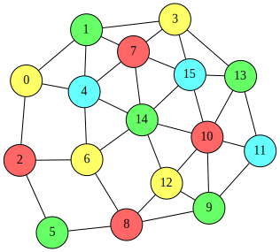
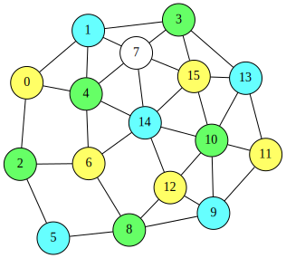

# Graph Coloring Problem
Given an undirected graph $G=(V,E)$, the **graph coloring problem** aims to assign a color to each node so that adjacent nodes receive different colors.
More specifically, for a set $C$ of colors, the goal is to find an assignment $\sigma:V\rightarrow C$ such that for every edge $(u,v)\in E$, we have $\sigma(u)\neq \sigma(v)$. The graph coloring problem can be formulated easily as a QUBO expression.
Let $V=\lbrace 0,1,\ldots ,n−1\rbrace$ and $C=\lbrace 0,1,\ldots ,m−1\rbrace$.
We introduce an $n\times m$ matrix $X=(x_{i,j})$ of binary variables, where $x_{i,j}=1$ if and only if node $i$ is assigned color $j$.

### One-hot constraint
Since exactly one color must be assigned to each node, each row of
$X$ must be one-hot:

$$
\begin{aligned}
  \text{onehot}&= \sum_{i=0}^{n-1}\Bigl(\sum_{j=0}^{m-1}x_{i,j}=1\Bigr)\\
   &=\sum_{i=0}^{n-1}\Bigl(1-\sum_{j=0}^{m-1}x_{i,j}\Bigr)^2
\end{aligned}
$$

### Adjacent nodes must differ
For each edge, its endpoints must not share the same color. This can be penalized as follows:

$$
\begin{aligned}
  \text{different}&= \sum_{(u,v)\in E}x_u\cdot x_v\\
   &=\sum_{(u,v)\in E}\sum_{j=0}^{m-1}x_{u,j}x_{v,j}
\end{aligned}
$$

## QUBO objective
By combining these expressions, we obtain the QUBO objective function

$$
\begin{aligned}
  f &= \text{onehot}+\text{different}
\end{aligned}
$$

This objective attains the minimum value 0 if and only if a valid
$m$-coloring of the graph exists.

## QUBO++ formulation
Since any planar graph can be colored with at most four colors, we use a planar graph with 16 nodes and $m=4$ colors as an example. The following QUBO++ program solves this instance:

```cpp
#include <qbpp/qbpp.hpp>
#include <qbpp/easy_solver.hpp>
#include <qbpp/graph.hpp>

int main() {
  const size_t n = 16;
  std::vector<std::pair<size_t, size_t>> edges = {
      {0, 1},   {0, 2},   {0, 4},   {1, 3},   {1, 4},   {1, 7},   {2, 5},
      {2, 6},   {3, 7},   {3, 13},  {3, 15},  {4, 6},   {4, 7},   {4, 14},
      {5, 8},   {6, 8},   {6, 14},  {7, 14},  {7, 15},  {8, 9},   {8, 12},
      {9, 10},  {9, 11},  {9, 12},  {10, 11}, {10, 12}, {10, 13}, {10, 14},
      {10, 15}, {11, 13}, {12, 14}, {13, 15}, {14, 15}};
  const size_t m = 4;

  auto x = qbpp::var("x", n, m);

  auto onehot = qbpp::sum(qbpp::vector_sum(x) == 1);
  auto different = qbpp::Expr(0);
  for (const auto& e : edges) {
    different += qbpp::sum(qbpp::row(x, e.first) * qbpp::row(x, e.second));
  }

  auto f = onehot + different;

  f.simplify_as_binary();
  auto solver = qbpp::EasySolver(f);
  auto sol = solver.search({{"target_energy", 0}});

  std::cout << "onehot = " << sol(onehot) << std::endl;
  std::cout << "different = " << sol(different) << std::endl;

  auto node_color = qbpp::onehot_to_int(sol(x));

  qbpp::graph::GraphDrawer graph;
  for (size_t i = 0; i < n; ++i) {
    graph.add_node(qbpp::graph::Node(i).color(node_color[i] + 1));
  }
  for (const auto& e : edges) {
    graph.add_edge(qbpp::graph::Edge(e.first, e.second));
  }

  graph.write("graph_color.svg");
}
```

In this program, we first define an $n\times m$ matrix `x` of binary variables, and then construct the expressions `onehot`, `different`, and `f` according to the formulation described above. We solve the resulting QUBO using the Easy Solver with target energy 0, and store the solution in `sol`.

Next, we print the values of `onehot` and `different` evaluated at `sol`. We also compute `node_color`, which stores the color assigned to each node, by applying `qbpp::onehot_to_int()` to `sol(x)`.

Finally, we draw the colored graph using `qbpp::graph::GraphDrawer`. Each node `i` is colored with color number `node_color[i] + 1`.

The function `qbpp::onehot_to_int()` returns a vector of integers in the range $[0,m−1]$, where each entry indicates the position of the 1 in the corresponding row of the one-hot matrix. If a row is not a valid one-hot vector, the function returns
$−1$ for that row.
In this case, the node color becomes $-1 + 1 = 0$, so the node is drawn in color 0 (white).

### Result for $m=4$
This program produces the following output:
```
onehot = 0
different = 0
```
Therefore, a valid 4-coloring is found:
<p align="center">
  
</p>

### Result for $m=3$
We also run the same program with
$m=3$.
It then produces:
```
onehot = 1
different = 0
```
This output indicates that the solver failed to assign a color to exactly one node (i.e., one row is not one-hot). The resulting graph shows that node 7 is left uncolored:

<p align="center">
  
</p>
