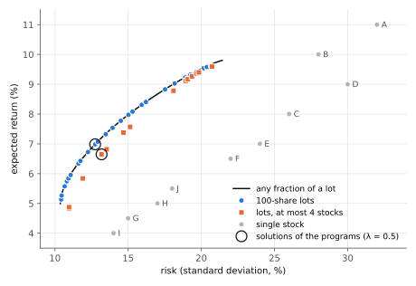

# Portfolio Optimization

We invest a budget of 10 million yen in a combination of ten stocks.
Shares can only be bought in units of 100 shares (one lot), and at most 30% of the budget may go into one stock.
We look for a combination with a large **expected return** (the expected yearly gain from price and dividends,
as a fraction of the amount invested) and a small **risk** (the spread of the return).

The stocks are as follows (fictional data).
The volatility is the standard deviation of the yearly return.

| Stock | Sector | Price (yen) | Expected return | Volatility |
|:---:|:---:|---:|---:|---:|
| A | Electronics | 2,450 | 11.0% | 32% |
| B | Electronics | 6,180 | 10.0% | 28% |
| C | Autos | 1,870 | 8.0% | 26% |
| D | Autos | 3,320 | 9.0% | 30% |
| E | Banks | 1,240 | 7.0% | 24% |
| F | Banks | 4,060 | 6.5% | 22% |
| G | Food | 2,890 | 4.5% | 15% |
| H | Food | 5,510 | 5.0% | 17% |
| I | Telecom | 1,530 | 4.0% | 14% |
| J | Telecom | 3,970 | 5.5% | 18% |

The correlation coefficient of the returns of two stocks is 0.6 if they are in the same sector and 0.2
otherwise. Stocks in the same sector tend to move together, so spreading the purchase over sectors lowers
the risk.

## Formulation

Let the integer variable $x_i$ be the number of lots of stock $i$.
With $c_i$ the cost of one lot (thousand yen) and $B = 10000$ the budget (thousand yen), stock $i$ takes
the fraction $w_i = c_i x_i / B$ of the budget.
The expected return and the risk (variance) of the portfolio are then

$$
R = \sum_{i} \mu_i w_i, \qquad
V = \sum_{i} \sum_{j} \rho_{ij}\, \sigma_i \sigma_j\, w_i w_j
$$

where $\mu_i$ is the expected return, $\sigma_i$ the volatility and $\rho_{ij}$ the correlation coefficient
($\rho_{ii} = 1$).
We want a small risk and a large return, so with a weight $\lambda$ the problem is

$$
\begin{aligned}
\text{Minimize}\quad & V - \lambda R \\
\text{Subject to}\quad & 9800 \le \sum_{i} c_i x_i \le 10000 \\
& 0 \le x_i \le u_i && \text{(every stock } i\text{)}
\end{aligned}
$$

$u_i$ is the number of lots that fit within 30% of the budget (3000 thousand yen).
At least 9.8 million yen of the budget is invested (the rest is cash, with no risk and no return).
$\lambda$ sets how much the return counts: $\lambda = 0$ minimizes the risk, and a larger $\lambda$
favors the return.
This is the mean-variance (Markowitz) model.
If the fractions $w_i$ could be chosen freely, it would be a convex quadratic program that is solved
efficiently; the lot constraint, and the limit on the number of stocks in the next section, make it a
combinatorial optimization problem.

The coefficients are real numbers, so we use [real (double) coefficients](VAREXPR#real-double-coefficients)
(`#define DOUBLE_TYPE`).
The numbers of lots $x_i$ are [native integer variables](NATIVE_INTEGER), and the budget constraint is
written with `qbpp::cons()`.
Amounts are integers in thousands of yen, so violating the budget constraint shifts the amount by at least
1 and the penalty is at least 1.
The objective is below 0.1 in this problem, so weight 1 is enough for the constraint.

## Program

We solve it with $\lambda = 0.5$.


```cpp
#define DOUBLE_TYPE
#include <qbpp/qbpp.hpp>
#include <qbpp/easy_solver.hpp>

#include <cmath>
#include <cstdio>
#include <vector>

int main() {
  // Stocks A-J: sector, price (yen), expected return, volatility (annual)
  std::vector<int> sector = {0, 0, 1, 1, 2, 2, 3, 3, 4, 4};
  std::vector<int> price = {2450, 6180, 1870, 3320, 1240, 4060, 2890, 5510, 1530, 3970};
  std::vector<double> mu = {0.11, 0.10, 0.08, 0.09, 0.07, 0.065, 0.045, 0.05, 0.04, 0.055};
  std::vector<double> sigma = {0.32, 0.28, 0.26, 0.30, 0.24, 0.22, 0.15, 0.17, 0.14, 0.18};
  int n = price.size();
  int budget = 10000;  // thousand yen
  double lambda = 0.5;

  // Cost of one lot (100 shares, thousand yen) and the lots within 30% of the budget
  std::vector<int> lot(n), cap(n);
  for (int i = 0; i < n; ++i) {
    lot[i] = price[i] / 10;
    cap[i] = 3000 / lot[i];
  }

  auto x = 0 <= qbpp::int_var("x", n) <= qbpp::array(cap);

  qbpp::Expr risk, ret, cost;
  for (int i = 0; i < n; ++i) {
    double wi = double(lot[i]) / budget;
    for (int j = 0; j < n; ++j) {
      double wj = double(lot[j]) / budget;
      double rho = (i == j) ? 1.0 : (sector[i] == sector[j] ? 0.6 : 0.2);
      risk += rho * sigma[i] * sigma[j] * wi * wj * x[i] * x[j];
    }
    ret += mu[i] * wi * x[i];
    cost += lot[i] * x[i];
  }
  auto f = risk - lambda * ret + qbpp::cons(9800 <= cost <= budget);
  f.simplify_as_binary();

  auto sol = qbpp::EasySolver(f).search({{"time_limit", 1.0}});
  for (int i = 0; i < n; ++i)
    if (sol(x[i]) > 0)
      std::printf("%c: %2.0f lots (%4.0f thousand yen)\n", 'A' + i, sol(x[i]),
                  lot[i] * sol(x[i]));
  std::printf("cost = %.0f thousand yen, return = %.2f%%, risk = %.2f%%\n",
              sol(cost), 100 * sol(ret), 100 * std::sqrt(sol(risk)));
}
```


The program prints the lots and the amount (thousand yen) of every stock bought, followed by the total
amount, the expected return and the risk (standard deviation).

```
A:  4 lots ( 980 thousand yen)
B:  2 lots (1236 thousand yen)
C:  5 lots ( 935 thousand yen)
D:  2 lots ( 664 thousand yen)
E:  7 lots ( 868 thousand yen)
F:  2 lots ( 812 thousand yen)
G:  4 lots (1156 thousand yen)
H:  2 lots (1102 thousand yen)
I:  4 lots ( 612 thousand yen)
J:  4 lots (1588 thousand yen)
cost = 9953 thousand yen, return = 6.98%, risk = 12.75%
```

- `x` is the array of integer variables $x_i$; its upper bounds `cap` differ by stock.
- `risk`, `ret` and `cost` are the risk $V$, the expected return $R$ and the total amount.
- `EasySolver` searches for 1 second.

The money is spread over all ten stocks, with an expected return of 6.98% and a risk of 12.75%.
The risk of 12.75% is below the volatility of every single stock (14% even for I, the lowest),
which shows the effect of diversification.
An integer programming solver confirms that this is the optimal solution of the problem.

## Limiting the number of stocks

Holding small amounts of ten stocks is tedious, so we buy at most four stocks.
We add binary variables $y_i$, which are 1 when stock $i$ is bought, and the constraints

$$
\begin{aligned}
& x_i \le u_i\, y_i && \text{(every stock } i\text{)}\\
& \sum_{i} y_i \le 4
\end{aligned}
$$

The first constraint means that a stock with $y_i = 0$ cannot be bought.
In the program, `y` and these constraints are added after the budget constraint.


```cpp
#define DOUBLE_TYPE
#include <qbpp/qbpp.hpp>
#include <qbpp/easy_solver.hpp>

#include <cmath>
#include <cstdio>
#include <vector>

int main() {
  // Stocks A-J: sector, price (yen), expected return, volatility (annual)
  std::vector<int> sector = {0, 0, 1, 1, 2, 2, 3, 3, 4, 4};
  std::vector<int> price = {2450, 6180, 1870, 3320, 1240, 4060, 2890, 5510, 1530, 3970};
  std::vector<double> mu = {0.11, 0.10, 0.08, 0.09, 0.07, 0.065, 0.045, 0.05, 0.04, 0.055};
  std::vector<double> sigma = {0.32, 0.28, 0.26, 0.30, 0.24, 0.22, 0.15, 0.17, 0.14, 0.18};
  int n = price.size();
  int budget = 10000;  // thousand yen
  double lambda = 0.5;

  // Cost of one lot (100 shares, thousand yen) and the lots within 30% of the budget
  std::vector<int> lot(n), cap(n);
  for (int i = 0; i < n; ++i) {
    lot[i] = price[i] / 10;
    cap[i] = 3000 / lot[i];
  }

  auto x = 0 <= qbpp::int_var("x", n) <= qbpp::array(cap);

  qbpp::Expr risk, ret, cost;
  for (int i = 0; i < n; ++i) {
    double wi = double(lot[i]) / budget;
    for (int j = 0; j < n; ++j) {
      double wj = double(lot[j]) / budget;
      double rho = (i == j) ? 1.0 : (sector[i] == sector[j] ? 0.6 : 0.2);
      risk += rho * sigma[i] * sigma[j] * wi * wj * x[i] * x[j];
    }
    ret += mu[i] * wi * x[i];
    cost += lot[i] * x[i];
  }
  auto f = risk - lambda * ret + qbpp::cons(9800 <= cost <= budget);

  // At most 4 stocks: y[i] = 1 when stock i is bought
  auto y = qbpp::var("y", n);
  for (int i = 0; i < n; ++i) f += qbpp::cons(x[i] - cap[i] * y[i] <= 0);
  f += qbpp::cons(qbpp::sum(y) <= 4);
  f.simplify_as_binary();

  auto sol = qbpp::EasySolver(f).search({{"time_limit", 1.0}});
  for (int i = 0; i < n; ++i)
    if (sol(x[i]) > 0)
      std::printf("%c: %2.0f lots (%4.0f thousand yen)\n", 'A' + i, sol(x[i]),
                  lot[i] * sol(x[i]));
  std::printf("cost = %.0f thousand yen, return = %.2f%%, risk = %.2f%%\n",
              sol(cost), 100 * sol(ret), 100 * std::sqrt(sol(risk)));
}
```


The output of this program is:

```
B:  4 lots (2472 thousand yen)
C:  9 lots (1683 thousand yen)
G: 10 lots (2890 thousand yen)
J:  7 lots (2779 thousand yen)
cost = 9824 thousand yen, return = 6.65%, risk = 13.19%
```

One stock each is chosen from electronics, autos, food and telecom, so no two stocks share a sector.
Because of the limit, the expected return drops from 6.98% to 6.65% and the risk rises from 12.75% to
13.19%.
This is also the optimal solution of the problem.

## Risk and return

We solved the same problem for $\lambda$ from 0 to 4 in steps of 0.05 and plotted the risk and expected
return of the solutions.
Each point was found by the ABS3 Solver in 1 second, and an integer programming solver confirms that all of
them are optimal.

<p align="center">
  
</p>

- The black line shows the optimal solutions when the fractions can be chosen freely, without the lot
  constraint (the efficient frontier). No higher return is possible at the same risk.
- The solutions in 100-share lots (blue) lie almost on the black line: one lot is small compared with the
  budget, so the lot constraint costs little.
- The solutions with at most four stocks (orange) lie below and to the right of the black line: the same
  return needs a larger risk. At the upper-right end, where the return counts most, the portfolio is
  concentrated in a few stocks anyway, so the difference becomes small.
- Every solution has a smaller risk than the single stocks (gray) with a similar return.
