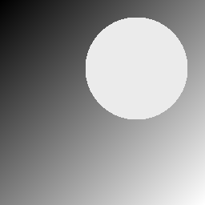
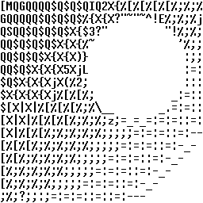
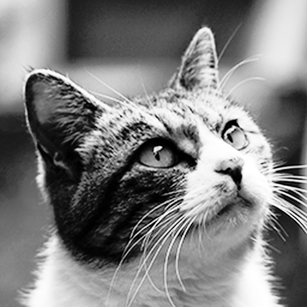
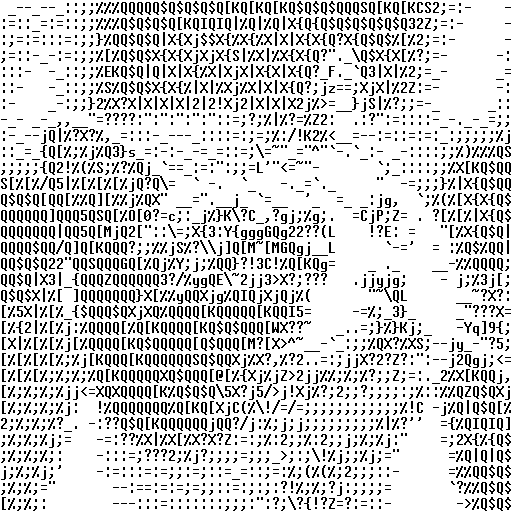

# ASCII Art Generation

**ASCII art** draws a picture with characters.
Each character has its own amount and shape of black pixels, so from a distance a grid of characters blurs into shades of gray.
As in [image halftoning](HALFTONING), we model this blur with a Gaussian filter. A good ASCII art is then

**a grid of characters whose blurred image is as close as possible to the original image**.

If binary variables tell which character is placed in each cell, this problem is a QUBO as it stands.
The objective function used here is the same as in the ASCII art generation method by local exhaustive search [1].

## QUBO formulation

We split the image into cells of $16$ rows × $8$ columns of pixels and place one character in each cell of an $R \times C$ grid.
The characters are the $94$ characters from `!` to `~`; a space is represented by placing no character.
The glyph shapes come from the [unscii-16](http://viznut.fi/unscii/) font ($8 \times 16$ pixels, public domain).

**Variables**: $x_{r,c,k} \in \lbrace 0,1\rbrace$ is $1$ if character $k$ is placed in the cell at row $r$, column $c$.
The variables form an $R \times C \times 94$ three-dimensional array.

**Constraints**: each cell holds at most one character:

$$\sum_{k} x_{r,c,k} \le 1 \qquad (0 \le r < R,\ 0 \le c < C)$$

**Objective**: let $u$ be the image of the characters with $1$ for black pixels and $0$ for white pixels.
Each pixel of the blurred image $(G * u)$ is the "apparent darkness" of that pixel
($G$ is a $7 \times 7$ integer Gaussian with $\sigma = 2$ whose coefficients sum to $256$).
The target darkness $T$ is derived from the brightness $I$ of the original image:

$$T(p) = \left\lfloor \frac{(I_{\max} - I(p))\, t_{\max}}{I_{\max} - I_{\min}} \right\rfloor,
\qquad t_{\max} = \frac{256 \times 55}{128} = 110$$

Here $55$ is the number of black pixels (out of $16 \times 8 = 128$) of `N`, the character with the most black pixels,
and $t_{\max}$ is the darkness of a region filled with that character only.
Since characters cannot get any darker, the darkest pixel of the original image is mapped to $t_{\max}$ and the brightest pixel to $0$ (white).
We minimize the sum of squared differences between the blurred character image and the target darkness:

$$E(x) = \sum_{p} \bigl( (G * u)(p) - T(p) \bigr)^2$$

The sum runs over the image plus a white margin ($T = 0$) of width $3$ (the filter radius),
so blur that leaks out of the image also counts as error on white paper.

### Simplifying along the way to keep the term count down

$(G * u)(p)$ is linear in the variables, so building $(G * u)(p) - T(p)$ for each pixel, squaring it with `qbpp.sqr`, and adding everything up gives $E(x)$ (the same style as in [image halftoning](HALFTONING)).
For ASCII art, however, the expressions get large.
The $7 \times 7$ filter window covers up to $4$ cells, each with variables for $94$ characters, so the linear expression of a pixel has up to a few hundred terms, and its square has tens of thousands.
Moreover, the same pair of variables appears again and again in the squares of dozens of nearby pixels.
Adding the squares of all pixels and simplifying only once at the end inflates the terms before simplification to about $70$ times the final count.

So we build the expression piece by piece, simplify each piece to merge like terms and shrink it, and then add the pieces up:

- The linear expression of a pixel is a sum of $49$ values of $u$ in which the same variables appear many times, so `simplify()` merges them before squaring.
- The squares are added up for every $16$ pixel rows (one row of characters), shrunk with `simplify_as_binary()`, and then added to `f`. Terms repeated within one row of characters are merged here.
- Finally, `simplify_as_binary()` on the whole `f` merges the terms repeated across the boundaries of adjacent rows of characters.

Measurements for the $16 \times 32$ example ($256 \times 256$ pixels; C++ version, 64-core CPU):

| How to simplify | Build time | Peak memory |
|:---|:---:|:---:|
| Once at the end, after adding the squares of all pixels | 60 s | 28.7 GB |
| Every pixel row | 104 s | 5.8 GB |
| **Every 16 pixel rows (one row of characters)** | **59 s** | **2.4 GB** |

Simplifying along the way does not reduce the work of creating the terms, so the time hardly changes, but the memory drops to about $1/12$.
Splitting too finely slows things down with many simplify calls; one row of characters, within which duplicates merge well, is a good unit.

In Python, building with a simplify per row of characters takes about $1.5$ minutes (about $40$ seconds with `import pyqbpp.c32e64m2`, which fixes the term degree to at most 2) on a 32-core CPU.

## PyQBPP program

The following program converts a $256 \times 256$ synthetic grayscale image (diagonal gradient + bright circle)
into ASCII art of $16$ rows and $32$ columns and prints it. The `FONT` table at the top holds the glyph shapes:


```python
import pyqbpp as qbpp

FH, FW = 16, 8                   # character size (16 x 8 pixels)
NC = 94                          # kinds of characters ('!'..'~'; a space is "no character")
R, C = 16, 32                    # rows and columns of characters
ROWS, COLS = R * FH, C * FW      # image size (256 x 256 pixels)
M = 3                            # filter radius (7x7 filter)
G = [[1, 2, 3, 4, 3, 2, 1],
     [2, 4, 7, 7, 7, 4, 2],
     [3, 7, 10, 11, 10, 7, 3],
     [4, 7, 11, 12, 11, 7, 4],
     [3, 7, 10, 11, 10, 7, 3],
     [2, 4, 7, 7, 7, 4, 2],
     [1, 2, 3, 4, 3, 2, 1]]      # integer Gaussian (sigma = 2, sum 256)

# unscii-16 font (public domain): 16 rows x 8 bits per character, '!'..'~'
FONT = [
    "00181818181818181800001818000000", "00666666000000000000000000000000",
    "00006C6C6CFE6C6C6CFE6C6C6C000000", "0018183C666030180C06663C18180000",
    "000006C6CCCC181830306666C6C00000", "0000386C6C38307ADECCCCCC76000000",
    "00181818300000000000000000000000", "000C18183030303030303018180C0000",
    "003018180C0C0C0C0C0C0C1818300000", "0000000066663CFF3C66660000000000",
    "000000001818187E1818180000000000", "00000000000000000000381818306000",
    "000000000000007E0000000000000000", "00000000000000000000181818000000",
    "030306060C0C181830306060C0C00000", "0000386CC6C6CED6E6C6C66C38000000",
    "0000183878181818181818187E000000", "00003C666606060C183060607E000000",
    "00003C666606061C060666663C000000", "00000C1C3C6CCCCCFE0C0C0C0C000000",
    "00007E6060607C06060666663C000000", "00001C3060607C66666666663C000000",
    "00007E0606060C0C1818181818000000", "00003C666666763C6E6666663C000000",
    "00003C666666663E0606060C38000000", "00000018181800000000181818000000",
    "00000018181800000000381818306000", "000000060C18306030180C0600000000",
    "00000000007E0000007E000000000000", "0000006030180C060C18306000000000",
    "003C6666060C18181800001818000000", "00007CC6C6C6DEDEDEDCC0C07C000000",
    "0000183C6666667E6666666666000000", "00007C6666666C786C6666667C000000",
    "00003C6666606060606066663C000000", "0000786C666666666666666C78000000",
    "00007E606060607C606060607E000000", "00007E6060607C606060606060000000",
    "00003C666660606E666666663E000000", "000066666666667E6666666666000000",
    "00007E1818181818181818187E000000", "0000060606060606060666663C000000",
    "0000C6C6CCCCD8F0D8CCCCC6C6000000", "0000606060606060606060607E000000",
    "0000C6EEEEFED6D6C6C6C6C6C6000000", "0000C6C6E6E6F6FEDECECEC6C6000000",
    "00003C6666666666666666663C000000", "00007C666666667C6060606060000000",
    "00003C6666666666666666663C0C0600", "00007C666666667C6C66666666000000",
    "00003C66666030180C0666663C000000", "00007E18181818181818181818000000",
    "0000666666666666666666663C000000", "0000666666666666663C3C1818000000",
    "0000C6C6C6C6C6D6D6FEEEEEC6000000", "0000C3C3663C1818183C66C3C3000000",
    "0000C3C366663C181818181818000000", "00007E06060C0C18303060607E000000",
    "003C30303030303030303030303C0000", "C0C06060303018180C0C060603030000",
    "003C0C0C0C0C0C0C0C0C0C0C0C3C0000", "0010386C6CC6C6000000000000000000",
    "000000000000000000000000000000FF", "0018180C060000000000000000000000",
    "0000000000003C063E6666663E000000", "0000606060607C66666666667C000000",
    "0000000000003C66606060663C000000", "0000060606063E66666666663E000000",
    "0000000000003C66667E60603C000000", "00001E3030307E303030303030000000",
    "0000000000003E66666666663E06067C", "0000606060607C666666666666000000",
    "0000181800007818181818181E000000", "00000C0C00000C0C0C0C0C0C0C0C0C78",
    "00006060606066666C786C6666000000", "0000781818181818181818181E000000",
    "000000000000CCFED6D6D6D6C6000000", "0000000000007C666666666666000000",
    "0000000000003C66666666663C000000", "0000000000007C66666666667C606060",
    "0000000000003E66666666663E060606", "0000000000007C666660606060000000",
    "0000000000003E60603C06067C000000", "0000003030307E30303030301E000000",
    "0000000000006666666666663E000000", "00000000000066666666663C18000000",
    "000000000000C6C6D6D6D67C6C000000", "000000000000C6C66C386CC6C6000000",
    "0000000000006666666666663E06063C", "0000000000007E060C1830607E000000",
    "000E1818181818F018181818180E0000", "18181818181818181818181818180000",
    "00E030303030301E3030303030E00000", "0072D69C000000000000000000000000",
]


def ink(k, y, x):
    # 1 if pixel (y, x) of character k ('!' + k) is black
    return int(FONT[k][2 * y:2 * y + 2], 16) >> (7 - x) & 1


# input image: diagonal gradient + bright circle (synthetic)
img = [[235 if (i - 85) ** 2 + (j - 170) ** 2 < 64 ** 2
        else 255 * (i + j) // (ROWS + COLS - 2) for j in range(COLS)]
       for i in range(ROWS)]

# target darkness T: darkest pixel -> darkness of the blackest character,
# brightest pixel -> 0 (white), plus a white margin (T = 0) of width M
max_ink = max(sum(ink(k, y, x) for y in range(FH) for x in range(FW))
              for k in range(NC))
t_max = 256 * max_ink // (FH * FW)
lo = min(min(row) for row in img)
hi = max(max(row) for row in img)
T = [[0] * (COLS + 2 * M) for _ in range(ROWS + 2 * M)]
for i in range(ROWS):
    for j in range(COLS):
        T[i + M][j + M] = (hi - img[i][j]) * t_max // (hi - lo)

# x[r][c][k] = 1: character k is placed at row r, column c
x = qbpp.var("x", R, C, NC)

# u[i][j]: blackness of pixel (i, j) of the character image (linear in x)
u = [[0] * COLS for _ in range(ROWS)]
for i in range(ROWS):
    for j in range(COLS):
        for k in range(NC):
            if ink(k, i % FH, j % FW):
                u[i][j] += x[i // FH][j // FW][k]

# E = Σ((G * u) - T)^2: build FH pixel rows (one row of characters) at a time, simplify, add to f
f = 0
for i0 in range(-M, ROWS + M, FH):
    g = 0
    for i in range(i0, min(i0 + FH, ROWS + M)):
        for j in range(-M, COLS + M):
            e = -T[i + M][j + M]  # (G * u)(i, j) - T(i, j)
            for a in range(2 * M + 1):
                for b in range(2 * M + 1):
                    if 0 <= i + a - M < ROWS and 0 <= j + b - M < COLS:
                        e += G[a][b] * u[i + a - M][j + b - M]
            e.simplify()  # merge repeated variables before squaring
            g += qbpp.sqr(e)
    g.simplify_as_binary()  # merge like terms to shrink it,
    f += g                  # then add it to f
# at most one character per cell (no character = space)
f += 2 * t_max * 256 * max_ink * qbpp.cons(qbpp.vector_sum(x) <= 1)
f.simplify_as_binary()

sol = qbpp.EasySolver(f).search(time_limit=10)
print("variables =", sol.info["var_count"], " terms =", sol.info["term_count"])
print("energy =", sol.energy)

# print the solution as characters
val = sol(x)
for r in range(R):
    line = ""
    for c in range(C):
        ch = " "
        for k in range(NC):
            if val[r][c][k]:
                ch = chr(ord("!") + k)
        line += ch
    print(line)
```


The program works as follows.

1. `T` holds the target darkness (with a white margin of width $3$ around the image).
2. `qbpp.var("x", R, C, NC)` creates a $16 \times 32 \times 94$ variable array.
   `u[i][j]` is the blackness of pixel $(i, j)$ of the character image: the sum of the variables of the characters that make this pixel black (linear in `x`).
3. For each pixel, $(G * u)(p) - T(p)$ is built in `e`, simplified with `simplify()`, and `qbpp.sqr(e)` is added to `g`.
   After every $16$ pixel rows, `g.simplify_as_binary()` shrinks `g`, which is then added to `f`.
4. `qbpp.vector_sum(x)` sums over the last axis (the characters), giving the number of characters placed in each cell.
   `qbpp.cons(... <= 1)` imposes "at most one character" on every cell.
   A second, stacked character can reduce the error by at most $2\, t_{\max} \cdot 256 \cdot 55$ (the blur of a character sums to $256 \times$ its black pixels),
   so with this weight a solution with stacked characters never pays off.
5. The final `f.simplify_as_binary()` merges everything, `EasySolver` solves it, and the program prints the character whose value is $1$ in each cell of `sol(x)`.

### Output


```
variables = 48128  terms = 13703866
energy = 40285185
QQSQ[KQQ$Q$Q$QIQ2X{%[%[%[%[%;%;%
CQ[KQQ$Q$Q$Q$X{X{X?"~"~^!E%;%;%j
[KQQ$Q$Q$Q$X{X3?"         "!%;%;
QQ$QIQ$Q$X{X{%~             '%;;
QQ$Q$Q$X{X{X]}               :;;
QQ$S$%{X{Xj5%L               :=:
[Q$X{%{XjX(%5;               :::
$O{G{X{Xj%[%[%;            _:=::
32X|X|%[%[%[%;%\__       _.=:=::
[X|X|%[%[%[%;%;%;;;=_=_=:=:==:=:
[X|%[%[%;%;%;%;%;;;;;=:::=::=:--
[%[%[%[%;%;Z;%;;;;;::=:=::=:-_- 
[%[%;%;%;2;Z;;;;;=:=::::=:-_-   
[%;%;%;%;Z;;;;;=:=:=::=:-_-     
[%;%;%;%;;;;;=:=:=::=:-_-       
;%;%;%:;=:=:=::=::=:---         
```


There are $48{,}128$ variables, and the QUBO has about $13.7$ million terms after simplification.
`EasySolver` is a randomized heuristic, so the characters and the energy change from run to run.

The input image (left) and the output characters drawn with the same font (right):

<p align="center">
  
  
</p>

The gradient appears as changing character density, and along the circle the characters follow the direction of the edge,
such as `"` and `~` on the upper edge and `_` on the lower edge.
This is because the blurred shapes, not just the average darkness of the characters, are matched to the original image.

## Applying it to a photo

Replacing the part that generates the input image with reading a file, and changing $R$ and $C$, turns a real photo into ASCII art.
The following example converts a $512 \times 512$ photo into $32$ rows and $64$ columns of characters
($192{,}512$ variables and about $56$ million terms, $5$ minutes of search with `EasySolver`).
Most pixels of the photo were dark, so its brightness was spread out by histogram equalization before the conversion:

<p align="center">
  
  
</p>

## Speeding up: computing the terms directly

The program above expands the square pixel by pixel, exactly as the formula reads, so it creates the same terms many times and then merges them.
If we expand the objective function by hand first and compute the coefficient of each term as an integer, every QUBO term can be created exactly once.

### Method

Placing character $k$ in cell $(r, c)$ adds to the blurred image the image $h_k$ of character $k$ blurred by $G$ ($(16+6) \times (8+6)$ pixels), shifted to the position of that cell.
Since $h_k$ does not depend on the position of the cell, letting $p_{r,c}$ be the top-left position of cell $(r, c)$, we can write

$$(G * u)(p) = \sum_{r,c,k} h_k(p - p_{r,c})\, x_{r,c,k}.$$

Substituting this into $E(x)$ and expanding the square gives:

$$E(x) = \sum_{(r,c,k)} \sum_{(r',c',l)} A_{r'-r,\, c'-c}(k, l)\, x_{r,c,k}\, x_{r',c',l} \;-\; 2 \sum_{(r,c,k)} B_{r,c}(k)\, x_{r,c,k} \;+\; \sum_{p} T(p)^2$$

- $A_{dr,dc}(k, l)$ is the overlap of $h_k$ and $h_l$ shifted $dr$ cells down and $dc$ cells right (the sum of the products of the pixel values at the same positions).
  A blurred character spreads only into the adjacent cells, so it is $0$ unless $|dr| \le 1$ and $|dc| \le 1$.
  It does not depend on the position of the cell, so a table of $9$ shifts × $94 \times 94$ is computed only once.
- $B_{r,c}(k)$ is the overlap of $h_k$ placed in cell $(r, c)$ with the target darkness $T$.
- The terms $x_{r,c,k}\, x_{r,c,k}$ with $k = l$ in the same cell are merged into $x_{r,c,k}$ by `simplify_as_binary()`.

### Program

Replace the part of the program above from the line declaring `x` to the last `f.simplify_as_binary()` with the following code
(`FONT`, `ink`, the part that builds the target darkness `T`, and the search and output are unchanged):

```python
# h[k]: character k blurred by G ((FH + 2M) x (FW + 2M) pixels)
HY, HX = FH + 2 * M, FW + 2 * M
h = [[[0] * HX for _ in range(HY)] for _ in range(NC)]
for k in range(NC):
    for y in range(FH):
        for x in range(FW):
            if ink(k, y, x):
                for a in range(2 * M + 1):
                    for b in range(2 * M + 1):
                        h[k][y + a][x + b] += G[a][b]

# A[dr, dc][k][l]: overlap of h[k] and h[l] shifted dr rows and dc columns
A = {}
for dr in (-1, 0, 1):
    for dc in (-1, 0, 1):
        ii = range(max(0, dr * FH), min(HY, HY + dr * FH))
        jj = range(max(0, dc * FW), min(HX, HX + dc * FW))
        A[dr, dc] = qbpp.array(
            [[sum(h[k][i][j] * h[l][i - dr * FH][j - dc * FW] for i in ii for j in jj)
              for l in range(NC)] for k in range(NC)])

# x[r][c][k] = 1: character k is placed at row r, column c
x = qbpp.var("x", R, C, NC)

# create the terms of E = Σ A x x - 2 Σ B x + Σ T^2 directly
f = sum(t * t for row in T for t in row)
for r in range(R):
    for c in range(C):
        for k in range(NC):
            # overlap of h[k] and T
            B = sum(h[k][i][j] * T[r * FH + i][c * FW + j]
                    for i in range(HY) for j in range(HX))
            f += -2 * B * x[r][c][k]
        for dr in (-1, 0, 1):
            for dc in (-1, 0, 1):
                if 0 <= r + dr < R and 0 <= c + dc < C:
                    f += qbpp.einsum("k,kl,l->", x[r][c], A[dr, dc],
                                     x[r + dr][c + dc])
# at most one character per cell (no character means a space)
f += 2 * t_max * 256 * max_ink * qbpp.cons(qbpp.vector_sum(x) <= 1)
f.simplify_as_binary()
```

1. `h[k]` accumulates $G$ for each black pixel of character $k$, giving the blurred character image.
2. `A[dr, dc]` is the overlap of two blurred characters placed with a shift, as a $94 \times 94$ integer array.
3. The constant $\sum T^2$ and the linear terms $-2 B_{r,c}(k)\, x_{r,c,k}$ are added to `f` with their coefficients given directly.
4. The quadratic terms $\sum_{k,l} A_{dr,dc}(k, l)\, x_{r,c,k}\, x_{r+dr,c+dc,l}$ are created $94 \times 94$ at a time with
   [`qbpp.einsum`](EINSUM) for each pair of the $9$ adjacent cells, including the same cell (`x[r][c]` is the 1-D array of the $94$ variables of cell $(r, c)$).
   Loops over individual terms are slow in Python, so creating them in bulk is faster.

### Effect

The resulting QUBO is exactly the same as the one built by the program above (the same $13{,}703{,}866$ terms after simplification).
Since every term is created only once, the construction time drops from about $1.5$ minutes to about $9$ seconds
(from about $40$ seconds to about $6$ seconds with `import pyqbpp.c32e64m2`).

The program above, written exactly as the formula reads, is easy to read and easy to adapt to a different objective function.
Computing the terms directly requires deriving the expansion by hand, but greatly reduces the construction time for large problems.

## Reference

[1] Y. Takeuchi, D. Takafuji, Y. Ito, and K. Nakano,
"ASCII Art Generation Using the Local Exhaustive Search on the GPU,"
*Proc. International Symposium on Computing and Networking (CANDAR)*, pp. 194–200, 2013.
