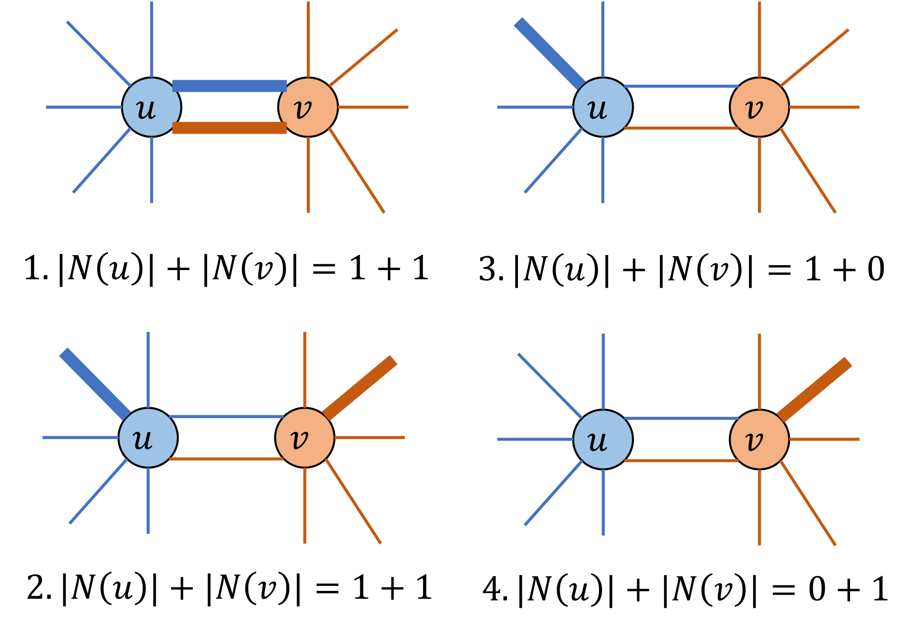

# Minimum Maximal Matching Problem

A **matching** in an undirected graph is a set of edges such that no two edges share a common endpoint.
A **maximal matching** is a matching to which no additional edge can be added without violating the matching condition.
Given an undirected graph $G=(V,E)$, the minimum maximal matching problem asks for a maximal matching $S \subseteq E$ with the minimum number of edges.

The maximality condition of a matching can be described in a compact way.
For a node $u\in V$, let $N(u)$ denote the set of edges in $S$ incident to $u$.
Then $S$ is a maximal matching if and only if, for every edge $(u,v)\in E$, the following condition holds:

$$
 1 \leq |N(u)|+|N(v)| \leq 2
$$

This condition is satisfied if and only if $S$ constitutes a maximal matching. To ensure that $S$ is a maximal matching, the following cases cover all possibilities:

<p align="center">
  
</p>

We can formulate the minimum maximal matching problem as finding a subset $S$ that satisfies the above condition and has minimum cardinality.

For a formal proof, see the following paper:

> **Reference**:
> Nakahara, Y., Tsukiyama, S., Nakano, K., Parque, V., & Ito, Y. (2025). **A penalty-free QUBO formulation for the minimum maximal matching problem**. International Journal of Parallel, Emergent and Distributed Systems, 1--19. https://doi.org/10.1080/17445760.2025.2579546


## Formulation of the minimum maximal matching problem
Assume that the graph has $n$ vertices and $m$ edges, and that the edges are labeled $0,1,\ldots,m-1$.
We introduce $m$ binary variables $x_0, x_1, \ldots, x_{m-1}$, where $x_i=1$ if and only if edge $i$ is selected (i.e., belongs to $S$).
The objective is to minimize the number of selected edges:

$$
\begin{aligned}
\text{objective} &= \sum_{i=0}^{m-1} x_i .
\end{aligned}
$$

The maximality condition is the range constraint $1 \leq |N(u)|+|N(v)| \leq 2$ for each edge $(u,v)\in E$.
In PyQBPP, it is enclosed in [`qbpp.cons()`](CONSTRAINTS) to declare it as a constraint, and combined with the objective to construct the expression $f$:

$$
\begin{aligned}
f &= \text{objective} + 2\times\sum_{(u,v)\in E} \text{cons}(1 \leq |N(u)|+|N(v)| \leq 2).
\end{aligned}
$$

When a constraint is violated, the square of the violation multiplied by the weight is added to the energy.
If the violation is 1, this value is 1. With the weight 1, a solution that violates a constraint can have the same energy as the solution that satisfies it by adding one edge, so solutions that violate constraints are mixed into the optimal solutions.
Therefore, the weight is 2.

## PyQBPP program
The following PyQBPP program finds a minimum maximal matching of a fixed undirected graph with $N=16$ nodes and $M=27$ edges:
```python
import pyqbpp as qbpp

N = 16
edges = [
    (0, 1),  (0, 2),  (1, 3),  (1, 4),  (2, 5),  (2, 6),  (3, 7),
    (3, 13), (4, 6),  (4, 7),  (4, 14), (5, 8),  (6, 8),  (6, 12),
    (6, 14), (7, 14), (8, 9),  (9, 10), (9, 12), (10, 11),(10, 12),
    (11, 13),(11, 15),(12, 14),(12, 15),(13, 15),(14, 15)]
M = len(edges)

adj = [[] for _ in range(N)]
for i in range(M):
    adj[edges[i][0]].append(i)
    adj[edges[i][1]].append(i)

x = qbpp.var("x", shape=M)

objective = qbpp.sum(x)

constraint = 0
for u, v in edges:
    t = 0
    for idx in adj[u]:
        t += x[idx]
    for idx in adj[v]:
        t += x[idx]
    constraint += qbpp.cons(t, between=(1, 2))

f = objective + 2 * constraint

f.simplify_as_binary()
solver = qbpp.ExhaustiveSolver(f)
sol = solver.search()

print(f"objective = {sol(objective)}")
print(f"violated constraints = {f.cons(sol)}")
print("Selected edges:", end="")
for i in range(M):
    if sol(x[i]) == 1:
        print(f" {edges[i]}", end="")
print()
```
We first define a vector `x` of `M` binary variables, and then define `objective`, `constraint`, and `f` based on the formulation above.
`qbpp.cons(t, between=(1, 2))` is the range constraint that `t` is between 1 and 2.
The Exhaustive Solver is used to find an optimal solution of `f`.
The objective value, the number of violated constraints `f.cons(sol)`, and the list of selected edges are printed.

This program produces the following output:
```
objective = 6
violated constraints = 0
Selected edges: (0, 2) (1, 3) (4, 7) (8, 9) (11, 15) (12, 14)
```
Therefore, $S$ contains 6 edges and forms a minimum maximal matching.

## Visualization using matplotlib
The following code visualizes the minimum maximal matching solution. Selected edges in $S$ and all nodes incident to these edges are highlighted in red:
```python
import matplotlib.pyplot as plt
import networkx as nx

G = nx.Graph()
G.add_nodes_from(range(N))
G.add_edges_from(edges)
pos = nx.spring_layout(G, seed=42)

matched_nodes = set()
for i in range(M):
    if sol(x[i]) == 1:
        matched_nodes.add(edges[i][0])
        matched_nodes.add(edges[i][1])
colors = ["#e74c3c" if i in matched_nodes else "#d5dbdb" for i in range(N)]
edge_colors = ["#e74c3c" if sol(x[i]) == 1 else "#cccccc"
               for i in range(M)]
edge_widths = [2.5 if sol(x[i]) == 1 else 1.0 for i in range(M)]
nx.draw(G, pos, with_labels=True, node_color=colors, node_size=400,
        font_size=9, edge_color=edge_colors, width=edge_widths)
plt.title("Minimum Maximal Matching")
plt.savefig("minmax_matching.png", dpi=150, bbox_inches="tight")
plt.show()
```

In the resulting figure, the selected edges in $S$ and all nodes incident to these edges are highlighted in red.
We can see that no more edge can be added, and the maximality condition is satisfied.
