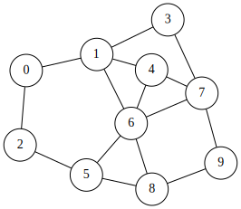
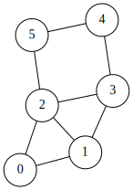
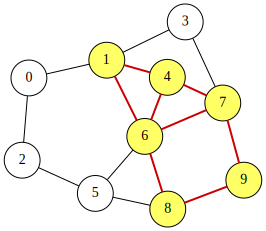

# Subgraph Isomorphism Problem
Given two undirected graphs $G_H=(V_H,E_H)$ (the host graph) and
$G_G=(V_G,E_G)$ (the guest graph), the **subgraph isomorphism problem** asks whether
$G_H$ contains a subgraph that is isomorphic to $G_G$.

More formally, the goal is to find an **injective mapping** $\sigma:V_G\rightarrow V_H$
such that, for every edge $(u,v)\in E_G$, the pair $(\sigma(u),\sigma(v))$ is also an edge of the host graph, i.e., $(\sigma(u),\sigma(v))\in E_H$.

For example, consider the following host and guest graphs:
<p align="center">
  <br>
  An example of the host graph $G_H=(V_H,E_H)$ with 10 nodes
</p>

<p align="center">
  <br>
  An example of the guest graph $G_G=(V_G,E_G)$ with 6 nodes
</p>

One solution $\sigma$ is:

| node $i$ in $G_G$ | 0 | 1 | 2 | 3 | 4 | 5 |
|:---:|:---:|:---:|:---:|:---:|:---:|:---:|
| node $\sigma(i)$ in $G_H$ | 1 | 4 | 6 | 7 | 9 | 8 |


This solution is visualized as follows:

<p align="center">
  <br>
  A solution to the subgraph isomorphism problem
</p>

## QUBO formulation of the subgraph isomorphism problem
Assume that the **guest graph** $G_G=(V_G,E_G)$ has $m$ nodes labeled $0, 1, \ldots m-1$, and
the **host graph** $G_H=(V_H,E_H)$ has $n$ nodes labeled $0, 1, \ldots n-1$.
We introduce an $m\times n$ **binary matrix** $X=(x_{i,j})$ ($0\leq i\leq m-1, 0\leq j\leq n-1$) with $mn$ binary variables.
This matrix represents an injective mapping $\sigma:V_G\rightarrow V_H$
such that $x_{i,j}=1$ if and only if $\sigma(i)=j$.

For example, the solution of the subgraph isomorphism problem can be represented by the following $6\times 10$ binary matrix:

| $i$ | $\sigma(i)$ | 0 | 1 | 2 | 3 | 4 | 5 | 6 | 7 | 8 | 9 |
|:---:|:---:|:---:|:---:|:---:|:---:|:---:|:---:|:---:|:---:|:---:|:---:|
| 0 | 1 | 0 | 1 | 0 | 0 | 0 | 0 | 0 | 0 | 0 | 0 |
| 1 | 4 | 0 | 0 | 0 | 0 | 1 | 0 | 0 | 0 | 0 | 0 |
| 2 | 6 | 0 | 0 | 0 | 0 | 0 | 0 | 1 | 0 | 0 | 0 |
| 3 | 7 | 0 | 0 | 0 | 0 | 0 | 0 | 0 | 1 | 0 | 0 |
| 4 | 9 | 0 | 0 | 0 | 0 | 0 | 0 | 0 | 0 | 0 | 1 |
| 5 | 8 | 0 | 0 | 0 | 0 | 0 | 0 | 0 | 0 | 1 | 0 |

Because $X$ represents an injective mapping, it must satisfy the following constraints:
- **Row constraint**: Each guest node is mapped to exactly one host node, i.e., the sum of each row is 1.
- **Column constraint**: Each host node is used by at most one guest node, i.e., the sum of each column is 0 or 1.

These can be combined into the following **QUBO++-style constraint**, which attains its minimum value when all constraints are satisfied:

$$
\begin{aligned}
\text{constraint} &= \sum_{i=0}^{m-1}\Bigl(\sum_{j=0}^{n-1}x_{i,j} = 1\Bigr)+\sum_{j=0}^{m-1}\Bigl(0\leq \sum_{i=0}^{n-1}x_{i,j} \leq 1\Bigr)
\end{aligned}
$$

In QUBO form, we can express the same constraints as:

$$
\begin{aligned}
\text{constraint}
 &=  \sum_{i=0}^{m-1}\Bigl(\sum_{j=0}^{n-1}x_{i,j} - 1\Bigr)^2+\sum_{j=0}^{m-1}\sum_{i=0}^{n-1}x_{i,j}\Bigl(\sum_{i=0}^{n-1}x_{i,j}-1\Bigr)
\end{aligned}
$$

Next, we define the objective as the number of guest edges that are mapped to host edges:

$$
\begin{aligned}
\text{objective} &= \sum_{(u_G,v_G)\in E_G}\sum_{(u_H,v_H)\in E_H} (x_{u_G,u_H}x_{v_G,v_H}+x_{u_G,v_H}x_{v_G,u_H})
\end{aligned}
$$

Here, an undirected guest edge $(u_G,v_G)\in E_G$ can correspond to a host edge $(u_H,v_H)\in E_H$ in two symmetric ways:
- $(u_G, v_G)\mapsto (u_H,v_H)$
- $(u_G, v_G)\mapsto (v_H,u_H)$

Therefore, we include both quadratic terms $x_{u_G,u_H}x_{v_G,v_H}$ and $x_{u_G,v_H}x_{v_G,u_H}$.

Finally, we combine the objective and the constraint into a single QUBO expression:

$$
\begin{aligned}
f  &= -\text{objective} + mn\times \text{constraint}
\end{aligned}
$$

The penalty coefficient $mn$ is chosen so that satisfying the constraints is prioritized over improving the objective.
The best possible value of $f$ is attained when the constraint term is zero and the objective equals the number of guest edges.

## PyQBPP program for the subgraph isomorphism problem
Based on the QUBO formulation above, the following PyQBPP program solves the subgraph isomorphism problem for a guest graph with $M=6$ nodes and a host graph with $N=10$ nodes:

```python
import pyqbpp as qbpp

N = 10
host = [
    (0, 1), (0, 2), (1, 3), (1, 4), (1, 6), (2, 5), (3, 7), (4, 6),
    (4, 7), (5, 6), (5, 8), (6, 8), (6, 7), (7, 9), (8, 9)]

M = 6
guest = [
    (0, 1), (0, 2), (1, 2), (1, 3), (2, 3), (2, 5), (3, 4), (4, 5)]

x = qbpp.var("x", shape=(M, N))

host_assigned = qbpp.vector_sum(x, 0)

constraint = qbpp.sum(qbpp.constrain(qbpp.vector_sum(x, 1), equal=1)) + \
             qbpp.sum(qbpp.constrain(host_assigned, between=(0, 1)))

objective = 0
for ug, vg in guest:
    for uh, vh in host:
        objective += x[ug][uh] * x[vg][vh] + x[ug][vh] * x[vg][uh]

f = -objective + constraint * (M * N)
f.simplify_as_binary()

solver = qbpp.EasySolver(f)
sol = solver.search(target_energy=-len(guest))

print(f"sol(x) = {sol(x)}")
print(f"sol(objective) = {sol(objective)}")
print(f"sol(constraint) = {sol(constraint)}")

guest_to_host = qbpp.onehot_to_int(sol(x), axis=1)
print(f"guest_to_host = {guest_to_host}")

host_to_guest = qbpp.onehot_to_int(sol(x), axis=0)
print(f"host_to_guest = {host_to_guest}")
```

The guest and host graphs are given as the edge lists `guest` and `host`, respectively.
We define an $M\times N$ binary matrix `x`, and then construct the expressions `constraint`, `objective`, and `f` according to the formulation above.

An Easy Solver instance is created for `f`, and the target energy is set to
$-|E_G|$ (the negative number of guest edges), which is the best possible value of `-objective` when all guest edges are mapped to host edges.
The obtained solution is stored in `sol`.
The values of `x`, `objective`, and `constraint` under `sol` are then printed.

Using the function **`qbpp.onehot_to_int()`**, the program also outputs the mappings from guest nodes to host nodes (`guest_to_host`, $\sigma$) and from host nodes to guest nodes (`host_to_guest`, $\sigma^{-1}$).

This program produces the following output:

```
sol(x) = {{0,1,0,0,0,0,0,0,0,0},{0,0,0,0,1,0,0,0,0,0},{0,0,0,0,0,0,1,0,0,0},{0,0,0,0,0,0,0,1,0,0},{0,0,0,0,0,0,0,0,0,1},{0,0,0,0,0,0,0,0,1,0}}
sol(objective) = 8
sol(constraint) = 0
guest_to_host = {1,4,6,7,9,8}
host_to_guest = {-1,0,-1,-1,1,-1,2,3,5,4}
```

The objective value equals the number of guest edges ($|E_G|=8$), and all constraints are satisfied (`constraint` = 0).
Therefore, the program finds an optimal solution that corresponds to a valid subgraph isomorphism.
Note that an entry of `host_to_guest` is `-1` if the corresponding host node is not mapped from any guest node.

## Visualization using matplotlib
The following code visualizes the Subgraph Isomorphism solution on the host graph:
```python
import matplotlib.pyplot as plt
import networkx as nx

G_host = nx.Graph()
G_host.add_nodes_from(range(N))
G_host.add_edges_from(host)
pos = nx.spring_layout(G_host, seed=42)

# Determine which host nodes are mapped
mapped = [0] * N
for i in range(M):
    for j in range(N):
        if sol(x[i][j]) == 1:
            mapped[j] = 1
colors = ["#e74c3c" if mapped[j] else "#d5dbdb" for j in range(N)]

# Highlight edges corresponding to guest edges
guest_adj = set()
for u, v in guest:
    guest_adj.add((u, v))
    guest_adj.add((v, u))

guest_to_host_map = {}
for i in range(M):
    for j in range(N):
        if sol(x[i][j]) == 1:
            guest_to_host_map[i] = j
host_to_guest_map = {v: k for k, v in guest_to_host_map.items()}

edge_colors = []
edge_widths = []
for u, v in host:
    gu = host_to_guest_map.get(u)
    gv = host_to_guest_map.get(v)
    if gu is not None and gv is not None and (gu, gv) in guest_adj:
        edge_colors.append("#e74c3c")
        edge_widths.append(2.5)
    else:
        edge_colors.append("#cccccc")
        edge_widths.append(1.0)

nx.draw(G_host, pos, with_labels=True, node_color=colors, node_size=400,
        font_size=9, edge_color=edge_colors, width=edge_widths)
plt.title("Subgraph Isomorphism")
plt.savefig("subgraph_isomorphism.png", dpi=150, bbox_inches="tight")
plt.show()
```

Mapped host nodes are shown in red, and edges corresponding to guest edges are highlighted.
