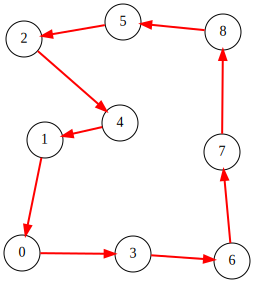

# Traveling Salesman Problem
The Traveling Salesman Problem (TSP) asks for the shortest tour that visits every node exactly once and returns to the start.
We assume that the nodes are placed on a plane and that the tour length is measured using the Euclidean distance.

In the figure below, an example of nine nodes and an optimal tour is shown:

<p align="center">
  
</p>


## QUBO formulation of the TSP
A tour can be represented by a permutation of the nodes.
Accordingly, we use a [permutation matrix](PERMUTATION) to encode a TSP solution.

Let $X=(x_{i,j})$ ($0\leq i,j\leq n-1$) be a matrix of $n\times n$ binary values.
The matrix $X$ is a **permutation matrix** each row and each column contains exactly one entry equal to 1, as illustrated below.

<p align="center">
  
</p>

We interpret  $x_{k,i}$ as "the $k$-th position in the tour is node $i$".
Therefore, every row and every column of $X$ must be one-hot, i.e., the following constraints must hold:

$$
\begin{aligned}
{\rm row}:& \sum_{j=0}^{n-1}x_{i,j}=1 & (0\leq i\leq n-1)\\
{\rm column}:& \sum_{i=0}^{n-1}x_{i,j}=1 & (0\leq j\leq n-1)
\end{aligned}
$$

Let $d_{i,j}$ denote the distance between nodes $i$ and $j$.
Then the tour length for a permutation matrix $X$ can be written as:

$$
\begin{aligned}
{\rm objective}: &\sum_{k=0}^{k-1} d_{i,j}x_{k,i}x_{(k+1)\bmod n,j}
\end{aligned}
$$

This expression adds $d_{i,j}$ exactly when node $i$ is visited at position $k$ and node
$j$ is visited next (at position $(k+1)\bmod n$), so it equals the total length of the tour.

## PyQBPP program for TSP
Using the permutation-matrix formulation above, we can write a PyQBPP program for the TSP as follows:

```python
import math
import pyqbpp as qbpp

nodes = [(10, 12),  (33, 125),  (12, 226),
         (121, 11), (108, 142), (111, 243),
         (220, 4),  (210, 113), (211, 233)]

def dist(i, j):
    dx = nodes[i][0] - nodes[j][0]
    dy = nodes[i][1] - nodes[j][1]
    return round(math.sqrt(dx * dx + dy * dy))

n = len(nodes)
x = qbpp.var("x", shape=(n, n))

constraint = qbpp.sum(qbpp.constrain(qbpp.vector_sum(x, 1), equal=1)) + \
             qbpp.sum(qbpp.constrain(qbpp.vector_sum(x, 0), equal=1))

objective = qbpp.expr()
for i in range(n):
    next_i = (i + 1) % n
    for j in range(n):
        for k in range(n):
            if k != j:
                objective += dist(j, k) * x[i][j] * x[next_i][k]

f = objective + constraint * 1000
f.simplify_as_binary()

solver = qbpp.EasySolver(f)
sol = solver.search(time_limit=1.0)

# Convert the permutation matrix into a tour (list of node indices)
tour = []
for i in range(n):
    for j in range(n):
        if sol(x[i][j]) == 1:
            tour.append(j)
            break
print(f"Tour: {tour}")
```

In this program, the coordinates of nodes `0` through `8` are stored in the list `nodes`, and the helper function `dist(i, j)` computes the rounded Euclidean distance between two nodes.
We create a 2D array `x` of binary variables and construct the one-hot constraints together with the tour-length objective.
These terms are combined into a single QUBO expression `f` by adding the constraints with a penalty weight (here, `1000`) to prioritize feasibility.

We then solve `f` using `EasySolver` with a 1.0-second time limit.
The resulting assignment `sol(x)` forms a permutation matrix.
This matrix is converted into a list of integers (a permutation) called `tour` by scanning each row for the entry equal to 1, and then printed.

This program produces the following output:
```
Tour: [7, 8, 5, 2, 4, 1, 0, 3, 6]
```

## Fixing the first node
Without loss of generality, we can assume that node 0 is the starting node of the tour.
Because the TSP tour is invariant under cyclic shifts, fixing the start position does not change the optimal tour length.

By fixing the start node, we can reduce the number of binary variables in the QUBO expression.
Specifically, we enforce that node 0 is assigned to position 0 in the permutation matrix.
To do this, we fix the following binary variables:

$$
\begin{aligned}
x_{0,0} &= 1\\
x_{i,0} &= 0& (i\geq 1)\\
x_{0,j} &= 0& (j\geq 1)
\end{aligned}
$$

These assignments ensure that node 0 appears only at position 0, and that no other node is assigned to position 0.
As a result, the effective problem size is reduced, which generally makes the QUBO easier to solve for local-search–based solvers.

## PyQBPP program for fixing the first node
In PyQBPP, fixed variable assignments can be applied using the `qbpp.replace()` function with a Python dict mapping variables to values:

```python
ml = {x[0][0]: 1}
ml.update({x[i][0]: 0 for i in range(1, n)})
ml.update({x[0][i]: 0 for i in range(1, n)})

g = qbpp.replace(f, ml)
g.simplify_as_binary()

solver = qbpp.EasySolver(g)
sol = solver.search(time_limit=1.0)

full_sol = qbpp.Sol(f).set([sol, ml])

# Convert the permutation matrix into a tour (list of node indices)
tour = []
for i in range(n):
    for j in range(n):
        if full_sol(x[i][j]) == 1:
            tour.append(j)
            break
print(f"Tour: {tour}")
```

First, we create a Python dict `ml`, which stores fixed assignments of variables.
Each key is a binary variable and each value is its fixed value (`0` or `1`).

Next, we call `qbpp.replace(f, ml)`, which returns a new expression obtained by substituting the fixed values specified in `ml` into the original QUBO expression `f`.
The resulting expression is stored in `g` and simplified.

We then create a solver for `g` and obtain a solution `sol`.
Since `sol` corresponds to the reduced problem, we create a `qbpp.Sol` object for `f` and set both the solver output `sol` and the fixed assignments `ml` via `set([sol, ml])`.
The resulting `full_sol` stores the complete assignment for all variables in `x`.

Finally, the permutation matrix represented by `full_sol(x)` is converted into a permutation by scanning each row and printed.

This program produces the following tour starting from node 0:
```
Tour: [0, 3, 6, 7, 8, 5, 2, 1, 4]
```

## Visualization using matplotlib
The following code visualizes the TSP solution, drawing each node as a labeled point and each tour edge as a directed red arrow:

```python
import matplotlib.pyplot as plt

plt.figure(figsize=(6, 6))
for i, (nx_, ny) in enumerate(nodes):
    plt.plot(nx_, ny, "ko", markersize=8)
    plt.annotate(str(i), (nx_, ny), textcoords="offset points", xytext=(5, 5))

for i in range(n):
    fr = tour[i]
    to = tour[(i + 1) % n]
    plt.annotate("", xy=(nodes[to][0], nodes[to][1]),
                 xytext=(nodes[fr][0], nodes[fr][1]),
                 arrowprops=dict(arrowstyle="->", color="#e74c3c", lw=2))
plt.title("TSP Tour")
plt.savefig("tsp.png", dpi=150, bbox_inches="tight")
plt.show()
```

The tour is shown as directed red arrows connecting the nodes in visiting order.
