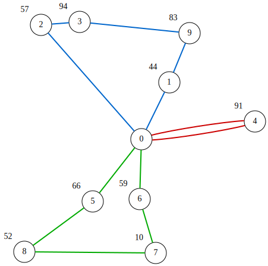

# 容量制約付き配車計画問題（CVRP）
**容量制約付き配車計画問題（CVRP）**は、単一の**デポ**から出発して戻る $V$ 台の**車両**の経路集合を求め、すべての**顧客**にサービスを提供することを目的とする問題です。
**場所**を $i \in \lbrace 0,1,\ldots,N-1\rbrace$ でインデックス付けし、場所0をデポ、場所 $1,\ldots,N-1$ を顧客とします。
各顧客 $i\in \lbrace 1,\ldots,N-1\rbrace$ には配送すべき需要量 $d_i$ があります（デポでは $d_0=0$ とします）。
各車両 $v \in \lbrace 0,\ldots,V-1\rbrace$ はデポを出発し、顧客の部分集合を訪問してデポに戻ります。このとき、経路上の配送需要の合計が車両容量 $q_v$ を超えないという容量制約を満たす必要があります。
目的関数は、全車両の総移動コストを最小化することです。

場所は2次元平面上の点であり、2つの場所間の移動コストはユークリッド距離であると仮定します。
$c_{i,j}$ を場所 $i$ と $j$ の間の距離（コスト）とします。

## QUBO++定式化：バイナリ変数の配列
CVRPをQUBO式として定式化するために、$V\times N\times N$ のバイナリ変数配列 $A=(a_{v,t,i})$（$0\leq v\leq V, 0\leq t,i\leq N-1$）を使用します。
ここで $a_{v,t,i}$ は、車両 $v$ の $t$ 番目に訪問する場所が場所 $i$ である場合にのみ1となります。

以下は $V=3$、$N=10$ における $A=(a_{v,t,i})$ の割り当ての例で、CVRPの解を表しています。
各車両はデポ（場所0）から出発し、いくつかの顧客を訪問した後デポに戻ります。
車両がデポに戻った後は、残りの時間ステップではデポに留まります。
各顧客 $1, \ldots, 9$ はちょうど1台の車両によってちょうど1回訪問されるため、この配列は実行可能なCVRPの解を表しています。

### 車両 $v=0$
巡回路: $0\rightarrow 4\rightarrow 0$

| t \ i | 0 | 1 | 2 | 3 | 4 | 5 | 6 | 7 | 8 | 9 | onehot value |
|:---:|:---:|:---:|:---:|:---:|:---:|:---:|:---:|:---:|:---:|:---:|:---:|
| 0 | 1 | 0 | 0 | 0 | 0 | 0 | 0 | 0 | 0 | 0 | 0 |
| 1 | 0 | 0 | 0 | 0 | 1 | 0 | 0 | 0 | 0 | 0 | 4 |
| 2 | 1 | 0 | 0 | 0 | 0 | 0 | 0 | 0 | 0 | 0 | 0 |
| 3 | 1 | 0 | 0 | 0 | 0 | 0 | 0 | 0 | 0 | 0 | 0 |
| 4 | 1 | 0 | 0 | 0 | 0 | 0 | 0 | 0 | 0 | 0 | 0 |
| 5 | 1 | 0 | 0 | 0 | 0 | 0 | 0 | 0 | 0 | 0 | 0 |
| 6 | 1 | 0 | 0 | 0 | 0 | 0 | 0 | 0 | 0 | 0 | 0 |
| 7 | 1 | 0 | 0 | 0 | 0 | 0 | 0 | 0 | 0 | 0 | 0 |
| 8 | 1 | 0 | 0 | 0 | 0 | 0 | 0 | 0 | 0 | 0 | 0 |
| 9 | 1 | 0 | 0 | 0 | 0 | 0 | 0 | 0 | 0 | 0 | 0 |


### 車両 $v=1$
巡回路: $0\rightarrow 6\rightarrow 5\rightarrow 8\rightarrow  0$

| t \ i | 0 | 1 | 2 | 3 | 4 | 5 | 6 | 7 | 8 | 9 | onehot value |
|:---:|:---:|:---:|:---:|:---:|:---:|:---:|:---:|:---:|:---:|:---:|:---:|
| 0 | 1 | 0 | 0 | 0 | 0 | 0 | 0 | 0 | 0 | 0 | 0 |
| 1 | 0 | 0 | 0 | 0 | 0 | 0 | 1 | 0 | 0 | 0 | 6 |
| 2 | 0 | 0 | 0 | 0 | 0 | 1 | 0 | 0 | 0 | 0 | 5 |
| 3 | 0 | 0 | 0 | 0 | 0 | 0 | 0 | 0 | 1 | 0 | 8 |
| 4 | 1 | 0 | 0 | 0 | 0 | 0 | 0 | 0 | 0 | 0 | 0 |
| 5 | 1 | 0 | 0 | 0 | 0 | 0 | 0 | 0 | 0 | 0 | 0 |
| 6 | 1 | 0 | 0 | 0 | 0 | 0 | 0 | 0 | 0 | 0 | 0 |
| 7 | 1 | 0 | 0 | 0 | 0 | 0 | 0 | 0 | 0 | 0 | 0 |
| 8 | 1 | 0 | 0 | 0 | 0 | 0 | 0 | 0 | 0 | 0 | 0 |
| 9 | 1 | 0 | 0 | 0 | 0 | 0 | 0 | 0 | 0 | 0 | 0 |

### 車両 $v=2$

巡回路: $0\rightarrow 7\rightarrow 9\rightarrow 1\rightarrow  3\rightarrow  2\rightarrow  0$

| t \ i | 0 | 1 | 2 | 3 | 4 | 5 | 6 | 7 | 8 | 9 | onehot value |
|:---:|:---:|:---:|:---:|:---:|:---:|:---:|:---:|:---:|:---:|:---:|:---:|
| 0 | 1 | 0 | 0 | 0 | 0 | 0 | 0 | 0 | 0 | 0 | 0 |
| 1 | 0 | 0 | 0 | 0 | 0 | 0 | 0 | 1 | 0 | 0 | 7 |
| 2 | 0 | 0 | 0 | 0 | 0 | 0 | 0 | 0 | 0 | 1 | 9 |
| 3 | 0 | 1 | 0 | 0 | 0 | 0 | 0 | 0 | 0 | 0 | 1 |
| 4 | 0 | 0 | 0 | 1 | 0 | 0 | 0 | 0 | 0 | 0 | 3 |
| 5 | 0 | 0 | 1 | 0 | 0 | 0 | 0 | 0 | 0 | 0 | 2 |
| 6 | 1 | 0 | 0 | 0 | 0 | 0 | 0 | 0 | 0 | 0 | 0 |
| 7 | 1 | 0 | 0 | 0 | 0 | 0 | 0 | 0 | 0 | 0 | 0 |
| 8 | 1 | 0 | 0 | 0 | 0 | 0 | 0 | 0 | 0 | 0 | 0 |
| 9 | 1 | 0 | 0 | 0 | 0 | 0 | 0 | 0 | 0 | 0 | 0 |


## QUBO++定式化の制約

### 行制約（各時刻でone-hot）
各車両は各時刻 $t$ でちょうど1つの場所にいなければなりません。
one-hot制約を課します:

$$
\begin{aligned}
\text{row}\_\text{constraint} & = \sum_{v=0}^{V-1}\sum_{t=0}^{N-1}\bigr(\sum_{i=0}^{N-1} a_{v,t,i} = 1\bigl)\\
 &= \sum_{v=0}^{V-1}\sum_{t=0}^{N-1}\bigr(1-\sum_{i=0}^{N-1} a_{v,t,i}\bigl)^2
\end{aligned}
$$

**row\_constraint** は、すべての行がone-hotである場合にのみ最小値 $0$ をとります。

また、最初の位置をデポに固定します:

$$
\begin{aligned}
a_{v,0,0}& = 1 && (0\leq v\leq V-1) \\
a_{v,0,i}& = 0 && (0\leq v\leq V-1, 1\leq i\leq N-1)
\end{aligned}
$$

これらは変数の固定により強制できます。

### 連続デポ制約（「デポを再び出発しない」制約）
車両がデポに戻った後に再び顧客を訪問するパターンを禁止します。
デポ指示変数 $a_{v,t,0}$ を用いて、列

$$
a_{v,1,0}, a_{v,2,0}, \ldots, a_{v,N-1,0}
$$

が連続する0の後に連続する1で構成される（すなわち1になったら1のまま）ことを要求します。
禁止された遷移 $1\rightarrow 0$ にペナルティを与えることで強制します:

$$
\begin{aligned}
\text{consecutive}\_\text{constraint} &= \sum_{v=0}^{V-1}\sum_{t=1}^{N-2} (1-a_{v,t})a_{v,t+1}
\end{aligned}
$$

**consecutive\_constraint** は、デポ指示変数が $t$（$1\leq t\leq N-1$）について単調非減少である場合にのみ0をとります。

この制約は距離メトリックが三角不等式を満たす場合は冗長（そのような「再出発」解は最適になり得ない）ですが、ソルバーがそのような非最適な構造を避けるのに役立つことが多いです。

### 列制約
各顧客はちょうど1台の車両によってちょうど1つの時刻に1回だけ訪問されなければなりません:

$$
\begin{aligned}
\text{column}\_\text{constraint}
& = \sum_{i=1}^{N-1}\bigr(\sum_{v=0}^{V-1}\sum_{t=0}^{N-1} a_{v,t,i} = 1\bigl)\\
 &= \sum_{i=1}^{N-1}\bigr(1-\sum_{v=0}^{V-1}\sum_{t=0}^{N-1} a_{v,t,i}\bigl)^2
\end{aligned}
$$

**column\_constraint** は、すべての顧客 $i = 1, \dots ,N-1$ がちょうど1回訪問される場合にのみ0をとります。

### 容量制約
各車両 $v$ の配送需要の合計は

$$
\sum_{t=1}^{N-1}\sum_{i=1}^{N-1}d_ix_{t,i},
$$

であり、$q_v$ 以下でなければなりません。
以下の制約が0でなければなりません:

$$
\begin{aligned}
\text{capacity}\_\text{constraint} &= \sum_{v=0}^{V-1}\Bigr(0\leq \sum_{t=1}^{N-1}\sum_{i=1}^{N-1}d_ix_{t,i}\leq q_v\Bigl)
\end{aligned}
$$

**capacity\_constraint** は、すべての車両が容量を超えない場合にのみ0をとります。


## QUBO定式化の目的関数

総巡回コストは連続して訪問する場所から計算されます:

$$
\begin{aligned}
\text{objective} &= \sum_{v=0}^{V-1}\sum_{t=0}^{N-1}\sum_{i=0}^{N-1}\sum_{j=0}^{N-1}c_{i,j}x_{v,t,i}x_{v,(t+1)\bmod N, j}
\end{aligned}
$$

車両 $v$ が時間ステップ $t$ で場所 $i$ を訪問し、時間ステップ $(t+1)\bmod N$ で場所 $j$ に移動する場合、$x_{v,t,i}=x_{v,(t+1)\bmod N, j}=1$ となります。
この場合、対応する項は $c_{i,j}$ を和に寄与します。したがって、すべての制約が満たされている（各 $(v,t)$ にちょうど1つのアクティブな場所がある）とき、$\text{objective}$ はすべての車両の総移動コストに等しくなります。

ユークリッドメトリックの下では、すべての $i$ に対して $c_{i,i}=0$ であるため、同じ場所に留まっても追加コストは発生しません。

## CVRPのQUBO定式化

目的関数と制約を組み合わせて、QUBOを得ます:

$$
\begin{aligned}
f &= \text{objective} + P\cdot (\text{row}\_\text{constraint}+\text{consecutive}\_\text{constraint}+\text{column}\_\text{constraint}+\text{capacity}\_\text{constraint}),
\end{aligned}
$$

ここで $P$ は十分に大きな定数であり、コスト最小化よりも実行可能性（制約充足）が優先されます。

## QUBO++プログラム
以下のQUBO++プログラムは、$N=10$ 箇所、$V=3$ 台の車両のCVRPインスタンスの解を求めます。
ベクトル `locations` は3つ組 `(x,y,d)` を格納し、`(x,y)` は場所の2D座標、`d` は顧客の需要量（デポの需要量は0）です。
ベクトル `vehicle_capacity` は $V=3$ 台の車両の容量を格納します。
この例では `{100, 200, 300}` に設定されているため、車両0、1、2はそれぞれ小、中、大の容量を持ちます。

```cpp
#include <cmath>
#include <qbpp/qbpp.hpp>
#include <qbpp/easy_solver.hpp>
#include <qbpp/graph.hpp>

int main() {
  std::vector<std::tuple<float, float, int>> locations = {
      {200, 200, 0},  {247, 296, 44}, {31, 393, 57}, {96, 398, 94},
      {391, 230, 91}, {118, 95, 66},  {197, 99, 59}, {224, 8, 10},
      {3, 10, 52},    {281, 379, 83}};
  std::vector<int> vehicle_capacity = {100, 200, 300};

  const size_t N = locations.size();

  const size_t V = vehicle_capacity.size();

  auto a = qbpp::var("a", V, N, N);

  auto row_constraint = qbpp::sum(qbpp::vector_sum(a) == 1);

  auto column_sum = qbpp::expr(N - 1);
  for (size_t v = 0; v < V; ++v) {
    for (size_t t = 0; t < N; ++t) {
      for (size_t i = 1; i < N; ++i) {
        column_sum[i - 1] += a[v][t][i];
      }
    }
  }
  auto column_constraint = qbpp::sum(column_sum == 1);

  auto consecutive_constraint = qbpp::toExpr(0);
  for (size_t v = 0; v < V; ++v) {
    for (size_t t = 1; t < N - 1; ++t) {
      consecutive_constraint += a[v][t][0] * (1 - a[v][t + 1][0]);
    }
  }

  auto vehicle_load = qbpp::expr(V);
  auto capacity_constraint = qbpp::toExpr(0);
  for (size_t v = 0; v < V; ++v) {
    for (size_t t = 0; t < N; ++t) {
      for (size_t i = 1; i < N; ++i) {
        const auto [x, y, q] = locations[i];
        vehicle_load[v] += a[v][t][i] * q;
      }
    }
    capacity_constraint += 0 <= vehicle_load[v] <= vehicle_capacity[v];
  }

  auto objective = qbpp::toExpr(0);
  for (size_t v = 0; v < V; ++v) {
    for (size_t t = 0; t < N; ++t) {
      auto next_t = (t + 1) % N;
      for (size_t i = 0; i < N; ++i) {
        const auto [x1, y1, q1] = locations[i];
        for (size_t j = 0; j < N; ++j) {
          const auto [x2, y2, q2] = locations[j];
          int dist = static_cast<int>(
              std::sqrt((x1 - x2) * (x1 - x2) + (y1 - y2) * (y1 - y2)));
          objective += dist * a[v][t][i] * a[v][next_t][j];
        }
      }
    }
  }

  auto f = objective + 10000 * (row_constraint + column_constraint +
                                consecutive_constraint + capacity_constraint);

  qbpp::MapList ml;
  for (size_t v = 0; v < V; ++v) {
    ml.push_back({a[v][0][0], 1});
    for (size_t i = 1; i < N; ++i) {
      ml.push_back({a[v][0][i], 0});
    }
  }

  auto g = qbpp::replace(f, ml);
  f.simplify_as_binary();
  g.simplify_as_binary();
  auto solver = qbpp::EasySolver(g);

  auto sol = solver.search();

  auto full_sol = qbpp::Sol(f).set(sol).set(ml);

  std::cout << "row_constraint = " << row_constraint(full_sol) << std::endl;
  std::cout << "column_constraint = " << column_constraint(full_sol)
            << std::endl;
  std::cout << "consecutive_constraint = " << consecutive_constraint(full_sol)
            << std::endl;
  std::cout << "capacity_constraint = " << capacity_constraint(full_sol)
            << std::endl;
  std::cout << "objective = " << objective(full_sol) << std::endl;

  auto tour = qbpp::onehot_to_int(full_sol(a));

  for (size_t v = 0; v < V; ++v) {
    std::cout << "Vehicle " << v << " : load = " << vehicle_load[v](full_sol)
              << " / " << vehicle_capacity[v];
    std::cout << " : 0 ";
    for (size_t t = 1; t < N; ++t) {
      auto node = tour[v][t];
      if (node > 0) {
        std::cout << "-> " << node << "("
                  << std::get<2>(locations[static_cast<size_t>(node)]) << ") ";
      }
    }
    std::cout << "-> 0" << std::endl;
  }

  qbpp::graph::GraphDrawer graph;
  for (size_t i = 0; i < locations.size(); ++i) {
    const auto [x, y, q] = locations[i];
    graph.add(qbpp::graph::Node(i).position(x, y).xlabel(
        q != 0 ? std::to_string(q) : ""));
  }

  for (size_t v = 0; v < V; ++v) {
    for (size_t i = 0; i < N; ++i) {
      int from = tour[v][i];
      int to = tour[v][(i + 1) % N];
      if (from < 0 || to < 0 || from == to) continue;
      graph.add(qbpp::graph::Edge(from, to).color(v + 1).penwidth(2.0f));
    }
  }
  graph.draw();
  graph.write("cvrp.svg");
}
```
このプログラムは、$V\times N\times N$ のバイナリ変数配列 `a` を定義します。
次に、上記の定式化に従って目的関数項 `objective` と制約項 `row_constraint`、`column_constraint`、`consecutive_constraint`、`capacity_constraint` を定義し、ペナルティ付き目的関数
`f = objective + 10000 * ( row_constraint + column_constraint + consecutive_constraint + capacity_constraint )` にまとめます。

すべての車両の最初の訪問場所（$t=0$）をデポ（場所0）に固定するために、プログラムは写像 `ml` を構成し、`qbpp::replace()` を使って `f` に適用します。
結果の式は `g` に格納されます。
次に Easy Solver を使って `g` を最小化する割り当て `sol` を探索します。

`g` には `ml` で固定された変数が含まれないため、プログラムは `sol` と `ml` を `full_sol` にマージし、`a` のすべての変数に値を割り当てます。
`full_sol` を使って各制約項と目的関数の値を出力し、$V=3$ 台の車両の巡回路も出力します。

例えば、プログラムは以下の結果を出力します:
```
row_constraint = 0
column_constraint = 0
consecutive_constraint = 0
vehicle_constraint = 0
objective = 2142
Vehicle 0 : load = 91 / 100 : 0 -> 4(91) -> 0
Vehicle 1 : load = 177 / 200 : 0 -> 6(59) -> 5(66) -> 8(52) -> 0
Vehicle 2 : load = 288 / 300 : 0 -> 7(10) -> 9(83) -> 1(44) -> 3(94) -> 2(57) -> 0
```
最後に、プログラムは得られた解をグラフとして可視化し、`cvrp.svg` に書き出します:


<p align="center">
  
</p>
