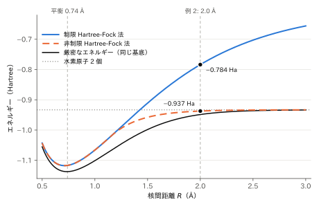

# FMQA による量子化学計算

[FMQA によるブラックボックス最適化](FMQA)の手順を使って、分子のエネルギーを最小にする分子軌道を探します。
分子軌道の形を角度で表し、その角度を[ネイティブ整数変数](NATIVE_INTEGER)で探索します。
エネルギーを予測するモデル（サロゲートモデル）には、FM の代わりに整数変数の多項式を使います。
QUBO++ は、整数変数の 4 次の多項式を、バイナリ変数に展開せずにそのまま最小化します。

このページでは、変数が 1 つの例（HeH⁺）と、2 つの例（結合を引き伸ばした H₂）を順に扱います。

## 前提: 評価が高価なエネルギー計算

量子化学計算では、電子が入る軌道（分子軌道）を決めると、そのときの分子のエネルギーが計算できます。
エネルギーが最も低くなる分子軌道を求めることが、計算の中心です。
実際の分子では、1 回のエネルギーの計算に時間がかかります。
量子コンピュータで分子のエネルギーを測る方法（変分量子固有値ソルバー、VQE）でも、回路の角度を決めてエネルギーを測ることを繰り返します。
そこで、エネルギーをブラックボックス関数とみなし、少ない評価回数で最小点を探します。

このページの例は電子が 2 個の小さな分子なので、エネルギーは短い式で計算できます。
この式は評価の代わりと答え合わせにだけ使い、FMQA の部分は式の中身を使いません。

## 整数変数を使った FMQA

手順は [FMQA](FMQA) と同じです。

1. ランダムに選んだ点をいくつか評価する。
2. それまでに評価したすべての点に、サロゲートモデルを当てはめる（学習）。
3. サロゲートモデルを QUBO++ の式にして、予測値を最小にする点を `EasySolver` で求める。
4. その点のエネルギーを評価してデータに加え、2. に戻る。

違うのは、変数とサロゲートモデルです。

- **変数**: 分子軌道の角度を、65 段階の整数で表します。
  ネイティブ整数変数は 2 進数のビットに展開されず、ソルバーは整数の値のまま探索します。
  隣の角度へ動くことは、整数を 1 増やす・減らすという自然な移動になります。
- **サロゲートモデル**: FM はバイナリ変数の 2 次式なので、そのまま QUBO になります。
  このページの変数は 1〜2 個の整数なので、より自由な形を表せる 4 次の多項式を使います。
  係数は、変数が 1 個なら 5 個、2 個なら 15 個です。
  ネイティブ整数変数の `n * n` は整数の 2 乗として扱われるので、4 次の多項式もそのまま QUBO++ の式になります。
- **学習**: 予測値は係数の 1 次式なので、正則化付き最小二乗法（正則化係数 $10^{-6}$）で、連立 1 次方程式を 1 回解けば係数が求まります。

## 例 1: HeH⁺ の分子軌道

### ブラックボックス関数

ヘリウム水素イオン HeH⁺ は、電子を 2 個持ちます。
ここでは最小限の基底（STO-3G 基底）を使い、He の 1s 軌道と H の 1s 軌道を直交化した 2 つの関数 $\chi_1, \chi_2$ の組み合わせで分子軌道を表します。
2 個の電子が同じ分子軌道に入るとき（制限 Hartree-Fock 法）、分子軌道は角度 $\theta$ 1 つで表せます:

$$\phi(\theta) = \cos\theta\, \chi_1 + \sin\theta\, \chi_2$$

どの $\theta$ でも $\phi$ の大きさは 1 です。
$\theta$ と $\theta + \pi$ は符号が違うだけの同じ軌道なので、$-\pi/2 \le \theta \le \pi/2$ ですべての分子軌道を表せます。
エネルギーは、$c = \cos\theta$、$s = \sin\theta$ として次の式で計算できます:

$$
\begin{aligned}
E(\theta) = E_\mathrm{nuc}
&+ 2\bigl(c^2 h_{11} + 2cs\, h_{12} + s^2 h_{22}\bigr) \\
&+ c^4 (11|11) + s^4 (22|22) + 2c^2 s^2 \bigl[(11|22) + 2\,(12|12)\bigr]
+ 4c^3 s\, (11|12) + 4cs^3\, (22|12)
\end{aligned}
$$

$h_{pq}$ は 1 電子積分（電子 1 個の運動エネルギーと、原子核からの引力）、$(pq|rs)$ は 2 電子積分（電子どうしの反発）、$E_\mathrm{nuc}$ は原子核どうしの反発です。
核間距離 1.4632 bohr での値は、プログラムの中に書いてあります。

H₂ のように同じ原子 2 つからなる分子では、対称性から分子軌道が決まります。
HeH⁺ は異なる原子からなるので、電子が He 側にどれだけ寄るか（$\theta$ の値）は、計算してみないと分かりません。

### 整数変数とサロゲートモデル

$\theta$ を、$-\pi/2$ から $\pi/2$ までの 65 段階の整数 $n \in \lbrace 0, \ldots, 64\rbrace$ で表します:

$$\theta(n) = -\frac{\pi}{2} + \frac{\pi n}{64}$$

サロゲートモデルは、$t = n/64$ の 4 次多項式です:

$$\hat{E}(n) = w_0 + w_1 t + w_2 t^2 + w_3 t^3 + w_4 t^4$$

最初にランダムな 4 点を評価し、あとは QUBO++ が求めた $n$ を評価します。
QUBO++ が求めた $n$ がすでに評価済みのときは、それまでの最良点の隣（$n \pm 1$）で、まだ評価していない点を評価します。
最良点の両隣がどちらも評価済みなら、最良点が両隣より低いことが確かめられたので、そこで終了します。

### QUBO++ プログラム


```cpp
#define DOUBLE_TYPE
#include <qbpp/qbpp.hpp>
#include <qbpp/easy_solver.hpp>

#include <algorithm>
#include <cmath>
#include <iomanip>
#include <random>
#include <vector>

// HeH+ の積分値（STO-3G 基底、核間距離 1.4632 bohr、単位 Hartree）
// 添字 1 は He の 1s、2 は H の 1s（直交化した基底）
const double H11 = -2.475236114935;  // 1 電子積分
const double H22 = -1.448259466847;
const double H12 = -0.378724331272;
const double G1111 = 1.147471043048;  // 2 電子積分
const double G2222 = 0.816258183162;
const double G1122 = 0.526201856993;
const double G1212 = 0.011345007430;
const double G1112 = -0.003104665462;
const double G2212 = -0.004941256971;
const double E_NUC = 1.366867140514;  // 原子核どうしの反発エネルギー
const double PI = std::acos(-1.0);

constexpr int L = 65;    // 角度の段階数
constexpr int D = 4;     // サロゲートモデルの次数
constexpr int INIT = 4;  // 最初にランダムに選んで評価する点の数

// 黒箱: 分子軌道 cos(θ) χ1 + sin(θ) χ2 に電子が 2 個入ったときのエネルギー
// 本当は時間のかかる量子化学計算で、ここでは式で代用する
double blackbox(double theta) {
  double c = std::cos(theta), s = std::sin(theta);
  return E_NUC + 2 * (c * c * H11 + 2 * c * s * H12 + s * s * H22) +
         c * c * c * c * G1111 + s * s * s * s * G2222 +
         2 * c * c * s * s * (G1122 + 2 * G1212) + 4 * c * c * c * s * G1112 +
         4 * c * s * s * s * G2212;
}

// 整数 k（0 から L-1）に対応する角度
double theta(int k) { return -PI / 2 + PI * k / (L - 1); }

// Σ_m (Σ_j A[m][j] w_j - y_m)^2 + 1e-6 Σ_j w_j^2 を最小にする w を求める
std::vector<double> fit(const std::vector<std::vector<double>>& A,
                        const std::vector<double>& y) {
  const size_t P = A[0].size();
  // 連立 1 次方程式 (A^T A + 1e-6 I) w = A^T y（M の最後の列が右辺）
  std::vector<std::vector<double>> M(P, std::vector<double>(P + 1, 0.0));
  for (size_t m = 0; m < A.size(); ++m)
    for (size_t i = 0; i < P; ++i) {
      for (size_t j = 0; j < P; ++j) M[i][j] += A[m][i] * A[m][j];
      M[i][P] += A[m][i] * y[m];
    }
  for (size_t i = 0; i < P; ++i) M[i][i] += 1e-6;
  // ガウスの消去法で解く
  for (size_t i = 0; i < P; ++i)
    for (size_t j = i + 1; j < P; ++j) {
      double r = M[j][i] / M[i][i];
      for (size_t l = i; l <= P; ++l) M[j][l] -= r * M[i][l];
    }
  std::vector<double> w(P);
  for (size_t i = P; i-- > 0;) {
    w[i] = M[i][P];
    for (size_t j = i + 1; j < P; ++j) w[i] -= M[i][j] * w[j];
    w[i] /= M[i][i];
  }
  return w;
}

int main() {
  std::mt19937 rng(1);
  std::uniform_int_distribution<int> pick(0, L - 1);
  std::vector<int> ks;     // 評価した点
  std::vector<double> es;  // そのエネルギー
  auto evaluated = [&](int k) {
    return std::find(ks.begin(), ks.end(), k) != ks.end();
  };
  std::cout << std::fixed << std::setprecision(6);

  // 1. ランダムに選んだ点を評価する
  while (ks.size() < INIT) {
    int k = pick(rng);
    if (evaluated(k)) continue;
    ks.push_back(k);
    es.push_back(blackbox(theta(k)));
    std::cout << "eval " << ks.size() << ": n = " << std::setw(2) << k
              << ", E = " << es.back() << " Ha (random)" << std::endl;
  }

  auto n = 0 <= qbpp::int_var("n") <= L - 1;
  qbpp::Expr t = (1.0 / (L - 1)) * n;  // 0 から 1 までの座標
  while (true) {
    // 2. サロゲートモデル w0 + w1 t + ... + w4 t^4 を当てはめる
    std::vector<std::vector<double>> A;
    for (int k : ks) {
      std::vector<double> row;
      for (int d = 0; d <= D; ++d) row.push_back(std::pow(k / (L - 1.0), d));
      A.push_back(row);
    }
    auto w = fit(A, es);

    // 3. サロゲートモデルを QUBO++ の式にして、最小にする n を求める
    qbpp::Expr f = 0, td = 1;
    for (int d = 0; d <= D; ++d) {
      f += w[d] * td;
      td = td * t;
    }
    f.simplify_as_binary();
    auto sol = qbpp::EasySolver(f).search({{"time_limit", 0.2}});
    int k = int(sol(n));

    // 評価済みの点なら、最良点の隣のまだ評価していない点にする
    if (evaluated(k)) {
      int b = ks[std::min_element(es.begin(), es.end()) - es.begin()];
      if (b > 0 && !evaluated(b - 1)) {
        k = b - 1;
      } else if (b < L - 1 && !evaluated(b + 1)) {
        k = b + 1;
      } else {
        break;  // 最良点の両隣を評価済み
      }
    }

    // 4. エネルギーを評価してデータに加える
    ks.push_back(k);
    es.push_back(blackbox(theta(k)));
    std::cout << "eval " << ks.size() << ": n = " << std::setw(2) << k
              << ", E = " << es.back() << " Ha" << std::endl;
  }

  size_t i = std::min_element(es.begin(), es.end()) - es.begin();
  std::cout << "best: n = " << ks[i] << ", theta = " << std::setprecision(4)
            << theta(ks[i]) << ", E = " << std::setprecision(6) << es[i]
            << " Ha" << std::endl;
  // 答え合わせ: L 通りすべての中の最小値
  double emin = INFINITY;
  for (int k = 0; k < L; ++k) emin = std::min(emin, blackbox(theta(k)));
  std::cout << "minimum over all " << L << " values: " << emin << " Ha"
            << std::endl;
}
```


- `#define DOUBLE_TYPE` で、式の係数を実数（`double`）にしています（[実数（double）係数](VAREXPR#実数double係数)）。
  当てはめた多項式の係数 $w_d$ を、そのまま QUBO++ の式の係数にできます。
- `0 <= qbpp::int_var("n") <= L - 1` が、$0$ 以上 $64$ 以下の整数変数 $n$ の宣言です。
  `t` は $t = n/64$ を表す式で、`td = td * t` を繰り返して $t^d$ を作ります。
- `fit` は正則化付き最小二乗法で、連立 1 次方程式をガウスの消去法で解きます。
  係数の行列は対称で正定値なので、行の入れ替えをせずに解けます。
- `sol(n)` は実数で返るので、`int` に変換しています。
- 実行には数秒かかります。

### 出力結果

```
eval 1: n = 27, E = -2.022443 Ha (random)
eval 2: n = 64, E = -0.713394 Ha (random)
eval 3: n = 46, E = -2.701490 Ha (random)
eval 4: n = 60, E = -1.104257 Ha (random)
eval 5: n = 39, E = -2.812462 Ha
eval 6: n = 38, E = -2.782225 Ha
eval 7: n = 40, E = -2.832456 Ha
eval 8: n = 41, E = -2.841406 Ha
eval 9: n = 42, E = -2.838619 Ha
best: n = 41, theta = 0.4418, E = -2.841406 Ha
minimum over all 65 values: -2.841406 Ha
```

最初のランダムな 4 点（`random`）のあと、4 回の評価で 65 通りの中の最良点 $n = 41$（$\theta = 0.4418$）に到達しました。
`eval 9` で最良点の隣の $n = 42$ も評価し、最良点の両隣が評価済みになったので終了しています。
最後の行は、65 通りすべてを評価して確かめた答えで、FMQA の結果と一致しています。

得られた分子軌道は $\cos\theta = 0.90$、$\sin\theta = 0.43$ で、電子が He 側に寄っています。
$\theta$ を連続的に動かしたときの最小値は $-2.841836$ Ha で、得られた値との差（0.43 mHa）は、$\theta$ を 65 段階に区切ったことによるものです。

乱数の種を変えて 20 回実行すると、20 回とも 65 通りの中の最良点に到達しました。
最初の 4 点を含めた評価回数は 6〜11 回（多くは 7〜8 回）で、65 通りすべてを評価する場合の約 1/8 です。

## 例 2: 引き伸ばした H₂ とスピン対称性の破れ

### ブラックボックス関数

水素分子 H₂ の 2 個の電子を考えます。
STO-3G 基底では、2 つの H の 1s 軌道から、結合性軌道 $\sigma_g$ と反結合性軌道 $\sigma_u$ の 2 つの分子軌道ができます。
非制限 Hartree-Fock 法では、上向きスピン（$\alpha$）の電子と下向きスピン（$\beta$）の電子が、別々の分子軌道に入ることができます。
それぞれの分子軌道を、角度 $\theta_\alpha, \theta_\beta$ で表します:

$$
\phi_\alpha = \cos\theta_\alpha\, \sigma_g + \sin\theta_\alpha\, \sigma_u, \qquad
\phi_\beta = \cos\theta_\beta\, \sigma_g + \sin\theta_\beta\, \sigma_u
$$

エネルギーは、$c_x = \cos\theta_x$、$s_x = \sin\theta_x$ として次の式で計算できます:

$$
\begin{aligned}
E(\theta_\alpha, \theta_\beta) = E_\mathrm{nuc}
&+ (c_\alpha^2 + c_\beta^2)\, h_{gg} + (s_\alpha^2 + s_\beta^2)\, h_{uu} \\
&+ c_\alpha^2 c_\beta^2\, J_{gg} + s_\alpha^2 s_\beta^2\, J_{uu}
+ (c_\alpha^2 s_\beta^2 + s_\alpha^2 c_\beta^2)\, J_{gu}
+ 4\, c_\alpha s_\alpha c_\beta s_\beta\, K_{gu}
\end{aligned}
$$

$h_{gg}, h_{uu}$ は 1 電子積分、$J_{gg}, J_{uu}, J_{gu}$ はクーロン積分（電子どうしの反発）、$K_{gu}$ は交換積分です。
このページでは、結合を平衡の長さ（0.74 Å）から引き伸ばした、核間距離 2.0 Å での値を使います。
値はプログラムの中に書いてあります。

### 対称な解と、対称性の破れた解

$\theta_\alpha = \theta_\beta = 0$ では、2 個の電子がどちらも $\sigma_g$ に入ります。
これは 2 個の電子が同じ軌道に入る制限 Hartree-Fock 法の解で、$E = -0.78379$ Ha です。
$\sigma_g$ は 2 つの原子に均等に広がった軌道なので、$\alpha$ 電子も $\beta$ 電子も、両方の原子に半分ずつ存在します。

結合を引き伸ばすと、$\alpha$ 電子と $\beta$ 電子が別々の原子に分かれたほうが、エネルギーが低くなります。
これが $\theta_\alpha = -\theta_\beta \approx \pm 0.668$ の解で、$E = -0.937213$ Ha と、上の解より 153.4 mHa 低くなります。
$\alpha$ 電子はほぼ一方の原子に、$\beta$ 電子はほぼもう一方の原子にあります（原子ごとのスピン密度 $\pm 0.98$）。
制限 Hartree-Fock 法の解が持っていた「$\alpha$ 電子と $\beta$ 電子が同じ分布を持つ」という対称性が失われるので、スピン対称性の破れた解と呼ばれます。
$\alpha$ と $\beta$ を入れ替えた解（$\theta_\alpha$ と $\theta_\beta$ の符号を入れ替えた解）も、同じエネルギーの最小点です。

通常の計算（SCF 計算）は、$\theta_\alpha = \theta_\beta$ の対称な状態から始めると、対称な解から動きません。
FMQA には、このような対称性について何も教えません。

どちらの解が低くなるかは、結合の長さで決まります。
次の図は、核間距離 $R$ ごとに、制限 Hartree-Fock 法のエネルギー（$\theta_\alpha = \theta_\beta = 0$）、非制限 Hartree-Fock 法の最小エネルギー（$\theta_\alpha, \theta_\beta$ を自由に動かしたときの最小）、同じ基底での厳密なエネルギーを描いたものです。
図の値は、FMQA ではなく細かい格子で直接求めました。

<p align="center">
  
</p>

- $R$ が約 1.15 Å より短いと、2 つの Hartree-Fock 法のエネルギーは一致し、対称性は破れません。
- それより長いと、対称性の破れた解のほうが低くなります。
  $R$ を大きくすると、非制限 Hartree-Fock 法のエネルギーは水素原子 2 個のエネルギーに近づきますが、制限 Hartree-Fock 法のエネルギーは上がり続けます。
  2 個の電子が同じ軌道に入るという制限のため、離れた 2 つの原子の一方に電子が 2 個とも集まる配置が、半分の重みで混ざったまま残るからです。
- 厳密なエネルギーとの差（電子相関エネルギー）は、どちらの Hartree-Fock 法でも取り込めない部分です。

このページの例は、対称性の破れがはっきり現れる $R = 2.0$ Å です（図の黒い点）。

### 整数変数とズーム

2 つの角度を、探索範囲（窓）の中の 65 段階の整数 $n_\alpha, n_\beta \in \lbrace 0, \ldots, 64\rbrace$ で表します。
最初の窓は $-\pi/2 \le \theta_\alpha, \theta_\beta \le \pi/2$ で、角度の刻みは $\pi/64 \approx 0.049$ rad です。
サロゲートモデルは、窓の中の座標 $u = n/64 \in [0, 1]$ の、2 変数の 4 次多項式です:

$$\hat{E} = \sum_{i + j \le 4} w_{ij}\, u_\alpha^i\, u_\beta^j$$

最良値が 4 回続けて更新されなかったら（または 1 つの窓で QUBO++ に 15 回点を求めさせたら）、最良点を中心に窓の幅を半分にします（ズーム）。
段階数を奇数の 65 にしているので、窓の中心 $n = 32$ が格子点になり、最良点がそのまま次の窓の格子点になります。
6 段のズームで、角度の刻みは約 0.049 rad から約 0.0015 rad まで細かくなります。

- 各段の最初に、窓の中のランダムな点を評価します（最初の段は 6 点、以降は 3 点）。
- 学習には、それまでの段で評価した点も含め、いまの窓の中にある点をすべて使います。
  多項式は連続な座標の関数なので、いまの格子に乗っていない点もそのまま使えます。
- QUBO++ が求めた点が評価済みなら、その周りの 8 点のうち、まだ評価していない点で予測値が最小の点を評価します。

### QUBO++ プログラム


```cpp
#define DOUBLE_TYPE
#include <qbpp/qbpp.hpp>
#include <qbpp/easy_solver.hpp>

#include <algorithm>
#include <array>
#include <cmath>
#include <iomanip>
#include <random>
#include <set>
#include <utility>
#include <vector>

// 引き伸ばした H2 の積分値（STO-3G 基底、核間距離 2.0 Å、単位 Hartree）
// g は結合性軌道 σg、u は反結合性軌道 σu
const double H_GG = -0.778922064923;  // 1 電子積分
const double H_UU = -0.670266674748;
const double J_GG = 0.509462821477;  // クーロン積分
const double J_UU = 0.534664130913;
const double J_GU = 0.519201267361;
const double K_GU = 0.259138467265;  // 交換積分
const double E_NUC = 0.264588624497;  // 原子核どうしの反発エネルギー
const double PI = std::acos(-1.0);

constexpr int L = 65;      // 窓の中の角度の段階数（奇数）
constexpr int D = 4;       // サロゲートモデルの次数
constexpr int STAGES = 6;  // ズームの段数
constexpr int ITERS = 15;  // 1 段で QUBO++ に点を求めさせる回数の上限
constexpr int PATIENCE = 4;  // この回数続けて改善がなければ次の段へ

// 黒箱: α 電子が cos(θa) σg + sin(θa) σu に、
//       β 電子が cos(θb) σg + sin(θb) σu に入ったときのエネルギー
// 本当は時間のかかる量子化学計算で、ここでは式で代用する
double blackbox(double ta, double tb) {
  double ca = std::cos(ta), sa = std::sin(ta);
  double cb = std::cos(tb), sb = std::sin(tb);
  return E_NUC + (ca * ca + cb * cb) * H_GG + (sa * sa + sb * sb) * H_UU +
         ca * ca * cb * cb * J_GG + sa * sa * sb * sb * J_UU +
         (ca * ca * sb * sb + sa * sa * cb * cb) * J_GU +
         4 * ca * sa * cb * sb * K_GU;
}

// Σ_m (Σ_j A[m][j] w_j - y_m)^2 + 1e-6 Σ_j w_j^2 を最小にする w を求める
std::vector<double> fit(const std::vector<std::vector<double>>& A,
                        const std::vector<double>& y) {
  const size_t P = A[0].size();
  // 連立 1 次方程式 (A^T A + 1e-6 I) w = A^T y（M の最後の列が右辺）
  std::vector<std::vector<double>> M(P, std::vector<double>(P + 1, 0.0));
  for (size_t m = 0; m < A.size(); ++m)
    for (size_t i = 0; i < P; ++i) {
      for (size_t j = 0; j < P; ++j) M[i][j] += A[m][i] * A[m][j];
      M[i][P] += A[m][i] * y[m];
    }
  for (size_t i = 0; i < P; ++i) M[i][i] += 1e-6;
  // ガウスの消去法で解く
  for (size_t i = 0; i < P; ++i)
    for (size_t j = i + 1; j < P; ++j) {
      double r = M[j][i] / M[i][i];
      for (size_t l = i; l <= P; ++l) M[j][l] -= r * M[i][l];
    }
  std::vector<double> w(P);
  for (size_t i = P; i-- > 0;) {
    w[i] = M[i][P];
    for (size_t j = i + 1; j < P; ++j) w[i] -= M[i][j] * w[j];
    w[i] /= M[i][i];
  }
  return w;
}

using Point = std::pair<int, int>;  // 格子点 (ka, kb)

int main() {
  // サロゲートモデルの単項式 ua^i ub^j の指数 (i, j)（i + j <= D）
  std::vector<Point> powers;
  for (int i = 0; i <= D; ++i)
    for (int j = 0; i + j <= D; ++j) powers.push_back({i, j});

  std::vector<std::array<double, 3>> history;  // 評価した点の (θa, θb, E)
  std::set<Point> seen;               // この段で評価した格子点
  double lo[2] = {-PI / 2, -PI / 2};  // 窓の左下の角度
  double step = PI / (L - 1);         // 格子の間隔
  auto best = [&] {
    return *std::min_element(
        history.begin(), history.end(),
        [](const auto& a, const auto& b) { return a[2] < b[2]; });
  };
  // 格子点 k のエネルギーを評価してデータに加える
  // 最良値を更新したら true を返す（1e-12 未満の差は丸め誤差とみなす）
  auto evaluate = [&](Point k) {
    double ta = lo[0] + step * k.first, tb = lo[1] + step * k.second;
    double e = blackbox(ta, tb);
    bool improved = history.empty() || e < best()[2] - 1e-12;
    if (improved)
      std::cout << "eval " << std::setw(2) << history.size() + 1
                << ": E = " << std::setprecision(8) << e
                << " Ha (theta_a = " << std::setprecision(4) << ta
                << ", theta_b = " << tb << ")" << std::endl;
    history.push_back({ta, tb, e});
    seen.insert(k);
    return improved;
  };
  std::cout << std::fixed;

  std::mt19937 rng(1);
  std::uniform_int_distribution<int> pick(0, L - 1);
  auto na = 0 <= qbpp::int_var("na") <= L - 1;
  auto nb = 0 <= qbpp::int_var("nb") <= L - 1;
  qbpp::Expr ua = (1.0 / (L - 1)) * na;  // 窓の中の座標（0 から 1）
  qbpp::Expr ub = (1.0 / (L - 1)) * nb;

  for (int stage = 0; stage < STAGES; ++stage) {
    seen.clear();
    if (stage > 0) seen.insert({L / 2, L / 2});  // 窓の中心（それまでの最良点）
    // 1. ランダムに選んだ点を評価する（最初の段は 6 点、以降は 3 点）
    size_t init = stage == 0 ? 6 : 4;
    while (seen.size() < init) {
      Point k{pick(rng), pick(rng)};
      if (!seen.count(k)) evaluate(k);
    }

    int stall = 0;
    for (int it = 0; it < ITERS; ++it) {
      // 2. 窓の中にある評価済みの点に、サロゲートモデルを当てはめる
      std::vector<std::vector<double>> A;
      std::vector<double> y;
      for (const auto& h : history) {
        double u0 = (h[0] - lo[0]) / (step * (L - 1));
        double u1 = (h[1] - lo[1]) / (step * (L - 1));
        if (u0 < 0 || u0 > 1 || u1 < 0 || u1 > 1) continue;
        std::vector<double> row;
        for (auto [i, j] : powers)
          row.push_back(std::pow(u0, i) * std::pow(u1, j));
        A.push_back(row);
        y.push_back(h[2]);
      }
      auto w = fit(A, y);

      // 3. サロゲートモデルを QUBO++ の式にして、最小にする (na, nb) を求める
      qbpp::Expr f = 0;
      for (size_t p = 0; p < powers.size(); ++p) {
        qbpp::Expr term = w[p];
        for (int i = 0; i < powers[p].first; ++i) term = term * ua;
        for (int j = 0; j < powers[p].second; ++j) term = term * ub;
        f += term;
      }
      f.simplify_as_binary();
      auto sol = qbpp::EasySolver(f).search({{"time_limit", 0.2}});
      Point k{int(sol(na)), int(sol(nb))};

      // 評価済みの点なら、周りの 8 点のうち、まだ評価していない点で
      // 予測値が最小の点にする
      if (seen.count(k)) {
        Point next{-1, -1};
        double pred = INFINITY;
        for (int a = -1; a <= 1; ++a)
          for (int b = -1; b <= 1; ++b) {
            Point m{k.first + a, k.second + b};
            if (m.first < 0 || m.first >= L || m.second < 0 || m.second >= L ||
                seen.count(m))
              continue;
            double v = f({{na, m.first}, {nb, m.second}});
            if (v < pred) {
              pred = v;
              next = m;
            }
          }
        if (next.first < 0) break;
        k = next;
      }

      // 4. エネルギーを評価してデータに加える
      if (evaluate(k)) {
        stall = 0;
      } else if (++stall >= PATIENCE) {
        break;
      }
    }

    // ズーム: 最良点を中心に、窓の幅を半分にする
    step /= 2;
    lo[0] = best()[0] - step * (L / 2);
    lo[1] = best()[1] - step * (L / 2);
  }

  auto b = best();
  std::cout << "best: E = " << std::setprecision(8) << b[2] << " Ha after "
            << history.size()
            << " evaluations (theta_a = " << std::setprecision(4) << b[0]
            << ", theta_b = " << b[1] << ")" << std::endl;
  std::cout << "RHF (theta_a = theta_b = 0): E = " << std::setprecision(8)
            << blackbox(0, 0) << " Ha" << std::endl;
}
```


- `fit` は例 1 と同じです。
  `powers` はサロゲートモデルの単項式 $u_\alpha^i u_\beta^j$ の指数 $(i, j)$ の一覧で、15 個あります。
- 手順 3 では、`term = term * ua` のように単項式を掛け合わせて式 `f` を作ります。
  `f` は $n_\alpha, n_\beta$ の 4 次の多項式で、項は定数項を含めて 15 個です。
- 周りの 8 点の予測値は、式 `f` に値を代入して求めます（`f({{na, m.first}, {nb, m.second}})`、[評価関数](EVAL)）。
- `history` は評価したすべての点の角度とエネルギー、`seen` はいまの段で評価した格子点です。
  `evaluate` は、最良値を更新したら `true` を返します。
  対称な位置にある 2 点のエネルギーは本来等しいので、$10^{-12}$ 未満の差は丸め誤差とみなして更新に数えません。
- 実行には 15 秒ほどかかります。

### 出力結果

```
eval  1: E = -0.65807098 Ha (theta_a = -0.2454, theta_b = 1.5708)
eval  8: E = -0.66272660 Ha (theta_a = -1.5708, theta_b = -0.1473)
eval  9: E = -0.66539885 Ha (theta_a = -1.5708, theta_b = 0.0000)
eval 12: E = -0.66787474 Ha (theta_a = -1.5217, theta_b = 0.0491)
eval 14: E = -0.79260816 Ha (theta_a = -0.5890, theta_b = 1.2272)
eval 17: E = -0.86999057 Ha (theta_a = -0.5890, theta_b = 1.0308)
eval 18: E = -0.88335106 Ha (theta_a = -0.3927, theta_b = 0.8345)
eval 20: E = -0.88724665 Ha (theta_a = -0.4418, theta_b = 0.8836)
eval 21: E = -0.89592832 Ha (theta_a = -0.4418, theta_b = 0.8345)
eval 22: E = -0.90174911 Ha (theta_a = -0.9327, theta_b = 0.6627)
eval 25: E = -0.93718516 Ha (theta_a = -0.6627, theta_b = 0.6627)
eval 40: E = -0.93721215 Ha (theta_a = -0.6688, theta_b = 0.6688)
eval 55: E = -0.93721219 Ha (theta_a = -0.6688, theta_b = 0.6673)
eval 56: E = -0.93721235 Ha (theta_a = -0.6673, theta_b = 0.6673)
best: E = -0.93721235 Ha after 60 evaluations (theta_a = -0.6673, theta_b = 0.6673)
RHF (theta_a = theta_b = 0): E = -0.78379268 Ha
```

56 回目の評価で $E = -0.93721235$ Ha に到達しました（全体の評価回数は 60 回）。
角度を連続的に動かしたときの最小値 $-0.93721282$ Ha との差は 0.0005 mHa で、最後の段の格子の細かさによるものです。
得られた解は $\theta_\alpha = -\theta_\beta$ で、スピン対称性の破れた解です。
この乱数の種では、$\theta_\alpha < 0$ の解（$\alpha$ と $\beta$ を入れ替えた解）になっています。

なお、同じプログラムに平衡の核間距離 0.74 Å での積分値を入れると、対称性は破れず、$\theta_\alpha = \theta_\beta = 0$ の解（$E = -1.11676$ Ha）に収束します。

### ランダム探索・山登り法との比較

乱数の種を変えて上のプログラムを 20 回実行し、評価回数ごとの最良値を、次の 2 つの方法と比べました:

- **ランダム探索**: $-\pi/2$ から $\pi/2$ までの一様乱数で $(\theta_\alpha, \theta_\beta)$ を選んで評価することを繰り返します。
- **山登り法**: ランダムな点から始め、いまの刻み幅で周りの 8 点を評価して、最も良い点へ移ります。
  周りに良い点がなければ、刻み幅を半分にします。
  最初の刻み幅は、$\pi/2$ から $\pi/32$ までのうち最も成績の良かった $\pi/8$ です。

表の値は、最小値 $-0.93721282$ Ha との差の平均と、差が 0.01 mHa 以内に入った割合です。
FMQA は 52〜62 回の評価で終了し、60 回より前に終わった場合は終了時の値を使っています。

| 方法 | 20 回 | 40 回 | 60 回 |
|---|---:|---:|---:|
| FMQA | 3.88 mHa / 0% | 0.0034 mHa / 90% | **0.0005 mHa / 100%** |
| ランダム探索 | 26.5 mHa / 0% | 16.2 mHa / 0% | 10.1 mHa / 0% |
| 山登り法 | 23.4 mHa / 0% | 2.86 mHa / 0% | 0.47 mHa / 0% |

FMQA は、評価したすべての点からエネルギーの形を学習するので、周りの点を 1 つずつ調べる山登り法より少ない評価回数で最小点に近づきます。

## QUBO++ の役割

このページの例は変数が 1〜2 個なので、サロゲートモデルの最小化そのものは簡単で、65 通りや $65^2 = 4225$ 通りの値をすべて調べても求まります。
また、H₂ の対称性の破れた解は、対称性を破った状態から SCF 計算を始めればすぐに得られます。
このページの目的は、量子化学計算のエネルギーをブラックボックス関数とみなし、整数変数で FMQA を行う手順を示すことです。

分子が大きくなって角度の数 $k$ が増えると、格子点の数は $65^k$ で増え、サロゲートモデルの最小化は QUBO++ のソルバーの仕事になります。
そのときは多項式の係数の数も増えるので、[FMQA](FMQA) の FM のように、係数の数を抑えたモデルを使うことになります。
