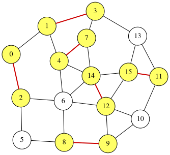

# 最小極大マッチング問題

無向グラフにおける**マッチング**とは、どの2辺も共通の端点を持たない辺の集合です。
**極大マッチング**とは、マッチング条件を崩さずにこれ以上辺を追加できないマッチングのことです。
無向グラフ $G=(V,E)$ が与えられたとき、最小極大マッチング問題は、辺数が最小の極大マッチング $S \subseteq E$ を求める問題です。

マッチングの極大性条件は、次のようにコンパクトに記述できます。
頂点 $u\in V$ に対して、$N(u)$ を $u$ に接続する $S$ 中の辺の集合とします。
このとき、$S$ が極大マッチングであるための必要十分条件は、すべての辺 $(u,v)\in E$ に対して以下が成り立つことです:

$$
 1 \leq |N(u)|+|N(v)| \leq 2
$$

この条件は $S$ が極大マッチングを構成する場合にのみ満たされます。$S$ が極大マッチングであることを保証するために、以下のケースがすべての場合を網羅します:

<p align="center">
  
</p>

最小極大マッチング問題は、上記の条件を満たし、かつ要素数が最小の部分集合 $S$ を見つける問題として定式化できます。

厳密な証明については、以下の論文を参照してください:


> **参考文献**:
> Nakahara, Y., Tsukiyama, S., Nakano, K., Parque, V., & Ito, Y. (2025). **A penalty-free QUBO formulation for the minimum maximal matching problem**. International Journal of Parallel, Emergent and Distributed Systems, 1–19. https://doi.org/10.1080/17445760.2025.2579546


## 最小極大マッチングの定式化
グラフが $n$ 個の頂点と $m$ 本の辺を持ち、辺に $0,1,\ldots,m-1$ のラベルが付いているとします。
$m$ 個のバイナリ変数 $x_0, x_1, \ldots, x_{m-1}$ を導入し、$x_i=1$ は辺 $i$ が選択されている（すなわち $S$ に属する）場合とします。
目的関数は、選択された辺の数を最小化することです:

$$
\begin{aligned}
\text{objective} &= \sum_{i=0}^{m-1} x_i .
\end{aligned}
$$

極大性条件は、各辺 $(u,v)\in E$ についての範囲の制約 $1 \leq |N(u)|+|N(v)| \leq 2$ です。
QUBO++ では、これを [`qbpp::cons()`](CONSTRAINTS) で囲んで制約として宣言し、目的関数と組み合わせて式 $f$ を次のように構成します:

$$
\begin{aligned}
f &= \text{objective} + 2\times\sum_{(u,v)\in E} \text{cons}(1 \leq |N(u)|+|N(v)| \leq 2).
\end{aligned}
$$

制約を破ると、違反量の2乗に重みを掛けた値がエネルギーに加わります。
違反量が1のとき、その値は1です。重みが1だと、制約を破った解のエネルギーが、辺を1本加えて制約を満たした解と同じになることがあり、制約を破った解が最適解に混ざります。
そこで重みを2にしています。

## QUBO++プログラム
以下のQUBO++プログラムは、$N=16$ 頂点、$M=27$ 辺の固定された無向グラフの最小極大マッチングを求めます:
```cpp
#include <qbpp/qbpp.hpp>
#include <qbpp/exhaustive_solver.hpp>
#include <qbpp/graph.hpp>

int main() {
  const size_t N = 16;
  std::vector<std::pair<size_t, size_t>> edges = {
      {0, 1},   {0, 2},   {1, 3},   {1, 4},   {2, 5},   {2, 6},   {3, 7},
      {3, 13},  {4, 6},   {4, 7},   {4, 14},  {5, 8},   {6, 8},   {6, 12},
      {6, 14},  {7, 14},  {8, 9},   {9, 10},  {9, 12},  {10, 11}, {10, 12},
      {11, 13}, {11, 15}, {12, 14}, {12, 15}, {13, 15}, {14, 15}};
  const size_t M = edges.size();

  std::vector<std::vector<size_t>> adj(N);
  for (size_t i = 0; i < M; ++i) {
    const auto& edge = edges[i];
    adj[edge.first].push_back(i);
    adj[edge.second].push_back(i);
  }

  auto x = qbpp::var("x", M);

  auto objective = qbpp::sum(x);

  auto constraint = qbpp::toExpr(0);
  for (const auto& e : edges) {
    auto u = e.first;
    auto v = e.second;
    auto t = qbpp::toExpr(0);
    for (const auto idx : adj[u]) {
      t += x[idx];
    }
    for (const auto idx : adj[v]) {
      t += x[idx];
    }
    constraint += qbpp::cons(1 <= t <= 2);
  }

  auto f = objective + 2 * constraint;

  f.simplify_as_binary();
  auto solver = qbpp::ExhaustiveSolver(f);
  auto sol = solver.search();

  std::cout << "objective = " << objective(sol) << std::endl;
  std::cout << "violated constraints = " << f.cons(sol) << std::endl;

  qbpp::graph::GraphDrawer graph;
  std::vector<int> selected_nodes(N);
  for (size_t i = 0; i < M; ++i) {
    if (sol(x[i])) {
      selected_nodes[edges[i].first] = 1;
      selected_nodes[edges[i].second] = 1;
    }
  }
  for (size_t i = 0; i < N; ++i) {
    graph.add_node(qbpp::graph::Node(i).color(selected_nodes[i]));
  }
  for (size_t i = 0; i < M; ++i) {
    auto edge = qbpp::graph::Edge(edges[i].first, edges[i].second);
    if (sol(x[i])) {
      edge.color(1).penwidth(2.0);
    }
    graph.add_edge(edge);
  }
  graph.write("minmaxmatching.svg");
}
```
まず `M` 個のバイナリ変数のベクトル `x` を定義し、上記の定式化に基づいて `objective`、`constraint`、`f` を定義します。
Exhaustive Solver を使用して `f` の最適解を求めます。
目的関数値と、破った制約の本数 `f.cons(sol)` が出力され、結果のグラフが `minmaxmatching.svg` に保存されます。

このプログラムは以下の出力を生成します:
```
objective = 6
violated constraints = 0
```
したがって、$S$ は6本の辺を含みます。
`minmaxmatching.svg` に格納された結果のグラフを以下に示します:
<p align="center">
  
</p>
このグラフでは、$S$ 中の選択された辺と、それらの辺に接続するすべての頂点がハイライトされています。
これ以上辺を追加できないことが確認でき、極大性条件が満たされています。
