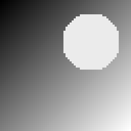
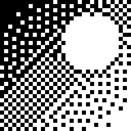
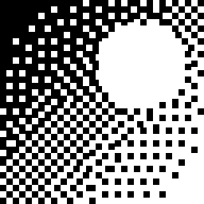
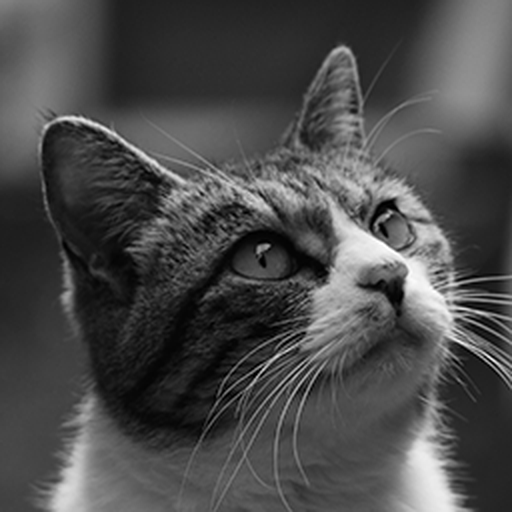
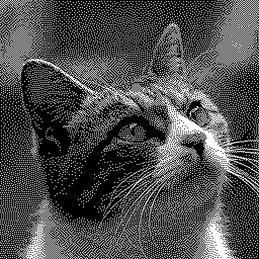
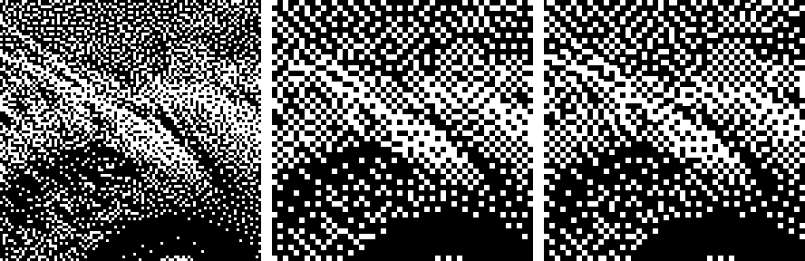

# クラスタドット・ハーフトーン

[ハーフトーン化](HALFTONING)では、ぼかすと元画像に近くなる白黒の2値画像を QUBO で求めました。
このページでは、それに「**どの画素も、同じ色の 2×2 のかたまりに属する**」という条件を加えます。
1 画素だけの白や黒の点、幅 1 画素の線は現れず、白も黒も 2×2 以上のかたまり（クラスタ）で描かれます。

この条件は、否定リテラル `~x` を使うと 1 画素につき 1 本の制約としてそのまま書けます。
また、条件を満たす解を先に簡単な方法で作り、それを**ヒント**として渡すと、探索が大きく改善します。

## なぜクラスタドットにするのか

ハーフトーン画像は、最後には紙に印刷されます。
ところがプリンタや印刷機は、1 画素の点を設計どおりに紙の上へ置けるとは限りません。

- **ドットゲイン**: インクやトナーは紙の上で少しにじんで広がるので、黒い点は設計より太ります。
  黒い部分の中にある 1 画素だけの白は、まわりの黒が広がって埋まり、**つぶれて**しまいます。
- **小さすぎる点の欠け**: 逆に、白い部分の中にある 1 画素だけの黒は小さすぎて、
  インクやトナーがうまく紙に乗らず、**消えたり、出たり出なかったり**します。

どちらも濃淡のずれになり、しかもずれ方はプリンタや紙の状態によって変わります。
白も黒も一定の大きさ以上のかたまりにまとめておけば、にじみや欠けの影響が相対的に小さくなり、濃淡が安定して再現されます。
新聞や雑誌の印刷に使われる網点も、点をかたまりにして、その大きさで濃淡を表す方法です。

このページでは、最小の点の大きさを 2×2 画素に保証します。

## QUBO 定式化

### 目的関数

目的関数は [ハーフトーン化](HALFTONING) と同じ、ぼかした2値画像と目標値の差の二乗和です
（$x_{ij} = 1$ が白、$0$ が黒、$G$ は係数の総和が $255$ の $7 \times 7$ 整数ガウシアン）:

$$E(x) = \sum_{i,j} \bigl( (G * x)_{ij} - T_{ij} \bigr)^2$$

### 制約: どの画素も単色の 2×2 窓に属する

左上が $(i, j)$ の 2×2 の窓が単色（4 画素とも白か、4 画素とも黒）なら $1$、そうでなければ $0$ になる式は、
否定リテラル $\overline{x} = 1 - x$ を使って次のように書けます:

$$m_{ij} = x_{i,j}\, x_{i,j+1}\, x_{i+1,j}\, x_{i+1,j+1} + \overline{x_{i,j}}\; \overline{x_{i,j+1}}\; \overline{x_{i+1,j}}\; \overline{x_{i+1,j+1}}$$

画素 $p$ を含む 2×2 の窓は最大 $4$ つ（$p$ が窓の左上・右上・左下・右下のどこにくるか）あります。
条件「$p$ は同じ色の 2×2 のかたまりに属する」は、そのどれかが単色であることです
（単色の窓の色は、その中にある $p$ の色と同じです）:

$$\sum_{W \ni p} m_W \ge 1 \qquad (\text{すべての画素 } p)$$

窓は画像の内側だけでとるので、四隅の画素の窓は $1$ つだけで、四隅の 2×2 は必ず単色になります。

### 否定リテラルをそのまま使う

QUBO++ の `simplify_as_binary()` は、3 次以上の項に含まれる否定リテラル `~x` を $1 - x$ に展開せず、そのまま残します。
そのため、黒の窓を表す $\overline{x_{i,j}}\;\overline{x_{i,j+1}}\;\overline{x_{i+1,j}}\;\overline{x_{i+1,j+1}}$ は 4 次の項 $1$ つのままで、
制約の式は 1 画素あたり最大 $8$ 項（窓 $4$ つ × 白と黒の $2$ 項）です。
$(1 - x)$ の積で書くと黒の窓 $1$ つが $16$ 項に展開されるので、制約の式は全体で約 $6$ 倍の大きさになります。
`qbpp.cons()` で囲んだ 4 次の制約は、EasySolver と ABS3Solver がそのまま扱います。

## 探索の工夫: 2×2 ブロックの解をヒントにする

この制約の付いた問題は、ソルバーにとって難しい問題です。
条件を満たす画像から 1 画素だけ反転すると、ほとんどの場合その画素か近くの画素が条件を破るので、
かたまりの形を変えるには、途中で条件を破る状態を何度も通らなければなりません。

一方、条件を満たす画像は簡単に作れます。
画像を 2×2 のブロックに区切り、ブロックごとに白か黒かを決めれば（変数は縦横半分の格子）、どの画素も必ず単色の 2×2 に属します。
これは解像度が半分のハーフトーン化で、制約のない普通の QUBO です。

そこで 2 段階で解きます:

1. 2×2 ブロック単位のハーフトーン化を解く。
2. その解を `search()` の `hint=` 引数でヒントとして渡し、画素ごとの変数と制約の付いた問題を解く。

ヒントの解はどの制約も満たしているので、ソルバーは条件を満たす良い解から探索を始め、
かたまりをずらしたり形を変えたりして、ブロックの格子にとらわれない解を探します。
返る解のエネルギーがヒントより悪くなることはありません。

## PyQBPP プログラム

以下のプログラムは、[ハーフトーン化](HALFTONING) と同じ $64\times 64$ の合成画像を、2 段階でクラスタドット・ハーフトーンに変換します:


```python
import pyqbpp as qbpp

M = 3                                        # フィルタ半径（7x7 フィルタ）
G = [[0, 0, 1, 1, 1, 0, 0],
     [0, 1, 5, 7, 5, 1, 0],
     [1, 5, 14, 21, 14, 5, 1],
     [1, 7, 21, 31, 21, 7, 1],
     [1, 5, 14, 21, 14, 5, 1],
     [0, 1, 5, 7, 5, 1, 0],
     [0, 0, 1, 1, 1, 0, 0]]                  # 整数ガウシアン（総和 255）
ROWS = COLS = 64


def blur(a):
    # G との畳み込み（画像の外側の画素は 0 とみなす）
    out = [[0] * COLS for _ in range(ROWS)]
    for i in range(ROWS):
        for j in range(COLS):
            for k in range(2 * M + 1):
                for l in range(2 * M + 1):
                    if 0 <= i + k - M < ROWS and 0 <= j + l - M < COLS:
                        out[i][j] += G[k][l] * a[i + k - M][j + l - M]
    return out


# 入力画像: 対角グラデーション + 明るい円（合成画像）
img = [[235 if (i - 20) ** 2 + (j - 44) ** 2 < 196
        else 255 * (i + j) // (ROWS + COLS - 2) for j in range(COLS)]
       for i in range(ROWS)]

# 目標値 T: 元画像そのもの（境界は届くフィルタ質量に合わせて縮小）
mass = blur([[1] * COLS for _ in range(ROWS)])
target = [[round(img[i][j] * mass[i][j] / 255) for j in range(COLS)]
          for i in range(ROWS)]


def error(px):
    # E = sum(((G * x) - T)^2)。px(i, j) は画素 (i, j) の値（1 が白）
    f = 0
    for i in range(ROWS):
        for j in range(COLS):
            e = -target[i][j]
            for k in range(2 * M + 1):
                for l in range(2 * M + 1):
                    if 0 <= i + k - M < ROWS and 0 <= j + l - M < COLS and G[k][l]:
                        e += G[k][l] * px(i + k - M, j + l - M)
            f += qbpp.sqr(e)
    return f


# 1 段目: 2x2 のブロック単位で塗る（変数は縦横半分の格子）
y = qbpp.var("y", ROWS // 2, COLS // 2)
f1 = error(lambda i, j: y[i // 2][j // 2])
f1.simplify_as_binary()
sol1 = qbpp.EasySolver(f1).search(time_limit=5)
print("block:   energy =", sol1.energy)

# 2 段目: 画素ごとの変数 x と「どの画素も同じ色の 2x2 窓に属する」制約
x = qbpp.var("x", ROWS, COLS)
f = error(lambda i, j: x[i][j])
# mono[i][j]: 左上が (i, j) の 2x2 窓が単色（4 画素とも白か、4 画素とも黒）なら 1
mono = [[x[i][j] * x[i][j + 1] * x[i + 1][j] * x[i + 1][j + 1] +
         ~x[i][j] * ~x[i][j + 1] * ~x[i + 1][j] * ~x[i + 1][j + 1]
         for j in range(COLS - 1)] for i in range(ROWS - 1)]
for i in range(ROWS):
    for j in range(COLS):
        c = 0  # 画素 (i, j) を含む窓（最大 4 つ）
        for s in range(i - 1, i + 1):
            for t in range(j - 1, j + 1):
                if 0 <= s < ROWS - 1 and 0 <= t < COLS - 1:
                    c += mono[s][t]
        f += 140000 * qbpp.cons(c, between=(1, None))
f.simplify_as_binary()

# 1 段目の解（どの制約も満たしている）をヒントにして探索する
hint = qbpp.Sol(f)
for i in range(ROWS):
    for j in range(COLS):
        hint.set(x[i][j], sol1(y[i // 2][j // 2]))
sol = qbpp.EasySolver(f).search(time_limit=5, hint=hint)
print("cluster: energy =", sol.energy, " violations =", f.cons(sol))

# 解を PGM 形式の2値画像として保存
bits = sol(x)
with open("cluster_halftone.pgm", "w") as fp:
    fp.write(f"P2\n{COLS} {ROWS}\n255\n")
    for i in range(ROWS):
        fp.write(" ".join(str(255 * int(v)) for v in bits[i]) + "\n")
```


- `error` は、画素の値を返す関数 `px` を受け取って目的関数 $E$ を作ります。
  1 段目は 2×2 ブロックの変数 `y[i // 2][j // 2]`、2 段目は画素ごとの変数 `x[i][j]` を渡します。
- `mono[i][j]` が単色の窓を表す式 $m_{ij}$ です。黒の窓は否定リテラル `~x` の積で書きます。
- `qbpp.cons(c, between=(1, None))` が画素ごとの制約です（$c \ge 1$。上限なし）。重み $140000$ は、
  1 画素を反転して誤差が減る量の上限（$2 \cdot 255 \cdot 255 + \sum G^2 \approx 134000$）より大きく選んでいます。
- `qbpp.Sol(f)` で `f` の変数の解を作り、1 段目の解を書き写してから `search(time_limit=5, hint=hint)` で渡します。
- `f.cons(sol)` は、解が破っている制約の数です（$0$ なら条件をすべて満たす）。

### 出力結果

```
block:   energy = 1869308
cluster: energy = 1633036  violations = 0
```

制約をすべて満たしたうえで、2 段目のエネルギー（誤差）は 1 段目のブロック単位の解より小さくなっています。
`EasySolver` は乱択ヒューリスティックなので、値は実行ごとに変わります。

入力画像（左）、1 段目の 2×2 ブロック単位の解（中）、2 段目のクラスタドット・ハーフトーン（右）:

<p align="center">
  
  
  
</p>

ブロック単位の解（中）は点がすべて 2×2 の格子に揃っていますが、2 段目（右）では一部の点が格子からずれて並び、そのぶん誤差が下がっています。

## 実画像への適用

入力画像を写真に替えると、次のようになります（$512 \times 512$ 画素、変数 $262{,}144$ 個、`ABS3Solver` で各段 300 秒）。
左から入力写真、2×2 ブロック単位の解、クラスタドット・ハーフトーン:

<p align="center">
  
  
  
</p>

一部を拡大すると、制約のない普通のハーフトーン（左）には 1 画素だけの白や黒がたくさんありますが、
2×2 ブロック単位（中）とクラスタドット・ハーフトーン（右）は、白も黒もすべて 2×2 以上のかたまりです:

<p align="center">
  
</p>

### ヒントと否定リテラルの効果

同じ写真で解き方を変えて比べました（`ABS3Solver`、合計 600 秒）。誤差は目的関数 $E(x)$ の値です:

| 解き方 | 誤差 |
|:---|---:|
| 制約のないハーフトーン（参考。条件を満たさない画素が 49%） | 9,414,753 |
| 画素ごとの変数と制約だけ（ヒントなし） | 193,151,598 |
| 2×2 ブロック単位だけ | 122,308,505 |
| **ブロック単位の解をヒントにして、制約付きで解く** | **118,891,447** |
| 同上。ただし黒の窓を `(1 - x)` の積で書いた場合 | 119,308,158 |

- **ヒントがないと届かない**: 制約付きの問題の解にはブロック単位の解がすべて含まれるのに、ヒントなしで解くとブロック単位よりずっと悪い解しか見つかりません。
  条件を満たす解から探索を始めると、ブロック単位の解からさらに誤差が下がります。
- **否定リテラルの効果**: `~x` のまま書くと、制約の式は全体で約 $209$ 万項です。
  `(1 - x)` の積で書くと約 $1280$ 万項（約 $6$ 倍）になり、式の構築にも時間がかかります（$19$ 秒 → $25$ 秒）。
  同じ探索時間でブロック単位の解から下げられた誤差も、`~x` のほうが大きくなりました（$4.3\%$ 対 $3.8\%$）。

制約のないハーフトーンより誤差がずっと大きいのは、2×2 のかたまりでは 1 画素単位の細かい模様を表せないからで、これは条件の代償です。
印刷では、この代償と引き換えに、にじみや欠けに強い画像が得られます。

