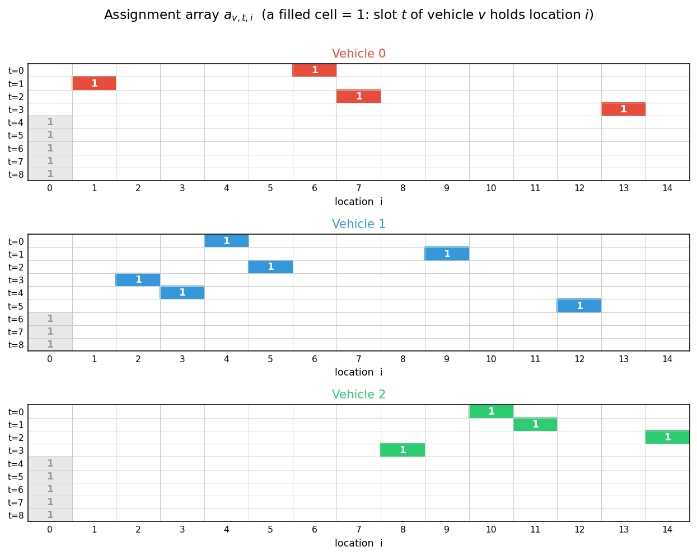
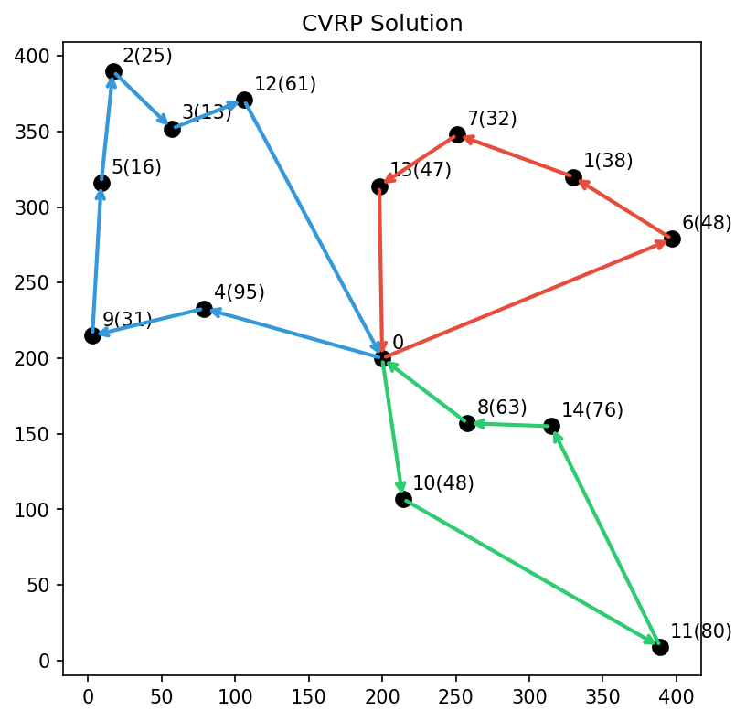

# 容量制約付き配車計画問題（CVRP）
**容量制約付き配車計画問題（CVRP）**は、単一の**デポ**から出発して戻る $V$ 台の**車両**の経路集合を求め、すべての**顧客**にサービスを提供することを目的とする問題です。
**場所**を $i \in \lbrace 0,1,\ldots,N-1\rbrace$ でインデックス付けし、場所0をデポ、場所 $1,\ldots,N-1$ を顧客とします。
各顧客 $i\in \lbrace 1,\ldots,N-1\rbrace$ には配送すべき需要量 $d_i$ があります（デポでは $d_0=0$ とします）。
各車両 $v \in \lbrace 0,\ldots,V-1\rbrace$ はデポを出発し、顧客の部分集合を訪問してデポに戻ります。このとき、経路上の配送需要の合計が車両容量 $q_v$ を超えないという容量制約を満たす必要があります。
目的関数は、全車両の総移動コストを最小化することです。

場所は2次元平面上の点であり、2つの場所間の移動コストはユークリッド距離であると仮定します。
$c_{i,j}$ を場所 $i$ と $j$ の間の距離（コスト）とします。

## QUBO++定式化：バイナリ変数の配列
各車両に $L$ 個の**スロット**を割り当て、車両 $v$ のスロット $t$ には車両 $v$ が $t$ 番目に訪問する顧客を格納します。
スロットは**空**であってもよく、これはデポ（場所0）をスロットに割り当てることで表現します。空のスロットは、その車両が $L$ 人未満の顧客を担当することを意味するだけです。

スロット数 $L$ は、1台の車両が担当できる顧客数の上界であり、需要量と最大の車両容量から事前に計算します：
需要量を昇順にソートし、最大容量を超えるまで貪欲に加算したときの個数が $L$ です。
以下で解くインスタンスでは $L=9$ となり、この定式化は $V\times L\times N = 3\times 9\times 15 = 405$ 個のバイナリ変数を使用します。

すなわち、$V\times L\times N$ のバイナリ変数配列 $A=(a_{v,t,i})$（$0\leq v\leq V-1$, $0\leq t\leq L-1$, $0\leq i\leq N-1$）を使用します。
ここで $a_{v,t,i}$ は、車両 $v$ のスロット $t$ が場所 $i$ を保持する場合にのみ1となります（$i=0$ はそのスロットが空であることを意味します）。

次の図は、$V=3$・$N=15$・$L=9$ のインスタンス（下のプログラムで解く
インスタンス）に対する $A=(a_{v,t,i})$ の割り当ての一例で、CVRPの解を
表しています。各車両（0・1・2）ごとに $L\times N$ の格子を示し、色の付いた
セルが $a_{v,t,i}=1$（車両 $v$ のスロット $t$ が場所 $i$ を保持）を表します。
デポ（場所0）に割り当てられたスロットは空きスロットです。

<p align="center">
  
</p>

各車両はデポ（場所0）から出発し、空でないスロットに格納された顧客を順に
訪問した後、デポに戻ります。各顧客 $1,\ldots,14$ はちょうど1台の車両の
ちょうど1つのスロットに現れるため、この配列は実行可能なCVRPの解を
表しています。空のスロットが顧客の後ろに並んでいますが、定式化はこれを
要求しません：2人の顧客の間に空きスロットがあることは、その間に車両が
デポを経由することを意味するだけで、三角不等式のもとで経路が短くなる
ことはありません。したがって空のスロットの位置に関する追加の制約は不要で、
最適解は自然に無駄のない経路になります。

## QUBO++定式化のための制約

### 行制約（各スロットのone-hot）
各スロットはちょうど1つの場所（顧客、または空のスロットを表すデポ）を保持しなければなりません。
次のone-hot制約を課します：

$$
\begin{aligned}
\text{row}\_\text{constraint} & = \sum_{v=0}^{V-1}\sum_{t=0}^{L-1}\bigr(\sum_{i=0}^{N-1} a_{v,t,i} = 1\bigl)\\
 &= \sum_{v=0}^{V-1}\sum_{t=0}^{L-1}\bigr(1-\sum_{i=0}^{N-1} a_{v,t,i}\bigl)^2
\end{aligned}
$$

**row\_constraint** は、すべての行がone-hotである場合にのみ最小値 $0$ をとります。

### 列制約
各顧客は、ちょうど1台の車両のちょうど1つのスロットに保持されなければなりません：

$$
\begin{aligned}
\text{column}\_\text{constraint}
& = \sum_{i=1}^{N-1}\bigr(\sum_{v=0}^{V-1}\sum_{t=0}^{L-1} a_{v,t,i} = 1\bigl)\\
 &= \sum_{i=1}^{N-1}\bigr(1-\sum_{v=0}^{V-1}\sum_{t=0}^{L-1} a_{v,t,i}\bigl)^2
\end{aligned}
$$

**column\_constraint** は、すべての顧客 $i = 1, \dots ,N−1$ がちょうど1回訪問される場合にのみ0となります。
デポの列 $i=0$ にはこのような制約を課さないことに注意してください：空のスロットはいくつあっても構いません。

### 容量制約
各車両 $v$ について、配送する需要の合計は

$$
\sum_{t=0}^{L-1}\sum_{i=1}^{N-1}d_ia_{v,t,i}
$$

であり、これは $q_v$ 以下でなければなりません。
したがって、次の制約が0でなければなりません：

$$
\begin{aligned}
\text{capacity}\_\text{constraint} &= \sum_{v=0}^{V-1}\Bigr(0\leq \sum_{t=0}^{L-1}\sum_{i=1}^{N-1}d_ia_{v,t,i}\leq q_v\Bigl)
\end{aligned}
$$

**capacity\_constraint** は、すべての車両が容量を超えない場合にのみ0となります。


## QUBO定式化のための目的関数

車両の巡回コストは、デポから最初のスロットへの区間、連続するスロット間の区間、最後のスロットからデポへ戻る区間から構成されます：

$$
\begin{aligned}
\text{objective} &= \sum_{v=0}^{V-1}\Bigr(\sum_{i=1}^{N-1}c_{0,i}a_{v,0,i}
+ \sum_{t=0}^{L-2}\sum_{i=0}^{N-1}\sum_{j=0}^{N-1}c_{i,j}a_{v,t,i}a_{v,t+1,j}
+ \sum_{i=1}^{N-1}c_{i,0}a_{v,L-1,i}\Bigl)
\end{aligned}
$$

ユークリッド距離では $c_{i,i}=0$ なので、経路の先頭や末尾にある空のスロットが余分なコストを生むことはなく、すべての制約が満たされているとき
$\text{objective}$ は全車両の総移動コストに等しくなります。

## CVRPのQUBO定式化

目的関数と制約を組み合わせて、次のQUBOを得ます：

$$
\begin{aligned}
f &= \text{objective} + P\cdot \text{cons}(\text{row}\_\text{constraint}+\text{column}\_\text{constraint}+\text{capacity}\_\text{constraint})
\end{aligned}
$$

ここで $P$ は制約の重みです。制約部分を `qbpp.cons()` で囲むことで
制約として宣言され、ソルバーは制約を満たすように効率よく探索を行います
（[ネイティブ制約](CONSTRAINTS)を参照）。

## PyQBPPプログラム
以下のPyQBPPプログラムは、ランダムに生成した $N=15$ 箇所の場所（デポ＋顧客14）と $V=3$ 台の車両からなるCVRPインスタンスの解を、制限時間10秒で求めます。距離は `math.sqrt` で計算した**正確なユークリッド距離**（丸めなし）を用い、[実数（double）係数](VAREXPR#real-double-coefficients)フロントエンド `pyqbpp.d` をインポートして `objective` を実数で構築します。

```python
import math
import pyqbpp.d as qbpp

locations = [
    (200, 200, 0),  (330, 320, 38), (17, 390, 25),  (57, 352, 13),
    (79, 233, 95),  (9, 316, 16),   (397, 279, 48), (251, 348, 32),
    (258, 157, 63), (3, 215, 31),   (214, 107, 48), (389, 9, 80),
    (106, 371, 61), (198, 314, 47), (315, 155, 76)]
vehicle_capacity = qbpp.array([200, 250, 300])
N, V = len(locations), len(vehicle_capacity)

def dist(i, j):                      # exact Euclidean distance (double)
    x1, y1 = locations[i][0], locations[i][1]
    x2, y2 = locations[j][0], locations[j][1]
    return math.sqrt((x1 - x2) ** 2 + (y1 - y2) ** 2)

sorted_demands = sorted(locations[i][2] for i in range(1, N))
max_capacity = max(vehicle_capacity[v] for v in range(V))
L, acc = 0, 0
for d in sorted_demands:
    if acc + d > max_capacity: break
    acc += d; L += 1

a = qbpp.var("a", shape=(V, L, N))
row_constraint = qbpp.sum(qbpp.vector_sum(a) == 1)
column_sum = [0 for _ in range(N - 1)]
for v in range(V):
    for t in range(L):
        for i in range(1, N):
            column_sum[i - 1] += a[v][t][i]
column_constraint = 0
for i in range(N - 1):
    column_constraint += (column_sum[i] == 1)
vehicle_load = [0 for _ in range(V)]
capacity_constraint = 0
for v in range(V):
    for t in range(L):
        for i in range(1, N):
            vehicle_load[v] += a[v][t][i] * locations[i][2]
    capacity_constraint += (0 <= vehicle_load[v]) & (qbpp.same <= vehicle_capacity[v])
objective = 0.0
for v in range(V):
    for i in range(1, N):
        objective += dist(0, i) * a[v][0][i]
    for t in range(L - 1):
        for i in range(N):
            for j in range(N):
                if dist(i, j) != 0:
                    objective += dist(i, j) * a[v][t][i] * a[v][t + 1][j]
    for i in range(1, N):
        objective += dist(i, 0) * a[v][L - 1][i]

f = objective + 3000 * qbpp.cons(row_constraint + column_constraint +
                                 capacity_constraint)
f.simplify_as_binary()
sol = qbpp.EasySolver(f).search(time_limit=10.0)
print("violated constraints =", f.cons(sol))
print(f"objective = {sol(objective):.2f}")
for v in range(V):
    load = int(sol(vehicle_load[v]))
    cap = int(vehicle_capacity[v])
    route = f"Vehicle {v} : load = {load} / {cap} : 0 "
    for t in range(L):
        for i in range(1, N):
            if sol(a[v][t][i]) == 1:
                route += f"-> {i}({locations[i][2]}) "; break
    print(route + "-> 0")
```

このプログラムは、スロット数 `L`（このインスタンスでは9）を計算して$V\times L\times N = 3\times 9\times 15 = 405$ 個のバイナリ変数配列 `a` を定義し、目的関数項と制約項を `qbpp.cons()` で結合します：`f = objective + 3000 * qbpp.cons(...)`。そして Easy Solver で制限時間10秒で `f` を最小化します。`f.cons(sol)` は違反している制約の本数（全充足なら0）です。実行例として次の結果が得られます：
```
violated constraints = 0
objective = 1821.13
Vehicle 0 : load = 165 / 200 : 0 -> 6(48) -> 1(38) -> 7(32) -> 13(47) -> 0
Vehicle 1 : load = 241 / 250 : 0 -> 4(95) -> 9(31) -> 5(16) -> 2(25) -> 3(13) -> 12(61) -> 0
Vehicle 2 : load = 267 / 300 : 0 -> 10(48) -> 11(80) -> 14(76) -> 8(63) -> 0
```
この総移動コスト1821.13は、長時間の実行を繰り返して確認したこのインスタンスの最良値です（厳密な最適性の証明は行っていません）。ヒューリスティックソルバーのため、10秒の実行では 1821.13 よりわずかに大きい解が得られることもあります。

## matplotlibによる可視化
以下のコードは得られた解を可視化し、`cvrp15.png` に書き出します：
```python
import matplotlib.pyplot as plt

vehicle_colors = ["#e74c3c", "#3498db", "#2ecc71"]
plt.figure(figsize=(6, 6))
for i, (lx, ly, q) in enumerate(locations):
    plt.plot(lx, ly, "ko", markersize=8)
    plt.annotate(f"{i}" + (f"({q})" if q > 0 else ""),
                 (lx, ly), textcoords="offset points", xytext=(5, 5))

for v in range(V):
    route_nodes = [0]
    for t in range(L):
        for i in range(1, N):
            if sol(a[v][t][i]) == 1:
                route_nodes.append(i)
                break
    route_nodes.append(0)
    for k in range(len(route_nodes) - 1):
        fr, to = route_nodes[k], route_nodes[k + 1]
        plt.annotate("", xy=(locations[to][0], locations[to][1]),
                     xytext=(locations[fr][0], locations[fr][1]),
                     arrowprops=dict(arrowstyle="->", color=vehicle_colors[v],
                                    lw=2))
plt.title("CVRP Solution")
plt.savefig("cvrp15.png", dpi=150, bbox_inches="tight")
plt.show()
```

得られた解の可視化（`cvrp15.png`）を以下に示します：

<p align="center">
  
</p>
