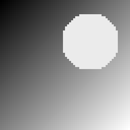
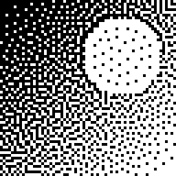
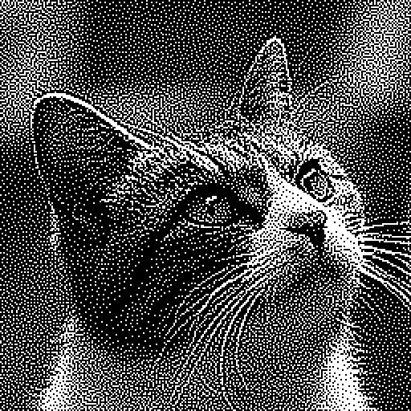

# 画像のハーフトーン化

**ハーフトーン化**（halftoning）は、グレースケール画像を白黒2値のドットパターン画像に変換する画像処理です。
新聞の写真やモノクロプリンタの印刷など、白か黒かの2値しか表現できない媒体で濃淡を表現するために使われています。
細かい白黒のパターンは、離れて見ると目の中で平均化され、中間調として知覚されます。

この「離れて見るとぼけて中間調に見える」という性質が定式化の鍵です。
人間の視覚系のぼけをローパスフィルタ（ガウシアンフィルタ）$G$ でモデル化すると、良いハーフトーン画像とは、

**ぼかした結果が元画像にできるだけ近い2値画像**

です。この差の二乗和を最小化する問題は、補助変数も制約も使わずにそのまま QUBO になります。

## QUBO 定式化

$n_r \times n_c$ 画素のグレースケール画像 $I$（画素値 $0 \le I_{ij} \le 255$）が与えられたとします。
出力画像の各画素にバイナリ変数 $x_{ij} \in \{0,1\}$ を割り当てます（$1$ が白、$0$ が黒）。
変数の個数は画素数と同じ $n_r n_c$ 個です。

視覚系のぼけは、$(2M{+}1)\times(2M{+}1)$ のフィルタ $G$ との畳み込みで表します
（以下の例では $M=3$、係数の総和が $255$ の $7\times 7$ 整数ガウシアンを使います）。
2値画像 $x$ のぼけは

$$(G * x)_{ij} = \sum_{k=0}^{2M} \sum_{l=0}^{2M} G_{kl}\, x_{i+k-M,\, j+l-M}$$

です（画像の外側の画素は $0$ とみなします）。$G$ の係数の総和が $255$ なので、画像の内部では $(G * x)$ の各要素は $0$〜$255$ の値をとります。目標値には元画像そのものを使います:

$$T_{ij} = \mathrm{round}\!\left(\frac{I_{ij}\, m_{ij}}{255}\right),
\qquad m_{ij} = (G * \mathbf{1})_{ij}$$

ここで $m_{ij}$ は画素 $(i,j)$ に届くフィルタ係数の合計（$\mathbf{1}$ は全画素が $1$ の画像）です。画像の内部では $m_{ij} = 255$、すなわち $T_{ij} = I_{ij}$（元画像そのまま）です。境界付近ではフィルタ窓が画像からはみ出して、その画素でぼけの値が到達できる最大値が $m_{ij}$ に下がるため、目標も同じ比率で縮めています。

元画像をぼかしたものを目標値にする定式化も考えられますが、元画像をぼかさずそのまま目標にする方がシャープなハーフトーン画像になり、人の目にはきれいに見えます。

最小化する目的関数は、ぼかした2値画像と目標値の差の二乗和です:

$$E(x) = \sum_{i,j} \bigl( (G * x)_{ij} - T_{ij} \bigr)^2$$

$(G * x)$ の各要素は変数の線形式なので、$E(x)$ は2次式、すなわち制約のない純粋な QUBO です。
二乗の展開で現れる2つの変数の積 $x_{ij}\, x_{kl}$ は、画素 $(i,j)$ と $(k,l)$ が同じフィルタ窓に入るもの、
つまり縦横の距離が $2M$ 以内のものに限られるため、QUBO は疎（バンド構造）になります。

## PyQBPP プログラム

以下のプログラムは、$64\times 64$ の合成グレースケール画像（対角グラデーション + 明るい円）を生成してハーフトーン化し、
結果を PGM 形式の画像ファイルとして保存します:

```python
import pyqbpp as qbpp

M = 3                                        # フィルタ半径（7x7 フィルタ）
G = [[0, 0, 1, 1, 1, 0, 0],
     [0, 1, 5, 7, 5, 1, 0],
     [1, 5, 14, 21, 14, 5, 1],
     [1, 7, 21, 31, 21, 7, 1],
     [1, 5, 14, 21, 14, 5, 1],
     [0, 1, 5, 7, 5, 1, 0],
     [0, 0, 1, 1, 1, 0, 0]]                  # 整数ガウシアン（総和 255）
ROWS = COLS = 64

def blur(a):
    # G との畳み込み（画像の外側の画素は 0 とみなす）
    out = [[0] * COLS for _ in range(ROWS)]
    for i in range(ROWS):
        for j in range(COLS):
            for k in range(2 * M + 1):
                for l in range(2 * M + 1):
                    if 0 <= i + k - M < ROWS and 0 <= j + l - M < COLS:
                        out[i][j] += G[k][l] * a[i + k - M][j + l - M]
    return out

# 入力画像: 対角グラデーション + 明るい円（合成画像）
img = [[235 if (i - 20) ** 2 + (j - 44) ** 2 < 196
        else 255 * (i + j) // (ROWS + COLS - 2) for j in range(COLS)]
       for i in range(ROWS)]

# 目標値 T: 元画像そのもの（境界は届くフィルタ質量に合わせて縮小）
mass = blur([[1] * COLS for _ in range(ROWS)])
target = [[round(img[i][j] * mass[i][j] / 255) for j in range(COLS)]
          for i in range(ROWS)]

# E = sum(((G * x) - T)^2): 画素ごとに (G * x) - T を組み立てて二乗和
x = qbpp.var("x", ROWS, COLS)
f = 0
for i in range(ROWS):
    for j in range(COLS):
        e = 0
        for k in range(2 * M + 1):
            for l in range(2 * M + 1):
                if 0 <= i + k - M < ROWS and 0 <= j + l - M < COLS and G[k][l]:
                    e += G[k][l] * x[i + k - M, j + l - M]
        f += qbpp.sqr(e - target[i][j])
f.simplify_as_binary()

sol = qbpp.EasySolver(f).search(time_limit=5)
print("variables =", sol.info["var_count"], " terms =", sol.info["term_count"])
print("energy =", sol.energy)

# 解を PGM 形式の2値画像として保存
bits = sol(x)
with open("halftone.pgm", "w") as fp:
    fp.write(f"P2\n{COLS} {ROWS}\n255\n")
    for i in range(ROWS):
        fp.write(" ".join(str(255 * int(v)) for v in bits[i]) + "\n")
```

内側の二重ループが、各画素のぼけの値 $(G * x)$ から目標値を引いた式を組み立て、`qbpp.sqr` で二乗して `f` に足し込みます — 数式の定義をそのまま書き写した形です。
`simplify_as_binary()` が同類項をまとめ、バイナリ変数の規則 $x^2 = x$ で式を整理します。

### 出力結果

```
variables = 4096  terms = 244488
energy = 259375
```

$64\times 64$ で変数は $4096$ 個、simplify 後の QUBO は約 $24$ 万項（各変数が縦横 $\pm 2M$ の近傍としか結合しないバンド構造）になります。
`EasySolver` は乱択ヒューリスティックなので、energy の値は実行ごとに変わります。

入力画像（左）と出力されたハーフトーン画像（右）:

<p align="center">
  
  
</p>

グラデーションが白ドットの密度の変化として表現されていることがわかります。

### 配列演算によるベクトル化

`f` を構築している二重ループの部分は、QUBO++ の配列演算で**ベクトル化**できます（`x` はそのまま使います）:

```python
# ゼロパディング: x の周囲に幅 M のゼロを連結
xp = qbpp.concat([0] * M + [x] + [0] * M, axis=1)   # 左右
xp = qbpp.concat([0] * M + [xp] + [0] * M, axis=0)  # 上下

# (G * x): シフトしたスライスの重み付き和
conv = qbpp.expr(ROWS, COLS)
for k in range(2 * M + 1):
    for l in range(2 * M + 1):
        if G[k][l]:
            conv += G[k][l] * xp[k:k + ROWS, l:l + COLS]

# E = sum(((G * x) - T)^2)
f = qbpp.sum((conv - qbpp.array(target)).sqr())
f.simplify_as_binary()
```

1. `qbpp.concat` で `x` の上下左右に幅 $M$ のゼロを連結し、$(n_r{+}2M) \times (n_c{+}2M)$ のパディング済み配列 `xp` を作ります（リスト中のスカラー `0` は、連結する軸に沿ったゼロの行・列に自動的にブロードキャストされます）。
2. `xp` から縦横に $k, l$ だけシフトした $n_r \times n_c$ の部分配列 `xp[k:k + ROWS, l:l + COLS]` を係数 $G_{kl}$ 倍して `conv` に足し込みます。この二重ループが終わると、`conv` が線形式の配列 $(G * x)$ になります。
3. 目標値の配列 `qbpp.array(target)` を引いて要素ごとに `sqr()` で二乗し、`qbpp.sum` で合計すると目的関数 $E(x)$ が得られます。

どちらの書き方もまったく同じ QUBO を構築します（simplify 後の項数もエネルギーも完全に一致します）。
一方、構築時間は配列演算版が約 2〜2.5 倍高速です（実測例、20 コア CPU のサーバー）:

| 画像サイズ | ループ版 | 配列演算版 |
|:---:|:---:|:---:|
| 64×64 | 1.3 秒 | 0.6 秒 |
| 128×128 | 3.7 秒 | 1.8 秒 |
| 256×256 | 14.8 秒 | 6.0 秒 |

なお、ループ版の蓄積は必ず `f += ...` と書いてください。`f = f + ...` と書くと `f` 全体のコピーが画素ごとに発生して二次的に遅くなります（64×64 の実測で約 80 倍）。

ループ版は画素×タップごとに小さな式操作を繰り返す（256×256 では数百万回の呼び出し）のに対し、
配列演算版は数十回の粗粒度な配列演算で済み、要素ごとの処理はライブラリ内部で一括実行されるためです。

## 実画像への適用

入力画像を生成している部分をファイル読み込みに差し替えるだけで、実際の写真をハーフトーン化できます。
$256\times 256$ の写真では変数 $65{,}536$ 個・約 $417$ 万項の QUBO になりますが、
構築は数秒で終わり、`EasySolver` で数分探索すると次のような結果が得られます:

<p align="center">
  
  
</p>
