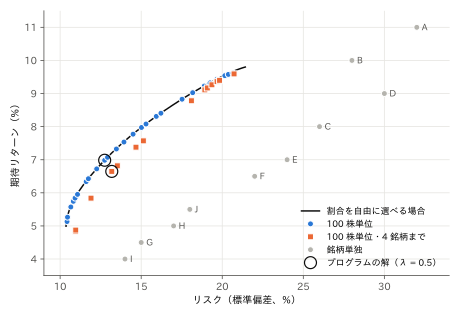

# ポートフォリオ最適化

予算 1000 万円で、10 銘柄の株を組み合わせて買います。
株は 100 株（1 単元）単位でしか買えず、1 銘柄に使えるのは予算の 30% までです。
**期待リターン**（1 年間に見込める値上がりと配当の割合）が大きく、**リスク**（リターンのばらつき）が小さい組合せを求めます。

銘柄は次のとおりです（架空のデータです）。
ボラティリティは 1 年間のリターンの標準偏差です。

| 銘柄 | 業種 | 株価（円） | 期待リターン | ボラティリティ |
|:---:|:---:|---:|---:|---:|
| A | 電機 | 2,450 | 11.0% | 32% |
| B | 電機 | 6,180 | 10.0% | 28% |
| C | 自動車 | 1,870 | 8.0% | 26% |
| D | 自動車 | 3,320 | 9.0% | 30% |
| E | 銀行 | 1,240 | 7.0% | 24% |
| F | 銀行 | 4,060 | 6.5% | 22% |
| G | 食品 | 2,890 | 4.5% | 15% |
| H | 食品 | 5,510 | 5.0% | 17% |
| I | 通信 | 1,530 | 4.0% | 14% |
| J | 通信 | 3,970 | 5.5% | 18% |

2 つの銘柄のリターンの相関係数は、同じ業種なら 0.6、違う業種なら 0.2 とします。
同じ業種の銘柄はそろって値動きしやすいので、業種を分けて買うほどリスクが下がります。

## 定式化

銘柄 $i$ の単元数を整数変数 $x_i$ とします。
1 単元の金額を $c_i$（千円）、予算を $B = 10000$（千円）とすると、銘柄 $i$ が予算に占める割合は $w_i = c_i x_i / B$ です。
このとき、ポートフォリオの期待リターンとリスク（分散）は次のとおりです。

$$
R = \sum_{i} \mu_i w_i, \qquad
V = \sum_{i} \sum_{j} \rho_{ij}\, \sigma_i \sigma_j\, w_i w_j
$$

ここで $\mu_i$ は期待リターン、$\sigma_i$ はボラティリティ、$\rho_{ij}$ は相関係数（$\rho_{ii} = 1$）です。
リスクを小さく、リターンを大きくしたいので、重み $\lambda$ を付けて次のように定式化します。

$$
\begin{aligned}
\text{最小化}\quad & V - \lambda R \\
\text{制約}\quad & 9800 \le \sum_{i} c_i x_i \le 10000 \\
& 0 \le x_i \le u_i && \text{（すべての銘柄 } i\text{）}
\end{aligned}
$$

$u_i$ は予算の 30%（3000 千円）までで買える単元数です。
予算は 980 万円以上使うことにします（残りは現金で、リスクもリターンも 0 です）。
$\lambda$ はリターンをどれだけ重視するかを表し、$\lambda = 0$ ならリスク最小、$\lambda$ が大きいほどリターン重視になります。
これは平均分散モデル（Markowitz モデル）で、
割合 $w_i$ を自由に選べるなら凸二次計画問題として効率よく解けますが、
単元の制約や、次の節の銘柄数の制限が入ると組合せ最適化問題になります。

係数は実数なので、[実数（double）係数](VAREXPR#実数double係数)のモジュール（`import pyqbpp.d`）を使います。
単元数 $x_i$ は[ネイティブ整数変数](NATIVE_INTEGER)、予算の制約は `qbpp.cons()` で書きます。
金額は千円単位の整数なので、予算の制約を破ると金額は少なくとも 1 ずれ、ペナルティは 1 以上になります。
目的関数の値はこの問題では 0.1 に満たないので、制約の重みは 1 で十分です。

## プログラム

$\lambda = 0.5$ として解きます。

```python
import math

import pyqbpp.d as qbpp

# 銘柄 A〜J の業種、株価（円）、期待リターン、ボラティリティ（年率）
sector = [0, 0, 1, 1, 2, 2, 3, 3, 4, 4]
price = [2450, 6180, 1870, 3320, 1240, 4060, 2890, 5510, 1530, 3970]
mu = [0.11, 0.10, 0.08, 0.09, 0.07, 0.065, 0.045, 0.05, 0.04, 0.055]
sigma = [0.32, 0.28, 0.26, 0.30, 0.24, 0.22, 0.15, 0.17, 0.14, 0.18]
n = len(price)
budget = 10000  # 千円
lam = 0.5

# 1 単元（100 株）の金額（千円）と、予算の 30% までで買える単元数
lot = [p // 10 for p in price]
cap = [3000 // c for c in lot]

x = qbpp.var("x", shape=n, integer=(0, cap))

risk = 0
ret = 0
cost = 0
for i in range(n):
    wi = lot[i] / budget
    for j in range(n):
        wj = lot[j] / budget
        rho = 1.0 if i == j else (0.6 if sector[i] == sector[j] else 0.2)
        risk += rho * sigma[i] * sigma[j] * wi * wj * x[i] * x[j]
    ret += mu[i] * wi * x[i]
    cost += lot[i] * x[i]
f = risk - lam * ret + qbpp.cons(cost, between=(9800, budget))
f.simplify_as_binary()

sol = qbpp.EasySolver(f).search(time_limit=1.0)
for i in range(n):
    if sol(x[i]) > 0:
        print(f"{chr(ord('A') + i)}: {sol(x[i]):2.0f} lots ({lot[i] * sol(x[i]):4.0f} thousand yen)")
print(f"cost = {sol(cost):.0f} thousand yen, return = {100 * sol(ret):.2f}%, "
      f"risk = {100 * math.sqrt(sol(risk)):.2f}%")
```

このプログラムは、買う銘柄ごとに単元数と金額（千円）を出力し、最後に合計金額、期待リターン、リスク（標準偏差）を出力します。

```
A:  4 lots ( 980 thousand yen)
B:  2 lots (1236 thousand yen)
C:  5 lots ( 935 thousand yen)
D:  2 lots ( 664 thousand yen)
E:  7 lots ( 868 thousand yen)
F:  2 lots ( 812 thousand yen)
G:  4 lots (1156 thousand yen)
H:  2 lots (1102 thousand yen)
I:  4 lots ( 612 thousand yen)
J:  4 lots (1588 thousand yen)
cost = 9953 thousand yen, return = 6.98%, risk = 12.75%
```

- `x` は単元数 $x_i$ の整数変数の配列で、`integer=(0, cap)` で銘柄ごとに違う上限を指定しています。
- `risk`、`ret`、`cost` は、それぞれリスク $V$、期待リターン $R$、合計金額です。
  予算の範囲は `qbpp.cons(cost, between=(9800, budget))` で指定します。
- `EasySolver` で 1 秒間探索します。

10 銘柄すべてに分けて買い、期待リターンは 6.98%、リスクは 12.75% になりました。
リスク 12.75% は、どの銘柄のボラティリティ（最も小さい I でも 14%）よりも小さく、分散して買う効果が表れています。
整数計画ソルバーで確かめると、これがこの問題の最適解です。

## 銘柄数の制限

10 銘柄に少しずつ分けて買うのは管理が大変なので、買う銘柄を 4 つまでに制限します。
銘柄 $i$ を買うとき 1 になるバイナリ変数 $y_i$ を加え、次の制約を課します。

$$
\begin{aligned}
& x_i \le u_i\, y_i && \text{（すべての銘柄 } i\text{）}\\
& \sum_{i} y_i \le 4
\end{aligned}
$$

1 つ目の制約により、$y_i = 0$ の銘柄は買えません。
プログラムでは、予算の制約の後に `y` とこれらの制約を加えます。

```python
import math

import pyqbpp.d as qbpp

# 銘柄 A〜J の業種、株価（円）、期待リターン、ボラティリティ（年率）
sector = [0, 0, 1, 1, 2, 2, 3, 3, 4, 4]
price = [2450, 6180, 1870, 3320, 1240, 4060, 2890, 5510, 1530, 3970]
mu = [0.11, 0.10, 0.08, 0.09, 0.07, 0.065, 0.045, 0.05, 0.04, 0.055]
sigma = [0.32, 0.28, 0.26, 0.30, 0.24, 0.22, 0.15, 0.17, 0.14, 0.18]
n = len(price)
budget = 10000  # 千円
lam = 0.5

# 1 単元（100 株）の金額（千円）と、予算の 30% までで買える単元数
lot = [p // 10 for p in price]
cap = [3000 // c for c in lot]

x = qbpp.var("x", shape=n, integer=(0, cap))

risk = 0
ret = 0
cost = 0
for i in range(n):
    wi = lot[i] / budget
    for j in range(n):
        wj = lot[j] / budget
        rho = 1.0 if i == j else (0.6 if sector[i] == sector[j] else 0.2)
        risk += rho * sigma[i] * sigma[j] * wi * wj * x[i] * x[j]
    ret += mu[i] * wi * x[i]
    cost += lot[i] * x[i]
f = risk - lam * ret + qbpp.cons(cost, between=(9800, budget))

# 買う銘柄は 4 つまで: 銘柄 i を買うとき y[i] = 1
y = qbpp.var("y", n)
for i in range(n):
    f += qbpp.cons(x[i] - cap[i] * y[i] <= 0)
f += qbpp.cons(qbpp.sum(y) <= 4)
f.simplify_as_binary()

sol = qbpp.EasySolver(f).search(time_limit=1.0)
for i in range(n):
    if sol(x[i]) > 0:
        print(f"{chr(ord('A') + i)}: {sol(x[i]):2.0f} lots ({lot[i] * sol(x[i]):4.0f} thousand yen)")
print(f"cost = {sol(cost):.0f} thousand yen, return = {100 * sol(ret):.2f}%, "
      f"risk = {100 * math.sqrt(sol(risk)):.2f}%")
```

このプログラムの出力は次のとおりです。

```
B:  4 lots (2472 thousand yen)
C:  9 lots (1683 thousand yen)
G: 10 lots (2890 thousand yen)
J:  7 lots (2779 thousand yen)
cost = 9824 thousand yen, return = 6.65%, risk = 13.19%
```

電機・自動車・食品・通信から 1 銘柄ずつ選ばれ、同じ業種の銘柄が重ならないようになっています。
銘柄数を制限した分、期待リターンは 6.98% から 6.65% に下がり、リスクは 12.75% から 13.19% に上がりました。
これもこの問題の最適解です。

## リスクとリターンの関係

$\lambda$ を 0 から 4 まで 0.05 刻みで変えて同じ問題を解き、得られた解のリスクと期待リターンを図にしました。
各点は ABS3 Solver で 1 秒ずつ求めたもので、すべて整数計画ソルバーで最適解であることを確かめています。

<p align="center">
  
</p>

- 黒い線は、単元の制約がなく割合を自由に選べる場合の最適解です（効率的フロンティアと呼ばれます）。
  同じリスクでこれより高いリターンは得られません。
- 100 株単位の解（青）は黒い線にほぼ重なります。予算に比べて 1 単元の金額が小さいので、単元の制約による損失はわずかです。
- 4 銘柄までに制限した解（橙）は黒い線より右下にあり、同じリターンを得るにはより大きなリスクが必要です。
  リターンを重視する右上の端では、もともと少数の銘柄に集中するので、差は小さくなります。
- どの解も、灰色で示した銘柄単独のリスクより小さなリスクで、同じ程度のリターンを得ています。
