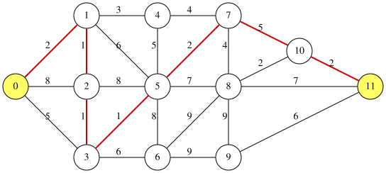
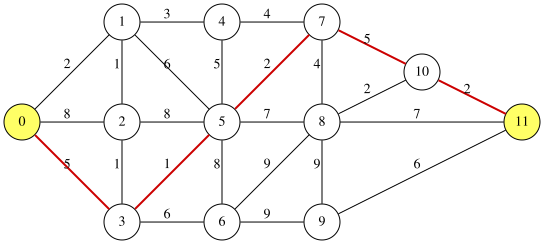

# 最短路問題
辺に重みが付いた無向グラフ $G=(V,E)$ と 2 つの頂点 $s$, $t$ が与えられたとき、**最短路問題**は、$s$ から $t$ への路のうち、通る辺の重みの和（路の長さ）が最小のものを求める問題です。
辺の重みはすべて正とします。

以下の図は、12 頂点・24 辺のグラフと、頂点 0 から頂点 11 への最短路（赤）を示しています。
辺に付いた数は辺の重みです。

<p align="center">
  
</p>

最短路はダイクストラ法で効率よく求められます。
このページでは、辺を選ぶバイナリ変数と頂点の次数の制約で最短路を表す定式化を示します。
この定式化では、ダイクストラ法をそのまま使えない条件も、制約を加えるだけで扱えます（[辺の本数に上限を付ける](#辺の本数に上限を付ける)）。

## 定式化
辺に $0,1,\ldots,m-1$ の番号を付け、辺 $i$ の重みを $w_i$ とします。
$m$ 個のバイナリ変数 $x_0, x_1, \ldots, x_{m-1}$ を導入し、$x_i=1$ は辺 $i$ を路に選ぶことを表します。

頂点 $v$ に接続する辺のうち、選んだ辺の本数を $v$ の次数と呼び、$\deg(v)$ と書きます：

$$
\deg(v) = \sum_{i\,:\,v \text{ は辺 } i \text{ の端点}} x_i
$$

選んだ辺が $s$ から $t$ への路になるように、次の制約を課します：

$$
\begin{aligned}
\deg(s) &= 1, \quad \deg(t) = 1, \\
\deg(v) &\in \lbrace 0, 2\rbrace && (v \neq s, t)
\end{aligned}
$$

$s$ と $t$ は路の端なので、選んだ辺が 1 本だけ接続します。
それ以外の頂点は、路が通るなら 2 本、通らなければ 0 本です。

目的関数は、選んだ辺の重みの和です：

$$
\text{objective} = \sum_{i=0}^{m-1} w_i x_i
$$

### 閉路が混ざらない理由
上の制約を満たす辺の選び方は、$s$ から $t$ への路だけとは限りません。
次数がすべて 2 以下なので、選んだ辺はいくつかの路と閉路に分かれます。
次数が 1 の頂点は $s$ と $t$ だけなので、路はちょうど 1 本で、その両端は $s$ と $t$ です。
つまり、制約を満たす選び方は、$s$ から $t$ への路 1 本に、その路と頂点を共有しない閉路がいくつか加わったものです。

閉路の重みの和は正なので、閉路を取り除くと、制約を満たしたまま目的関数が小さくなります。
したがって、目的関数を最小にする選び方は閉路を含まず、$s$ から $t$ への最短路になります。

### 式
制約を [`qbpp.cons()`](CONSTRAINTS) で宣言し、重み $P$ を掛けて目的関数に加えます：

$$
\begin{aligned}
f &= \text{objective} + P\times\Bigl(\text{cons}\bigl(\deg(s)=1\bigr) + \text{cons}\bigl(\deg(t)=1\bigr) + \sum_{v\neq s,t}\text{cons}\bigl(\deg(v)\in\lbrace 0,2\rbrace\bigr)\Bigr)
\end{aligned}
$$

制約を破ると、違反量の2乗に重みを掛けた値がエネルギーに加わります。
違反量は 1 以上なので、制約を 1 つでも破る割り当てのエネルギーは $P$ 以上です。
一方、制約を満たす割り当てのエネルギーは選んだ辺の重みの和なので、すべての辺の重みの和以下です。
そこで $P$ を「すべての辺の重みの和 + 1」とすれば、$f$ を最小にする割り当ては必ず制約を満たします。

## PyQBPPプログラム
以下のPyQBPPプログラムは、上の図のグラフで頂点 0 から頂点 11 への最短路を求めます：
```python
import pyqbpp as qbpp

N = 12
s, t = 0, 11
edges = [
    (0, 1, 2),  (0, 2, 8),  (0, 3, 5),  (1, 2, 1),  (1, 4, 3),  (1, 5, 6),
    (2, 3, 1),  (2, 5, 8),  (3, 5, 1),  (3, 6, 6),  (4, 5, 5),  (4, 7, 4),
    (5, 6, 8),  (5, 7, 2),  (5, 8, 7),  (6, 8, 9),  (6, 9, 9),  (7, 8, 4),
    (7, 10, 5), (8, 9, 9),  (8, 10, 2), (8, 11, 7), (9, 11, 6), (10, 11, 2)]
M = len(edges)

x = qbpp.var("x", shape=M)

objective = 0
total = 0
for i in range(M):
    a, b, w = edges[i]
    objective += w * x[i]
    total += w

constraint = 0
for v in range(N):
    deg = 0
    for i in range(M):
        a, b, w = edges[i]
        if a == v or b == v:
            deg += x[i]
    if v == s or v == t:
        constraint += qbpp.cons(deg == 1)
    else:
        constraint += qbpp.cons(deg, equal=[0, 2])

f = objective + (total + 1) * constraint
f.simplify_as_binary()

solver = qbpp.ExhaustiveSolver(f)
sol = solver.search()

print(f"length = {sol(objective)}")
print(f"violated constraints = {f.cons(sol)}")
print("selected edges:", end="")
for i in range(M):
    a, b, w = edges[i]
    if sol(x[i]) == 1:
        print(f" ({a},{b})", end="")
print()
```
このプログラムでは、各辺を（端点、端点、重み）の組として `edges` に格納しています。
最初のループで目的関数 `objective` と重みの和 `total` を作ります。
次のループでは、頂点 `v` ごとに次数 `deg` を作り、`v` が `s` か `t` なら `qbpp.cons(deg == 1)` を、それ以外なら `qbpp.cons(deg, equal=[0, 2])` を `constraint` に加えます。
`equal=[0, 2]` は、値が 0 か 2 のときだけ満たされる[許容値の集合](CONSTRAINTS#離散許容値集合)です。

Exhaustive Solver はすべての割り当てを調べるので、得られる解は最適です。
路の長さ `sol(objective)`、破った制約の本数 `f.cons(sol)`、選んだ辺が出力されます。

このプログラムの出力は以下のとおりです：
```
length = 14
violated constraints = 0
selected edges: (0,1) (1,2) (2,3) (3,5) (5,7) (7,10) (10,11)
```
選んだ辺は路 0 → 1 → 2 → 3 → 5 → 7 → 10 → 11 をなし、長さは 2+1+1+1+2+5+2 = 14 です。
頂点 0 から頂点 3 へは、直接の辺（重み 5）よりも頂点 1, 2 を回るほう（重み 4）が短いので、路は上下に折れ曲がります。

`qbpp.cons()` で宣言した制約は式の項に加わらないので、`f` の項は目的関数の 24 項だけです。
従来のペナルティ式では $\deg(v)\in\lbrace 0,2\rbrace$ をそのまま書けないので、頂点ごとにバイナリ変数 $y_v$ を加えて $(\deg(v)-2y_v)^2$ と書く必要があります。

辺の多いグラフでは全探索が終わらないので、`qbpp.ExhaustiveSolver` の代わりに `qbpp.EasySolver` を使い、`search()` に制限時間を与えます。
このグラフでは、制限時間 1 秒の Easy Solver でも同じ最短路が得られます。

## 辺の本数に上限を付ける
上の最短路は 7 本の辺を通ります。
通る辺を 5 本以下に制限したときの最短路を求めてみましょう。
選んだ辺の本数は $\sum_i x_i$ なので、`f` を作る前に次の 1 行を加えるだけです：
```python
constraint += qbpp.cons(qbpp.sum(x) <= 5)
```
このプログラムの出力は以下のとおりです：
```
length = 15
violated constraints = 0
selected edges: (0,3) (3,5) (5,7) (7,10) (10,11)
```
頂点 1, 2 を回る 3 本の代わりに直接の辺 0 → 3 を通る、長さ 15 の路になりました：

<p align="center">
  
</p>

ダイクストラ法はこのような条件をそのままでは扱えませんが、この定式化では制約を 1 つ加えるだけです。
辺の本数の上限は閉路を取り除いても満たされたままなので、[閉路が混ざらない理由](#閉路が混ざらない理由)の議論はそのまま成り立ちます。
重み $P$ も変える必要はありません。

ただし、閉路を取り除くと満たされなくなる制約を加えると、閉路を含む解が返ることがあります。
たとえば「頂点 $v$ を必ず通る」を $\deg(v)=2$ と書くと、$s$ から $t$ への路とは別に $v$ を通る閉路を選んでも満たされます。

## matplotlib による可視化
以下のコードは、最短路を可視化します：
```python
import matplotlib.pyplot as plt
import networkx as nx

pos = {0: (0, 150),   1: (100, 250), 2: (100, 150),  3: (100, 50),
       4: (200, 250), 5: (200, 150), 6: (200, 50),   7: (300, 250),
       8: (300, 150), 9: (300, 50),  10: (400, 200), 11: (500, 150)}

G = nx.Graph()
for a, b, w in edges:
    G.add_edge(a, b)
weights = {(a, b): w for a, b, w in edges}
path_edges = [(a, b) for i, (a, b, w) in enumerate(edges) if sol(x[i]) == 1]

node_colors = ["#f1c40f" if v in (s, t) else "#d5dbdb" for v in G.nodes]
nx.draw(G, pos, with_labels=True, node_color=node_colors, node_size=400,
        font_size=9, edge_color="#cccccc")
nx.draw_networkx_edges(G, pos, edgelist=path_edges, edge_color="#e74c3c",
                       width=2.5)
nx.draw_networkx_edge_labels(G, pos, edge_labels=weights, font_size=8)
plt.title("Shortest Path")
plt.savefig("shortest_path.png", dpi=150, bbox_inches="tight")
plt.show()
```
`pos` は頂点の座標です。
始点と終点は黄色、最短路の辺は赤で表示され、各辺に重みが書かれます。
